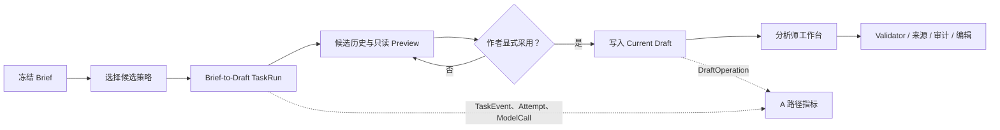

# CaseFile A 路径开发总结

> 日期：2026-08-09
>
> 开发分支：`codex/a-path-optimization`
>
> 基线分支：`feature/brief-to-bench`（`43e3ff1`）
>
> 开发工作树：`C:\Users\Lenovo\Desktop\CaseFile-APath`
>
> 报告存放：原工作树 `C:\Users\Lenovo\Desktop\CaseFile`

## 1. 开发目标

本轮开发围绕 CaseFile 的 A 路径，即“冻结 Brief → 生成候选 Draft → 预览与人工采用 → 进入分析师工作台 → 验证、编辑和持续观测”展开。

核心目标不是只完善界面，而是打通一条具备真实数据、明确人机边界、可恢复任务、可观测指标和自动化验收的完整产品路径。

## 2. 本轮解决的主要问题

| 问题 | 本轮解决方案 | 结果 |
|---|---|---|
| 候选只能看到摘要，无法安全查看完整内容 | 增加完整候选只读 Preview 接口和工作台预览态；编辑、重置、Agent、补丁、编译、导出等写能力全部锁定 | 用户可完整审阅候选，同时 Preview 不读取或修改 Current Draft |
| 候选历史只跟随当前 Brief，旧版本结果难以恢复 | 增加跨 Brief 版本候选历史恢复，区分 `pending`、`current`、`stale` | 旧候选可查看，但 stale 候选禁止采用 |
| 候选可能隐式替换作者工作稿 | 保留服务端显式采用接口和前端人工采用动作 | 候选生成、预览均不会自动改变 Current Draft |
| 采用请求已提交但响应丢失时，前端会误报失败 | 失败后重新读取候选列表和 Current Draft 进行权威对账；只有目标候选确为 Current 时才按成功处理 | 避免“服务端已采用、前端却提示失败”，也避免盲目重试造成 revision 冲突 |
| 工作台部分面板仍是样例或空壳 | 接入真实 Current Draft、确定性 Validator、冻结 Brief 对应 SourceRecord 正文、哈希、审计事件和 DraftOperation | 工作台验证、来源和审计面板全部来自后端事实 |
| 工作台对象编辑信息不完整 | 补齐对象字段、只读引用、有限字段编辑、revision 冲突处理和保存后重取 | 保持 CaseFile v1 契约和乐观并发边界 |
| 长任务主要依赖轮询，刷新后状态恢复不完整 | 建立 SSE 主通道，支持 `Last-Event-ID` 重放、断线轮询回退和 `AbortSignal`；刷新后恢复活动 TaskRun | 任务能从 queued/running 恢复到 succeeded、failed 或 cancelled |
| 刷新后生成任务可能一直显示“生成中”，取消还会被显示为失败 | 恢复逻辑同步更新 `latestTasks`、候选槽和生成总状态，终态后重新读取候选事实 | succeeded 会刷新候选；cancelled 保持独立非故障状态 |
| queued、running、孤儿任务取消行为不一致 | 统一取消服务，收敛 TaskRun、TaskAttempt 和 pending Chat；通过数据库锁处理完成/取消竞态 | 取消不会修改 Draft，并产生稳定取消事件和中文反馈 |
| 页面只显示模糊加载态 | 使用真实 `TaskView.stage`、Attempt、已完成数量和候选槽状态生成进度 | 不再伪造百分比，用户能看到实际阶段和失败/重试状态 |
| 缺少 A 路径漏斗和成本事实 | 增加只读 `/a-path-metrics`，从 TaskRun、TaskAttempt、TaskEvent、AgentModelCall 和 DraftOperation 推导漏斗、采用后编辑与用量 | 不新增分析表，指标来自现有不可变事实 |
| 失败或取消 Attempt 会漏算已经完成的模型调用 | 组件化任务优先按 AgentModelCall 的持久化 usage 汇总；无模型调用时才回退到 Attempt，最后回退 TaskRun | 部分步骤成功后整体失败/取消也不会把真实 Token 记成 0，并避免成功 Attempt 双算 |
| 移动端完成时间和主操作不够清晰 | 增加候选完成时间、390px 主 CTA、container query 和成功交接反馈 | 窄屏下按钮保持可见、横排且无横向溢出 |
| 缺少真实浏览器闭环验收 | 增加 Playwright A 路径黄金测试和独立 PowerShell 编排脚本 | 自动启动 Next.js、FastAPI、Worker 和 PostgreSQL，验证 Preview、Draft 不变、采用和 metrics |
| 独立 E2E 端口与跨源访问不稳定 | E2E Web 端口改为可配置，默认 `13000`；增加 `CASEFILE_CORS_ORIGINS` | 可在独立工作树中运行四服务测试，避免与日常开发端口冲突 |

## 3. 关键技术实现

### 3.1 前端

- **Next.js + React + TypeScript**：承载 Brief Intake、候选阶段和分析师工作台。
- **Context + Reducer 会话模型**：集中管理 Brief、候选历史、生成槽、预览候选、已采用候选和恢复状态。
- **SSE + 轮询回退**：任务事件以 SSE 为主通道，使用 `Last-Event-ID` 恢复游标；代理或网络中断后回到权威 HTTP 查询并重连。
- **AbortSignal**：页面或用户操作停止等待时，可主动取消本地等待和事件流。
- **权威状态对账**：采用操作发生网络不确定性时，重新读取候选和 Draft，而不是仅依赖 POST 响应。
- **CSS Modules、媒体查询和 Container Query**：实现工作台面板隔离、390px 响应式布局和主 CTA 可见性。
- **Vitest + React Testing Library**：覆盖状态恢复、候选权限、采用对账、取消 UX、工作台读模型和 Preview 只读边界。
- **Playwright**：执行真实浏览器用户闭环和窄屏验证。

### 3.2 后端

- **FastAPI**：提供候选历史、候选 Preview、采用、取消、SSE、工作台上下文和 A 路径指标接口。
- **SQLAlchemy 2 + PostgreSQL 18**：保存 Project、BriefVersion、TaskRun、TaskAttempt、TaskEvent、AgentStepRun、AgentModelCall、DraftOperation 等事实。
- **事务和行锁**：使用 `FOR UPDATE` 处理 Draft revision、采用和任务取消；Worker 使用 `FOR UPDATE SKIP LOCKED` 领取任务。
- **乐观并发控制**：所有采用和对象编辑都基于 Current Draft revision，冲突返回稳定错误而不是覆盖写入。
- **不可变事件和历史**：TaskEvent、BriefVersion、SourceRecord、候选结果和 DraftOperation 作为恢复、审计及指标来源。
- **Pydantic 与 CaseFile Validator**：模型结构化输出仍需通过本地严格校验；不会因为 Provider 返回 JSON 就绕过 CaseFile 契约。
- **只读指标推导**：A 路径 metrics 从现有事实聚合，不引入新的分析表或双写链路。
- **Ruff、mypy、pytest**：分别负责 Python 规范、静态类型和单元/真实 PostgreSQL 集成验证。

### 3.3 Agent 与生成链路

- **策略优先**：先产生或选择轻量候选策略，再生成一份完整深稿，避免串行生成多份完整 Draft。
- **分区生成**：Brief-to-Draft 将对象规划、故事世界、证据推理、解答和约束等组件拆分执行，再由服务端组装和校验。
- **稳定 ID 与结构化输出**：对象 ID 由服务端规划，模型输出通过 Pydantic Schema、CaseFile Validator 和确定性语义门禁。
- **组件级观测**：AgentStepRun 和 AgentModelCall 保存步骤、模型调用、诊断与 usage，支持失败恢复和完整成本统计。
- **语义覆盖代理**：对 Brief 的创作意图、推理命题、作者答案、锚点、约束、卖点和结构提纲进行非门禁式覆盖观测。

### 3.4 自动化 E2E

`scripts/test-a-path-e2e.ps1` 使用隔离测试数据库和零成本 FakeProvider，自动编排：

1. PostgreSQL 测试库；
2. FastAPI；
3. 独立 Worker；
4. Next.js；
5. Playwright 浏览器测试。

黄金路径核对以下事实：

- Preview 只请求候选 GET；
- Preview 前后 Current Draft 内容和 revision 不变；
- stale 候选不可采用；
- 390px 下完成时间和主 CTA 可见且无横向溢出；
- 作者显式采用后才更新 Current Draft；
- `/a-path-metrics` 返回真实漏斗和 Attempt/ModelCall 用量。

## 4. 数据与安全边界

- 所有项目读取继续按 `owner_user_id` 过滤。
- 候选 Preview 是只读 GET，不写入 Draft，也不复用生产工作台的写操作。
- 只有当前冻结 Brief 对应的可采用候选可以进入采用流程。
- stale 候选保留历史预览能力，但不能替换 Current Draft。
- 采用和编辑都验证最新 Draft revision。
- 取消、失败和恢复不会自动采用候选。
- SourceRecord 正文、内容哈希、DraftOperation 和 AuditEvent 均通过后端只读模型提供，不由前端伪造。

## 5. 主要代码落位

| 模块 | 主要职责 |
|---|---|
| `apps/web/features/case-session/case-session-api.ts` | Workflow HTTP/SSE Client、恢复、取消和采用对账 |
| `apps/web/features/case-session/case-session-provider.tsx` | A 路径前端会话、候选槽、终态恢复和显式采用 |
| `apps/web/features/case-session/case-session-mapping.ts` | 后端候选、Brief 与工作台会话模型映射 |
| `apps/web/features/intake/draft-candidates-stage.tsx` | 候选进度、历史、完成时间、采用 CTA 与错误反馈 |
| `apps/web/features/analyst-workbench/` | 候选 Preview、Current Draft 工作台、对象编辑和上下文面板 |
| `backend/src/casefile/application/draft_candidates.py` | 候选查询、Preview 和采用业务边界 |
| `backend/src/casefile/application/task_cancellation.py` | queued/running/orphan 任务取消收敛 |
| `backend/src/casefile/application/task_events.py` | 单调、不可变 TaskEvent 追加 |
| `backend/src/casefile/application/workbench_read_model.py` | Validator、来源、哈希和审计只读模型 |
| `backend/src/casefile/application/a_path_metrics.py` | A 路径漏斗、完整用量与采用后编辑推导 |
| `backend/src/casefile/agent_runtime/observability.py` | Brief 语义覆盖和标准化用量观测 |
| `backend/src/casefile/worker/runtime.py` | Worker 领取、lease、Attempt、取消竞态和组件事件持久化 |
| `scripts/test-a-path-e2e.ps1` | 四服务 A 路径浏览器验收编排 |

## 6. 验证结果

| 检查 | 结果 |
|---|---|
| Web Vitest | 12 files / 108 tests passed |
| Preview 只读聚焦回归 | 49 / 49 passed |
| Web typecheck | 通过 |
| 完整 ESLint | 0 error；任务相关文件 0 warning |
| Web production build | 通过 |
| Backend unit | 105 passed；最终 metrics 聚焦回归 7 / 7 passed |
| PostgreSQL integration | 41 passed；1 个真实 Provider opt-in 用例默认 skipped |
| 最终失败/取消用量回归 | 2 / 2 passed，运行于真实 `*_test` PostgreSQL |
| Backend mypy | 68 source files passed；最终 metrics 文件复核通过 |
| 改动 Python 文件 Ruff | 通过 |
| 四服务 Playwright E2E | 1 passed，约 14.6 秒 |
| `git diff --check` | 通过 |
| 人工维护文件 2000 行硬门槛 | 无超限文件 |

说明：完整仓库在 Ruff 0.16.2 下仍有 12 个既有 import-order 问题，均位于本轮未修改的基线文件；本轮改动 Python 文件已经通过 Ruff。

## 7. 当前仍可继续优化的非阻断项

### P2：继续拆分接近行数上限的文件

优先关注：

- `case-session-provider.tsx`：1997 行；
- `analyst-workbench.module.css`：1970 行；
- `workflow_service.py`：1928 行；
- `test_application_services.py`：1683 行；
- `analyst-workbench.tsx`：1563 行；
- `worker/runtime.py`：1503 行。

这些文件均未超过 2000 行硬门槛，但已接近维护警戒线，后续应按职责继续拆分。

### P2：增加确定性取消并发屏障

当前真实 PostgreSQL 测试已经覆盖 queued、running、orphan 三类取消，并断言 Draft revision 和内容不变。后续可以增加测试专用 Worker barrier，确定性交错“任务完成事务”和“取消事务”，再补浏览器取消 E2E，避免依赖竞态 sleep。

### P2：积累真实 Provider 长期指标

当前已经记录完整请求数和 Token，但没有冻结 Provider 价格，因此不会虚构金额。后续可在明确版本化价格和真实运行样本后，建立 p50/p95 延迟、成功率、重试率和单位候选 Token 基线。

## 8. 交付状态

- 所有开发均位于独立工作树 `CaseFile-APath`。
- 当前分支为 `codex/a-path-optimization`，基线仍为 `feature/brief-to-bench@43e3ff1`。
- 原工作目录 `C:\Users\Lenovo\Desktop\CaseFile` 未被切换或写入。
- 当前改动尚未暂存、提交或推送。
- 候选仍必须由作者显式采用，Preview 不读写 Current Draft。
