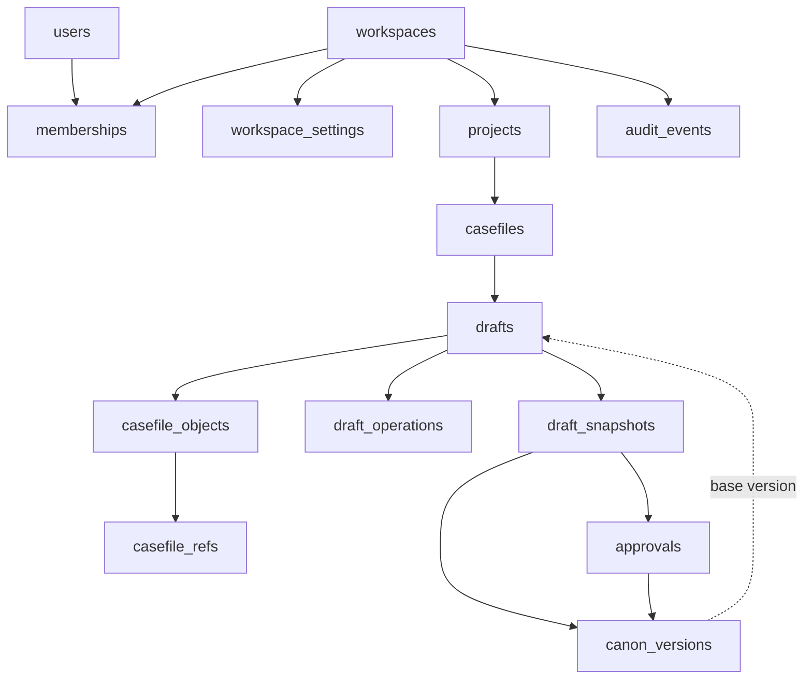

# CaseFile 数据库表职责说明

本文说明首批 PostgreSQL 地基表的职责和使用边界。迁移文件是数据库结构的唯一真相源；本文帮助开发者和 coding agent 判断数据应落在哪张表，不重复维护完整 DDL。

新增、删除、重命名表，或实质性改变表职责时，必须在同一次变更中同步更新：Alembic 迁移、SQLAlchemy 模型、本文和仓库根目录的 `AGENT.md`。

## 1. 总体约定

- 内部主键统一为 UUID；需要出现在 API 或领域引用中的资源另有稳定 `public_id`。
- 公开 ID 使用类型前缀，例如 `case_`、`draft_`、`snapshot_`、`cv_`；根资源默认使用前缀加 UUID4 的 32 位小写十六进制形式。
- CaseFile 内容对象的 `object_id` 由机器契约定义，可使用 `evt_`、`claim_`、`hyp_` 等语义前缀，不以名称或排序生成。
- 除 `users` 和 `workspaces` 自身外，所有业务表都包含 `workspace_id`。
- 跨业务表引用使用带 `workspace_id` 的复合外键，数据库直接阻断跨工作区串数据。
- 时间列使用 PostgreSQL `TIMESTAMPTZ`；应用服务按 UTC 读写和比较。
- 状态字段使用 `VARCHAR + CHECK`，不使用 PostgreSQL Enum。
- JSONB 保存领域内容或扩展配置；归属、引用、状态、版本和审批关系必须使用正式列。
- 物理删除只允许由未来的数据治理流程发起；普通业务操作使用归档、状态变化或软删除。

## 2. 三层关系



身份与 Workspace 是隔离地基；Project 和 CaseFile 是创作聚合根；Draft、Object 与 Ref 是当前工作态；Snapshot、Approval 和 Canon 构成正式版本边界；Audit Event 记录重要动作。

## 3. `users`

- **核心作用**：保存本地所有者以及未来启用登录后的账号身份；不保存 Workspace 权限和 CaseFile 内容。
- **领域与父表**：Identity；无父表。
- **主要字段**：内部 `id`、稳定 `public_id`、`display_name`、`status` 和创建/更新时间。
- **约束与索引**：`public_id` 全局唯一且必须以 `user_` 开头；状态只能为 `active` 或 `disabled`。
- **写入方**：Identity 应用服务；首个迁移负责创建 `user_local_owner`。
- **生命周期**：允许修改显示名和状态；已有业务历史的用户不做普通物理删除。
- **下游关系**：被 `memberships.user_id` 引用；审计和内容中的 actor 使用稳定 actor ID 表达。
- **典型场景**：localhost 启动后，以 Local Owner 身份进入默认 Workspace。

## 4. `workspaces`

- **核心作用**：作为全部业务数据的租户隔离根；不保存项目内容。
- **领域与父表**：Identity & Workspace；无父表。
- **主要字段**：内部 `id`、稳定 `public_id`、`slug`、名称、状态和时间戳。
- **约束与索引**：`public_id`、`slug` 分别全局唯一；状态只能为 `active` 或 `archived`。
- **写入方**：Workspace 应用服务；首个迁移负责创建 `ws_local`。
- **生命周期**：允许改名和归档；物理删除必须由未来的数据删除流程统一处理。
- **下游关系**：拥有 Membership、Settings、Project、Audit Event 及所有间接业务数据。
- **典型场景**：Repository 从 ActorContext 取得 `workspace_id` 后执行所有项目查询。

## 5. `memberships`

- **核心作用**：记录用户在某个 Workspace 中的角色和成员状态；不承载登录凭证或细粒度对象 ACL。
- **领域与父表**：Identity & Workspace；父表为 `users`、`workspaces`。
- **主要字段**：`workspace_id`、`user_id`、稳定 `public_id`、`role`、`status`、`joined_at`。
- **约束与索引**：一个用户在同一 Workspace 只能有一条 Membership；角色限定为 owner/admin/author/reviewer。
- **写入方**：Membership 应用服务；首个迁移创建本地 owner 关系。
- **生命周期**：允许角色变化和停用；不通过重复插入表达历史，历史写入 Audit Event。
- **下游关系**：为 ActorContext 和未来权限判断提供成员身份。
- **典型场景**：检查当前用户是否具有批准 Draft 生成 Canon 的资格。

## 6. `workspace_settings`

- **核心作用**：保存每个 Workspace 一份可扩展设置文档；不保存项目级配置、密钥或高频业务状态。
- **领域与父表**：Workspace；父表为 `workspaces`。
- **主要字段**：`workspace_id`、稳定 `public_id`、`settings_jsonb` 和时间戳。
- **约束与索引**：每个 Workspace 最多一条；JSONB 默认为空对象。
- **写入方**：Workspace Settings 应用服务。
- **生命周期**：允许整体或局部更新；随 Workspace 的治理删除一并清理。
- **下游关系**：供预算默认值、体验偏好和未来数据策略读取；不得被核心领域直接 import。
- **典型场景**：读取本地 Workspace 的默认语言或界面偏好。

## 7. `projects`

- **核心作用**：作为项目 API、素材和 CaseFile 的稳定父对象；不直接保存 CaseFile 对象内容。
- **领域与父表**：Intake & Brief / CaseFile；父表为 `workspaces`。
- **主要字段**：稳定 `public_id`、标题、说明、`status`、`profile_jsonb`、actor 与归档时间。
- **约束与索引**：业务 ID 在 Workspace 内唯一；按 Workspace、状态和更新时间建立列表索引。
- **写入方**：Project 应用服务。
- **生命周期**：允许编辑标题、Profile 和归档；普通删除不做物理清理。
- **下游关系**：首版拥有且只能拥有一个 `casefiles` 记录；未来素材和 Brief 也归属 Project。
- **典型场景**：`POST /api/v1/projects` 创建项目后初始化对应 CaseFile 和 Draft。

## 8. `casefiles`

- **核心作用**：表示项目的结构化事实源及其整体生命周期；不保存每个对象的 JSON 内容，也不覆盖历史 Canon。
- **领域与父表**：CaseFile & Versioning；父表为 `projects`。
- **主要字段**：稳定 `public_id`、标题、`status`、`schema_version`、actor 和归档时间。
- **约束与索引**：一个 Project 在 Workspace 内只能对应一个 CaseFile；状态限定为 draft/canon/archived。
- **写入方**：CaseFile 应用服务。
- **生命周期**：允许更新标题、状态和 Schema 版本；归档替代普通删除。
- **下游关系**：拥有一个当前 Draft、多个 Snapshot、Approval 和 Canon Version。
- **典型场景**：工作台通过 CaseFile ID 装载 Draft 对象树和最近 Canon 历史。

## 9. `drafts`

- **核心作用**：保存 CaseFile 当前可编辑工作态的版本边界和乐观锁；不保存完整内容副本。
- **领域与父表**：CaseFile 工作态；父表为 `casefiles`，可引用一个 `base_canon_version_id`。
- **主要字段**：稳定 `public_id`、`revision`、`schema_version`、`status`、base Canon 和 actor。
- **约束与索引**：每个 CaseFile 只能有一个当前 Draft；revision 必须大于等于 1；状态为 active/locked。
- **写入方**：Draft 应用服务及经授权的 Patch 应用流程；Agent 不直接绕过应用服务写表。
- **生命周期**：允许内容操作时递增 revision；发布 Canon 后仍保留并可基于 Canon 开启下一轮编辑。
- **下游关系**：拥有 Object、Ref、Operation 和 Snapshot。
- **典型场景**：对象更新携带当前 revision，成功写入后 Draft revision 增加。

## 10. `casefile_objects`

- **核心作用**：保存当前 Draft 中每个稳定对象的 JSON 内容，是 Draft 对象层的内容真相；不保存历史版本和正式 Canon。
- **领域与父表**：CaseFile 工作态；父表为同 Workspace、同 CaseFile 的 `drafts`。
- **主要字段**：Schema `object_id`、`object_type`、`revision`、`payload_jsonb`、`source_jsonb`、confidence、confirmation status、actor 和软删除时间。
- **约束与索引**：`(workspace_id, casefile_id, object_id)` 唯一；revision ≥ 1；confidence 为空或位于 0–1；JSONB 使用 GIN 索引。
- **写入方**：CaseFile Object 应用服务，在同一事务内同步 Ref 和 Operation。
- **生命周期**：允许带 revision 的更新；删除先写 `deleted_at`，入向引用未处理时业务服务必须阻断。
- **下游关系**：是 `casefile_refs` 两端对象和 `draft_operations.object_id` 的目标。
- **典型场景**：编辑 `evt_accident` 的开始时间，同时递增对象 revision 并记录操作。

## 11. `casefile_refs`

- **核心作用**：保存从对象 JSON 提取的方向性引用，是可重建派生索引；不是内容真相，也不保存对象正文。
- **领域与父表**：CaseFile 工作态；父表为 `drafts`，两端引用 `casefile_objects`。
- **主要字段**：`from_object_id`、`field_path`、`to_object_id`、`ref_kind` 和创建时间。
- **约束与索引**：引用两端必须属于同一 Workspace 和 Draft；同一边唯一；分别建立入向和出向索引。
- **写入方**：CaseFile Object Repository，只能与对象 JSON 在同一事务中同步更新。
- **生命周期**：对象字段变化时重建相关边；物理删除对象时派生引用可级联清理。
- **下游关系**：供引用完整性验证、影响分析、图查询和删除门禁使用。
- **典型场景**：查询删除某个 Location 前有哪些 Event 仍然引用它。

## 12. `draft_operations`

- **核心作用**：记录有顺序的 add/remove/replace 修改，用于撤销、追踪和问题定位；不替代 Audit Event，也不存整份快照。
- **领域与父表**：CaseFile 工作态；父表为 `drafts`，可指向一个 `casefile_objects`。
- **主要字段**：`sequence_no`、operation type、field path、前后 JSON、base/result revision、actor 和时间。
- **约束与索引**：同一 Draft 的 sequence 唯一；result revision 必须等于 base revision + 1；数据库触发器禁止更新。
- **写入方**：Draft 应用服务，在成功修改对象的同一事务内追加。
- **生命周期**：只追加，不原地更新；治理删除时随所属 Draft 处理。
- **下游关系**：供撤销、活动时间线和 Snapshot 变更摘要读取。
- **典型场景**：用户把事件开始时间从 20:00 改为 19:30 后生成一条 replace Operation。

## 13. `draft_snapshots`

- **核心作用**：保存某一 Draft revision 的不可变完整 JSON，固定任务和批准输入；不代表正式事实。
- **领域与父表**：Versioning；父表为 `drafts` 和对应 `casefiles`。
- **主要字段**：稳定 `public_id`、`snapshot_revision`、`schema_version`、`snapshot_jsonb`、SHA-256、actor 和创建时间。
- **约束与索引**：同一 Draft revision 只能生成一份 Snapshot；哈希必须为 64 位小写十六进制；数据库触发器禁止更新。
- **写入方**：Snapshot 应用服务，在验证序列化结果和内容哈希后创建。
- **生命周期**：只追加、不更新；是否被批准不改变 Snapshot 本身。
- **下游关系**：被 Approval 和 Canon 引用，未来也作为 TaskRun 的 InputSnapshotRef。
- **典型场景**：验证任务和批准页始终读取同一个 revision，避免编辑中的 Draft 漂移。

## 14. `approvals`

- **核心作用**：记录将某个 Draft Snapshot 冻结为 Canon 的明确人工决定；首版不承载 Patch 审批。
- **领域与父表**：Review & Approval；父表为 `draft_snapshots` 和对应 `casefiles`。
- **主要字段**：稳定 `public_id`、approval type、status、revision、请求人、决定人、理由和决定时间。
- **约束与索引**：状态为 pending/approved/rejected/cancelled；终态必须有决定人和时间；每个 Snapshot 最多一个 approved 记录。
- **写入方**：Approval 应用服务。
- **生命周期**：pending 可一次性流转到终态并递增 revision；终态由触发器锁定，不能再次修改。
- **下游关系**：approved 记录可被一个 `canon_versions` 引用；未来 Patch 审批通过新迁移扩展。
- **典型场景**：owner 审阅 Snapshot 后批准，随后 Canon 服务在同一责任人下创建正式版本。

## 15. `canon_versions`

- **核心作用**：保存经批准的、不可变的完整正式 CaseFile；不作为日常编辑表。
- **领域与父表**：CaseFile & Versioning；父表为 CaseFile、Draft Snapshot、Approval，可引用父 Canon。
- **主要字段**：稳定 `public_id`、`version_no`、parent、source Snapshot、Approval、Schema 版本、完整 JSON、SHA-256、有效性、批准人和冻结时间。
- **约束与索引**：CaseFile 内 version 唯一；Snapshot 和 Approval 各只能生成一个 Canon；触发器要求 Approval 已批准、批准人一致、内容哈希与 Snapshot 一致。
- **写入方**：Canon 应用服务，必须通过 Approval 端口创建。
- **生命周期**：只追加，数据库禁止更新；新事实通过下一版 Canon 表达。
- **下游关系**：是正式验证、模拟、Compiler 和 Release Package 的唯一合法事实输入，也可作为下一轮 Draft 的 base Canon。
- **典型场景**：将已批准 Snapshot 冻结为 `cv_...` 版本 3，后续编译始终引用该内部 UUID。

## 16. `audit_events`

- **核心作用**：记录有责任主体的重要业务和治理动作；不替代对象修改 Operation，也不保存完整业务快照。
- **领域与父表**：Governance & Audit；父表为 `workspaces`。
- **主要字段**：稳定 `public_id`、actor、event type、实体类型和业务 ID、action、payload、trace ID、发生时间。
- **约束与索引**：业务 ID 在 Workspace 内唯一；按 Workspace 时间和实体时间建立索引；数据库禁止原地更新。
- **写入方**：各应用服务通过统一 Audit Port 追加，业务 Repository 不散写审计 SQL。
- **生命周期**：只追加、不更新；最终物理删除遵循未来数据治理和保留策略。
- **下游关系**：供项目活动、完整导出、安全排查和责任追踪读取。
- **典型场景**：记录谁在何时批准哪个 Snapshot 并生成哪个 Canon。

## 17. Draft 到 Canon 的状态边界

```text
Draft（可编辑、revision 递增）
  -> Draft Snapshot（固定输入、不可更新）
  -> Approval pending
  -> Approval approved / rejected / cancelled（终态锁定）
  -> Canon Version（仅 approved 可创建、不可更新）
  -> 新一轮 Draft 可引用该 Canon 作为 base_canon_version_id
```

Agent 只能产生 Draft 内容或未来的 PatchCandidate。Agent、API route、Worker 和数据库脚本均不得绕过 Approval 直接创建或修改 Canon。

## 18. 尚未创建的表组

下列数据不得临时塞入当前 14 张表，应在对应功能实施时新增迁移和职责文档：

- 导入与素材：`content_blobs`、`source_assets`、`source_fragments`、`brief_versions`。
- Patch：`patch_candidates`、`patch_operations` 及 Patch 审批扩展。
- 长任务：`task_runs`、`job_attempts`、`task_events`、`task_checkpoints`。
- 验证与模拟：`validation_runs`、`validation_issues`、`validation_overrides`、`simulation_runs`。
- 推理搜索：`reasoning_runs`、`reasoning_nodes`、`reasoning_edges`、`reasoning_evaluations`。
- Compiler：Target、Projection、Compile、IR、Source Map、Artifact 和 Release Package 表。
- 协作与治理：Comment、Review Task、Usage、Data Policy、Deletion 和 Backup 表。

## 19. 迁移命名与执行

- 文件名：`VyyyyMMddHHmmss__lower_snake_case.py`。
- `revision`：与文件名相同的 14 位时间戳，不包含 `V`。
- `down_revision`：指向前一个时间戳，保持单调单链。
- 新迁移使用根目录 `scripts/new-migration.ps1 -Name lower_snake_case` 创建。
- 提交前运行根目录 `scripts/check.ps1`；迁移名检查会拒绝伪时间、重复版本、错误链和非小写蛇形描述。
