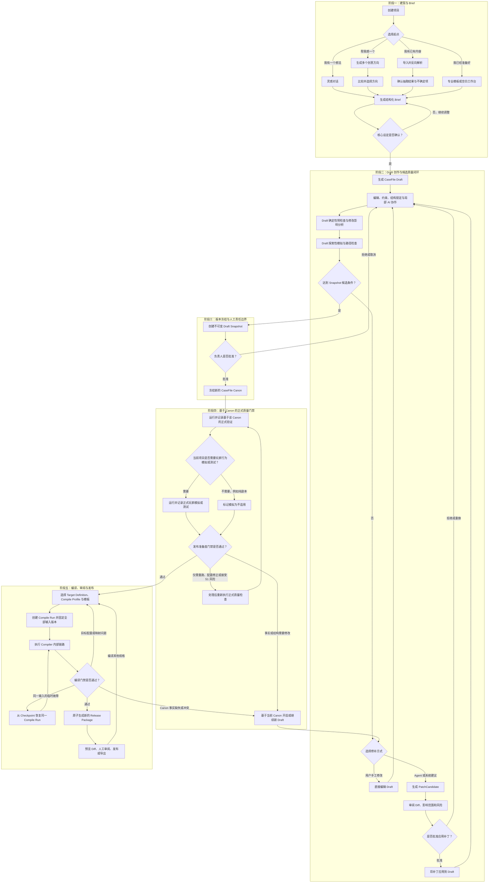
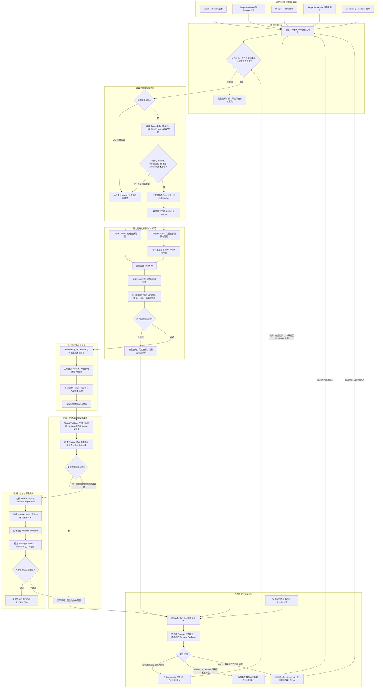

# CaseFile 推理卷宗产品需求文档（PRD）v2.3

| 文档项 | 内容 |
|---|---|
| 产品名称 | CaseFile 推理卷宗 |
| 文档版本 | v2.3 |
| 文档状态 | 定档 |
| 定档日期 | 2026-07-26 |
| 产品形态 | 桌面 Web，当前仅面向个人创作者 |
| 首发方向 | 互动推理内容的设计、验证、模拟与多目标编译 |
| 核心资产 | 结构化 CaseFile |

> 一句话定位：CaseFile 是一套面向互动内容创作者的结构化推理设计与验证平台。新手可以从一句想法开始，由 Agent 搭建可编辑骨架；专业作者可以接管人物、事件、信息、规则和推理链，精细控制并验证整个作品。

---

## 0. 文档目的与 v2.3 变化

旧版 PRD 已经较完整地回答了 CaseFile 如何存储、Agent 如何编排、验证器如何实现、系统如何部署，但整体偏向架构设计，用户能感知和理解的产品能力不够突出。

v2.3 在既有创作、验证、模拟与编译闭环之上，进一步回答以下八个产品化问题：

1. 谁会在什么场景下使用 CaseFile？
2. 用户第一次进入产品时，可以从哪里开始？
3. 新手和专业作者如何使用同一套产品？
4. 用户如何完成“创作 - 验证 - 修补 - 模拟 - 编译 - 发布”的完整任务？
5. 每项能力具体给用户什么结果，什么状态算完成？
6. 一份 Canon 如何稳定编译成不同媒介和规格的产物？
7. 用户如何理解产品、管理长任务、控制 AI 成本并信任数据处理？
8. v2.3 必须交付什么，明确不做什么？

v2.3 相对旧版的核心变化如下：

| 旧版侧重 | v2.3 定档方向 |
|---|---|
| 强调 CaseFile、数据库、Agent、推理算法 | 强调创作者任务、产品入口、工作流和可验收结果 |
| 默认语境偏凶案、侦探和剧本杀 | 将推理泛化为事实、身份、因果、路径、规则、关系和决策推理 |
| 用户先面对复杂 CaseFile 工作台 | 先经过创意方向和结构化 Brief，再逐步进入专业工作台 |
| AI 主要表现为一个总控 Agent | 将 AI 能力包装成对象级、关系级、局部和全案级任务 |
| 验证器更像后台研发能力 | 将验证、证据覆盖、知识状态和发布准备度做成用户可见的质量中心 |
| 缺少玩家视角验证 | 增加虚拟玩家推理路径模拟、卡点分析和难度评估 |
| 转换工坊更像一个导出功能 | 将 CaseFile Compiler 提升为独立核心模块，正式定义 Target Adapter、Target IR、Renderer、目标校验、Source Map 和 Release Package |
| 个人与小团队范围混杂 | v2.3 收敛为纯个人产品，团队协作整体移入远期路线 |
| 功能完整但首次体验不明确 | 定义三个首发黄金场景、五分钟引导、示例项目、用户语言和渐进披露 |
| 专业工作台缺少日常基础能力 | 补齐搜索、命令面板、批量操作、自动保存、撤销恢复和任务中心 |
| AI 能力丰富但成本不可见 | 增加任务档位、预算上限、超额确认和项目用量统计 |
| 缺少产品信任与商业闭环 | 明确内容所有权、训练选择、保留与删除、产品包装及商业指标 |
| 多种未来能力混在同一层级 | 明确 v2.3、v2.4 与远期平台能力的边界 |

v2.3 的产品与数据边界是：**一个自然人用户独立创建、编辑、验证、编译和管理自己的项目**。当前版本不引入 Workspace、团队、成员、邀请、组织角色、共享项目或协作审批等概念；这些能力只有在个人创作闭环得到验证后，才作为独立的后续版本重新设计。

本文档只保留必要的产品级技术约束。数据库、运行时、SDK、推理算法与部署细节继续由架构设计文档承载，不作为本 PRD 的主体。

---

## 1. 执行摘要

### 1.1 产品愿景

让创作者不必在“完全交给 AI”与“完全手工维护复杂内容”之间二选一，而是可以从模糊灵感开始，逐步建立一个可编辑、可验证、可模拟、可复用、可编译的推理内容系统。

### 1.2 产品核心价值

CaseFile 不以“一次生成一篇完整文本”为主要价值，而是帮助用户完成五件更难、也更有长期价值的事：

1. **把想法变成结构**：将一句灵感、空白命题或已有素材整理为正式 Brief 和 CaseFile。
2. **把复杂内容管清楚**：统一管理实体、事件、信息、关系、规则、假设、结论和叙事顺序。
3. **把逻辑问题找出来**：定位时间冲突、知识泄露、信息缺口、多解、无效信息和不公平误导。
4. **把玩家体验跑一遍**：模拟不同类型用户的推理路径，发现卡点、暴力猜解和难度失衡。
5. **把同一事实源编译成多种产物**：通过可版本化、可诊断、可复现的 Compiler，在不改变 Canon 事实的前提下，生成不同媒介、规格和视角的目标内容包。

### 1.3 北极星指标

**每周完成有效创作闭环的 CaseFile 数。**

一个 CaseFile 只有同时满足以下条件，才计入有效闭环：

- Brief 已确认；
- 至少形成一个 Canon 版本；
- S0 阻断问题为 0；
- S1 高风险问题已修复或被人工明确接受；
- 已完成至少一次玩家模拟或人工测试记录；
- 已通过 Compiler 成功生成目标 Release Package；
- 全部 AI 修改均有可追溯的人工批准记录。

### 1.4 v2.3 首发承诺

v2.3 必须让目标用户完成以下承诺：

> 我可以通过示例和五分钟引导快速理解产品，从一个模糊想法、AI 自主创意、已有文档或空白专业模板开始；系统先帮我形成一份看得懂、可确认的 Brief，再展开为结构化 CaseFile。我可以自己接管细节，也可以让 Agent 在受控预算内补全和修改。系统能指出内容为什么不成立、改一处会影响哪里、不同类型玩家是否能合理得出结论。所有正式修改、Canon 冻结和发布都由我本人确认。最后，我可以由 Compiler 将同一 Canon 编译为可追溯、可验证、可复现的目标内容包，并随时导出或删除自己的项目数据。

---

## 2. 产品背景与用户问题

### 2.1 市场与创作现状

现有 AI 写作工具通常擅长生成局部文案，但难以长期维护一个由多人物、多事件、多阶段信息和多条推理路径组成的互动内容。创作者往往需要在聊天记录、表格、脑图、文档和游戏配置之间反复同步。

当内容发生修改时，用户很难立即回答：

- 哪些人物、信息、章节和结局会受到影响？
- 某个结论究竟由哪些信息支持？
- 某个角色在某个阶段是否知道了不该知道的事？
- 用户是否能在目标时长内合理得出预期结论？
- 这个内容是唯一解、有限多解、开放解释，还是根本没有充分信息？
- 导出的主持人手册、角色信息包和测试材料是否仍然一致？

### 2.2 主要用户痛点

| 用户问题 | 当前常见做法 | 造成的结果 | CaseFile 机会 |
|---|---|---|---|
| 有创意但不知道如何搭建结构 | 与 AI 反复聊天或直接写长文 | 方向漂移、返工大 | 用对话和向导生成正式 Brief |
| 什么都没想好，只想寻找方向 | 随机生成完整故事 | 结果难比较、难控制 | 先给多个创意方向和风险评估 |
| 已有半成品但结构混乱 | 手工拆表、重新整理 | 成本高，历史信息易丢 | 反向解析并标出不确定、冲突和缺失项 |
| 复杂修改牵一发动全身 | 靠作者记忆逐份检查 | 产生设定漂移和导出不一致 | 提供影响分析和失效范围 |
| 逻辑正确但不好玩 | 靠作者经验或零散试玩 | 难度、节奏和误导失衡 | 用玩家模拟和质量指标提前发现问题 |
| AI 修改不可控 | 整篇重写、覆盖原文 | 核心设定被改、无法追责 | 锁定结构，所有 AI 修改先成为补丁 |
| 同一内容需要多个交付物 | 分别复制和改写 | 事实和版本持续漂移 | 从一个 Canon 编译目标内容包 |

### 2.3 产品机会

CaseFile 的差异化不在于“写得更长”，而在于把推理内容从一组松散文档变成一套可操作的设计系统：

- 创作入口足够低门槛；
- 结构足够通用，不绑定凶案题材；
- AI 行为可控、可审阅、可回滚；
- 质量问题可定位、可修复、可复验；
- 用户体验可以在发布前被模拟和测试；
- 下游产物可以追溯到同一事实源。

---

## 3. 产品定位与边界

### 3.1 产品定义

CaseFile 是一个 **CaseFile-first 的结构化推理内容创作环境**。产品首要输出不是消费型长文本，而是一个经过确认和验证的内容卷宗。

卷宗统一描述：

- 内容目标与目标用户；
- 世界、规则与约束；
- 核心实体及其关系；
- 真实发生的事件与叙事暴露顺序；
- 信息单元、来源、可见范围和可信度；
- 假设、推理链、反驳、结论和未决问题；
- 玩家视角、提示、阶段和可达路径；
- 版本、修改、审批、验证、编译和发布记录。

### 3.2 什么是“推理卷宗”

“推理卷宗”本质上不是一篇剧本，也不是一份故事文档，而是：

> **一套把人物、事件、信息、规则、假设、推理链和结论组织起来的结构化内容底座。**

它可以被理解为一个互动推理作品的“源代码”。普通剧本记录的是最终写给玩家、主持人或游戏引擎的呈现内容；推理卷宗记录的是这个作品在内部为什么成立，以及系统如何验证、模拟和转换它。

在产品中，“推理卷宗”对应 CaseFile。它不是一个单独的大文本字段，而是一组具有稳定 ID、引用关系、来源、状态和版本的结构化对象。

#### 3.2.1 推理卷宗记录什么

推理卷宗至少回答以下问题：

- 世界里到底发生了什么；
- 有哪些人物、地点、物品、组织、系统或规则；
- 每个真实事件何时、何地发生，涉及哪些实体；
- 每个角色或视角在不同阶段知道什么、不知道什么、误以为什么；
- 哪些 Information Unit 支持或反驳哪些 Claim；
- 用户需要推理出什么；
- 存在哪些候选解释，以及它们如何被支持、排除或保持未决；
- 结论是唯一解、有限多解、开放解释、最优方案还是其他模式；
- 哪些内容可以在什么阶段被哪些参与者看到；
- 哪些推理路径是必要路径，是否存在替代路径；
- 修改一个对象会影响哪些问题、模拟、Target IR 和 Artifact；
- 当前哪些内容是编辑草稿，哪些已经成为正式版本。

#### 3.2.2 Draft 与 Canon

推理卷宗具有明确版本状态：

- **CaseFile Draft（编辑草稿）**：用户和 Agent 正在编辑的结构，可以存在未解决问题和待确认推断；
- **PatchCandidate（修改建议）**：AI 或系统提出但尚未生效的结构化修改；
- **CaseFile Canon（正式版本）**：经过人工批准、可验证、可模拟、可编译的正式事实版本。

凡执行的正式验证、玩家模拟和编译都必须记录其使用的 Canon 版本。玩家模拟不是所有项目的必经步骤；Draft 或 Canon 变化后，旧验证、模拟和编译结果必须根据影响范围标记为有效、可能失效或已失效。

#### 3.2.3 示例：空间站不断重启

假设创作者要设计一个“空间站不断重启”的互动推理内容。

普通剧本可能只写：

> 玩家来到空间站，调查日志，最后发现 AI 为了保护实验而重复重启系统。

推理卷宗则会结构化记录：

| 结构 | 示例内容 |
|---|---|
| 核心问题 | 空间站为什么不断重启？ |
| 核心实体 | 空间站 AI、实验负责人、维修工程师、反应堆系统 |
| 真实事件 | 18:00 实验启动；18:20 反应堆异常；18:23 AI 启动保护协议；18:25 空间站状态回滚 |
| 信息单元 | 系统日志 A、工程师证词 B、被删除的保护协议 C |
| 候选解释 | AI 故障、工程师破坏、保护协议主动触发 |
| 推理链 | 日志 A + 协议 C → 重启不是故障 → AI 在主动保护实验 |
| 结论模式 | 唯一解 |
| 信息权限 | 工程师在第一阶段只能看到日志 A；协议 C 在第二阶段满足调查条件后可获得 |
| 替代路径 | 若玩家错过协议 C，可以通过维修终端和 AI 异常记录组合获得等价信息 |

有了这份卷宗，系统才能进一步检查：

- 工程师是否提前知道了不该知道的事；
- 玩家是否有机会获得协议 C；
- 删除某条日志后是否会变成多解或无解；
- 新手型玩家是否容易在第二阶段卡住；
- 某个 Compile Profile 是否让信息量超过目标时长；
- 能否将同一 Canon 编译成测试包，并在未来适配为 RPG 任务、互动小说或对话树。

#### 3.2.4 推理卷宗与 Brief 的区别

| 对比项 | Brief | 推理卷宗 / CaseFile |
|---|---|---|
| 回答的问题 | 这个作品准备做成什么？ | 这个作品内部具体如何成立？ |
| 主要内容 | 题材、用户、规模、体验、核心机制、约束 | 实体、事件、信息、知识状态、假设、推理链、结论和版本 |
| 形成阶段 | 创意方向确认阶段 | Brief 确认后进入持续创作和验证 |
| 精细程度 | 方向和边界 | 可编辑、可引用和可计算的具体结构 |
| 典型示例 | 科幻题材、4 名玩家、45 分钟、规则发现型推理 | 谁在何时知道什么、哪条信息支持哪个结论、哪些路径可达 |

产品对象链路为：

```text
Idea → Brief → CaseFile Draft → CaseFile Canon
     → 验证 / 玩家模拟
     → Compiler → Target IR → Release Package
```

Brief 是 CaseFile 的方向约束和生成输入，但不是事实源。Brief 被修改后，系统必须提示哪些 CaseFile 对象和结果可能失效。

#### 3.2.5 推理卷宗与剧本的区别

| 推理卷宗 / CaseFile | 剧本或其他最终产物 |
|---|---|
| 保存真实事实和结构 | 保存最终呈现文本或运行配置 |
| 面向作者、验证器、模拟器和 Compiler | 面向玩家、主持人、读者或游戏引擎 |
| 维护知识状态、信息关系、候选解释和推理路径 | 维护台词、章节、任务节点和叙事表现 |
| 可以验证逻辑、公平性和可达性 | 主要用于阅读、试玩或运行 |
| 可以编译成多种媒介和规格 | 通常只是某一种目标形态 |
| 目标媒介字段不进入核心事实层 | 可以包含该媒介特有的节点 ID、UI 文案或文件结构 |

剧本不是被推理卷宗取代，而是由推理卷宗经过 Target Adapter、Target IR、Renderer 和 Target Validator 生成的一类目标产物。

#### 3.2.6 概念定档

PRD 对“推理卷宗”的正式定义为：

> **推理卷宗是一份可编辑、可验证、可追溯、可模拟、可编译的互动推理内容模型。**

它不限定凶案题材。事实还原、身份判断、因果解释、规则发现、路径探索、关系推理和决策推理都可以使用同一套 CaseFile 结构。

### 3.3 “推理”的通用定义

本产品中的“推理”不等同于凶案侦破，而是指用户基于分散、不完整、冲突或分阶段释放的信息，对事实、身份、关系、因果、规则、路径或行动方案形成结论的过程。

v2.3 支持七类推理任务：

| 推理类型 | 核心问题 | 示例 |
|---|---|---|
| 事实还原型 | 过去发生了什么？ | 失踪事件、历史秘密、实验事故 |
| 身份判断型 | 某个实体的真实身份、阵营或立场是什么？ | 卧底、冒名顶替、社交推理 |
| 因果解释型 | 为什么会出现某种现象？ | 系统故障、环境变化、商业危机 |
| 路径探索型 | 正确地点、物品或行动顺序是什么？ | 寻宝、密室逃脱、RPG 任务 |
| 规则发现型 | 隐藏规则如何运作？ | 时间循环、异常空间、仪式或机制 |
| 关系推理型 | 实体之间存在什么隐含关系？ | 家族秘密、利益链、组织网络 |
| 决策推理型 | 在不完整信息下应选择什么方案？ | 谈判、生存选择、资源分配 |

### 3.4 结论模式

系统不得默认所有内容都必须存在唯一答案。每个项目必须明确选择一种结论模式：

- 唯一解；
- 有限多解；
- 最优方案；
- 概率排序；
- 开放解释；
- 多结局；
- 信息不足时保持未决。

验证器根据结论模式采用不同的判断标准：

- 唯一解需要证明信息充分、公平且不存在第二个同样成立的解释；
- 有限多解需要列出可成立的解与各自条件；
- 最优方案需要明确评价目标和约束；
- 开放解释需要保证不同解释均有可追溯依据，而不是强行收束；
- 多结局需要检查每个结局的触发条件与可达性。

### 3.5 产品不是以下形态

v2.3 不把 CaseFile 定义为：

- 一键生成完整长篇作品的工具；
- 只服务凶案或剧本杀的垂直生成器；
- 以聊天框为主界面的通用 AI 助手；
- 替代作者做最终创作决策的自动驾驶系统；
- 直接运行大型在线多人游戏的平台；
- 为所有行业提供专业结论的决策系统。

教育、企业培训、商业调查、医疗或法律训练等非娱乐场景属于未来模板扩展方向，v2.3 不对真实世界高风险决策负责。

---

## 4. 产品原则

### 4.1 同一底座，渐进式接管

新手可以只说一句话，专业作者可以直接编辑每个结构对象；二者使用的是同一个 CaseFile，不是两套割裂产品。用户可以随时委托 Agent，也可以随时接管。

### 4.2 Brief 先于大规模生成

任何从灵感或素材开始的项目，都先生成一份结构化 Brief。只有在用户确认核心方向后，系统才展开 CaseFile Draft，避免一开始生成大量无效内容。

### 4.3 CaseFile 是唯一事实源

目标内容包、预览、验证报告和模拟输入均来自同一 Canon。下游内容不得各自维护互相漂移的事实副本。

### 4.4 AI 建议不等于正式事实

Agent 只能创建 Draft 或 PatchCandidate，不能直接修改 Canon。任何影响正式事实的 AI 操作都必须可查看、可批准、可拒绝、可回滚。

### 4.5 修改必须说明影响

用户或 Agent 修改关键对象前，系统应尽量说明影响范围；修改后必须使相关验证、Target IR、Source Map 和 Artifact 失效并重新计算。

### 4.6 CaseFile 是内容源代码，Compiler 是生产引擎

CaseFile 决定事实、规则、信息权限和推理为什么成立；Compiler 决定这些内容如何被组织为剧本、任务、对话树、测试包或游戏配置。二者必须形成清晰边界，不能把目标媒介的表达细节混入 Canon。

### 4.7 编译器不能创造 Canon 事实

Compiler 必须先完成 CaseFile 到 Target IR 的结构映射，再进行语言、风格、视角和格式渲染。若目标模板需要的内容在 Canon 中不存在，Compiler 只能报告缺失、生成明确标记的占位项，或请求 Agent 创建 PatchCandidate；不能在渲染时偷偷补充新事实。

### 4.8 编译与创作分离

生成或修改事实属于 CaseFile 编辑；调整叙述视角、信息顺序、篇幅、文件格式和目标媒介表达属于编译。Unity 节点 ID、UI 标签、文件路径等目标特有信息只能存在于目标投影或产物中，不得污染 Canon。

### 4.9 编译必须可追溯、可复现

每次编译必须固定 Canon、Target Definition、Compile Profile、模板和 Compiler 的版本，并生成 Source Map。相同版本和配置必须得到结构一致的产物，任何不确定渲染都应被记录。

### 4.10 质量问题必须可定位

产品不能只显示“逻辑可能有误”或一个抽象分数。每个问题都要关联具体对象、依据、影响范围和下一步动作。

### 4.11 模拟是辅助证据，不是假装真实用户

虚拟玩家模拟用于发现风险、比较版本和辅助测试，不替代真实用户测试。产品必须明确区分模拟结论与真实测试数据。

### 4.12 用户语言优先于内部术语

产品可以在数据和开发中保留 Canon、Claim、Target IR 等精确术语，但默认界面必须先使用普通创作者能够理解的名称。高级术语通过帮助文本、专业模式和对象详情逐步显示，不能成为首次使用的门槛。

### 4.13 基础编辑体验优先于高级自动化

自动保存、保存状态、撤销重做、草稿恢复、搜索、批量操作和误删保护是专业工作台的底座。版本回滚不能代替日常编辑中的操作级撤销，新增高级 Agent 能力不得挤压这些基础体验。

### 4.14 AI 成本必须可预期、可限制

所有可能产生明显模型成本或长时间等待的任务，都必须在执行前显示任务档位、预计耗时和用量范围；超过用户或项目预算时必须先确认，不得静默超额执行。

### 4.15 私有创作默认受保护

项目默认私有，用户保有其上传和创作内容的权利。内容是否进入模型训练、原始素材和运行日志保留多久、谁能访问、如何完整导出和彻底删除，都必须成为可见且可配置的产品能力。

---

## 5. 目标用户与核心任务

### 5.1 首要目标用户

v2.3 只聚焦个人创作者，优先服务互动推理、互动叙事、RPG 任务和小型游戏内容的独立设计阶段。用户可以在不同任务中扮演作者、审校者和发布者，但系统中始终只有一个项目所有者，不建立多人项目关系。

| 用户角色 | 典型特征 | 核心任务 | 成功标准 |
|---|---|---|---|
| 灵感型新手 | 有一个模糊想法，不熟悉结构化设计 | 把想法整理成可理解、可继续编辑的作品骨架 | 首次使用能完成 Brief 确认并生成 Draft |
| AI 委托型创作者 | 希望 AI 提供方向和候选方案 | 从多个创意中选择并逐步收敛 | 能比较方向、控制约束，不被一次生成绑死 |
| 专业作者/叙事设计师 | 已有完整方法和核心设计 | 精细维护实体、时间、信息、推理与叙事 | 能锁定关键设计，局部使用 AI，修改不扩散失控 |
| 改编与整理用户 | 已有旧剧本、任务文档或半成品 | 将已有内容反向整理为统一卷宗 | 抽取结果可校对，不确定和冲突项清晰可见 |
| 审校者/内容主理人 | 对质量和交付负责 | 检查逻辑、可玩性、风险和版本 | 能定位问题、批准补丁、判断发布准备度 |

### 5.2 用户关键任务（JTBD）

1. 当我只有一个模糊创意时，我希望系统帮我形成清晰 Brief，以便知道作品是否值得继续做。
2. 当我完全没有创意时，我希望看到多个有差异、可比较的方向，而不是随机得到一个完整成品。
3. 当我已有文档或半成品时，我希望系统帮我结构化整理，同时明确哪些是事实、推断、冲突和未知。
4. 当我修改一个核心对象时，我希望立即知道哪些推理链、角色知识、Target IR 节点和 Artifact 会受到影响。
5. 当内容看起来逻辑正确时，我希望知道真实用户是否有机会、也有必要走到预期结论。
6. 当 AI 提议修改时，我希望保留最终控制权，并可以比较、拒绝或回滚。
7. 当我要交付内容时，我希望从同一事实源稳定生成一套一致、可追溯的内容包。
8. 当我第一次进入产品时，我希望通过一个完整示例在五分钟内理解主流程，而不是先学习一组技术术语。
9. 当多个长任务同时运行时，我希望在统一任务中心查看进度、成本、失败原因和结果。
10. 当我上传未公开作品时，我希望明确知道谁能访问、是否用于训练，以及如何完整导出和删除。

---

## 6. 产品目标、非目标与指标

### 6.1 v2.3 产品目标

| 编号 | 目标 | 用户结果 |
|---|---|---|
| G1 | 降低首次建案门槛 | 新手无需理解 CaseFile Schema，也能从一句话或空白开始 |
| G2 | 服务专业精细创作 | 作者能直接编辑结构对象、约束和锁定条件 |
| G3 | 泛化推理内容类型 | 数据与界面不默认凶手、线索或唯一解 |
| G4 | 建立可控 AI 协作 | AI 修改范围明确，正式事实只在人工批准后变化 |
| G5 | 产品化质量验证 | 用户能看到问题、依据、影响和发布准备度 |
| G6 | 引入玩家视角 | 用户能模拟推理路径、难度、卡点和暴力猜解风险 |
| G7 | 建立多目标编译底座 | 交付通用 Compiler Core，并以一个正式 Target Adapter 证明完整编译链路 |
| G8 | 建立首次成功体验 | 新用户能通过黄金场景、示例和渐进披露快速完成第一个可理解结果 |
| G9 | 补齐专业工作台基础体验 | 用户可稳定搜索、编辑、撤销、恢复、批量处理和管理长任务 |
| G10 | 收紧个人产品边界 | 账户、项目归属、数据隔离和操作记录均围绕单一用户设计 |
| G11 | 建立成本和数据信任 | 用户能控制 AI 预算，并清楚管理内容所有权、训练选择、保留、导出和删除 |

### 6.2 v2.3 非目标

- 不做任何团队协作能力，包括 Workspace、成员、邀请、组织角色、共享项目、评论线程、Review Task 和评审链接；
- 不做多人访问或共同管理同一项目，无论实时或非实时；
- 不做在线多人推理房间；
- 不做主持人实时运营控制台；
- 不做开放模板市场或插件市场；
- 不同时上线大量正式 Target Adapter；v2.3 只承诺一个适配器，但 Compiler Core 必须具备多目标扩展能力；
- 不做完整拖拽式推理图编辑器；
- 不默认启用高成本多 Agent 辩论或大规模分支搜索；
- 不支持 AI 跳过人工审批直接发布；
- 不支持音频、图片、视频的完整多模态反向解析；
- 不在 PRD 中锁定微服务、数据库、模型供应商或推理算法细节。

### 6.3 初始成功指标

以下均为 v2.3 的产品目标假设，上线后需根据首批真实用户校准。

| 指标组 | 指标 | v2.3 目标 |
|---|---|---|
| 激活 | 新用户首次会话完成 Brief 确认的比例 | ≥ 70% |
| 激活 | 从创建项目到确认 Brief 的中位时长 | ≤ 15 分钟 |
| 结构 | Agent 生成 Draft 的 Schema 合法率 | ≥ 95% |
| 完成 | 已确认 Brief 进入有效 Canon 的比例 | ≥ 60% |
| 可追溯 | 关键结论的信息引用完整率 | ≥ 90% |
| 可控 | AI 对 Canon 的修改具有人工批准记录 | 100% |
| 可恢复 | Canon 版本可回滚率 | 100% |
| 编译 | Target IR 与 Release Package 结构可解析率 | 100% |
| 追溯 | 关键产物片段可映射到 CaseFile 对象的比例 | 100% |
| 复现 | 相同输入版本和 Compile Profile 的结构一致率 | 100% |
| 质量 | 发布前 S0 问题数 | 0 |
| 体验 | 目标用户独立完成主流程的任务成功率 | ≥ 80% |
| 首次体验 | 新用户完成“五分钟建立第一个项目”的比例 | ≥ 80% |
| 编辑可靠性 | 已确认自动保存的内容在刷新或异常后恢复率 | 100% |
| 任务管理 | 长任务可在任务中心追踪、重试或恢复的覆盖率 | 100% |
| 成本控制 | 超出项目预算前触发用户确认的比例 | 100% |
| 归属 | 所有 Canon 冻结和发布动作都归属于当前用户 | 100% |
| 数据权利 | 项目完整导出和删除请求的成功率 | 100% |

虚拟玩家的正确率、卡点率和模拟难度在 v2.3 先作为观察指标，不直接作为发布硬门槛，待真实测试数据能够校准模拟偏差后再升级。

---

## 7. 核心产品对象

本节描述用户能够理解和操作的产品对象，不定义底层数据库结构。

| 对象 | 用户理解 | 关键状态或属性 |
|---|---|---|
| Idea Candidate | 一个可比较的创意方向 | 核心卖点、推理类型、风险、规模、预计成本 |
| Brief | 作品方向的正式确认单 | 草稿、待确认、已确认、已失效 |
| CaseFile | 作品的结构化卷宗 | Draft、Canon、归档 |
| Entity | 参与推理的核心实体 | 人物、组织、地点、物品、系统、规则等 |
| Event | 真实或叙事中的事件 | 时间、参与者、地点、可见范围、真值状态 |
| Information Unit | 用户可能获得或使用的信息单元 | 证据、观察、对话、文件、日志、规则、反馈等 |
| Claim | 可被支持、反驳或保持未决的断言 | 依据、反驳、可信度、验证状态 |
| Hypothesis | 对目标问题的候选解释或方案 | 所需条件、反证、状态、得分 |
| Reasoning Path | 从信息到结论的推理路径 | 类型、步骤、依赖、断点、替代路径 |
| Resolution Spec | 项目要回答什么、如何算完成 | 推理类型、结论模式、动态答案槽位 |
| Constraint | 创作和运行时必须遵守的条件 | 硬约束、软约束、冲突状态 |
| Structure Lock | 限制 Agent 修改范围的锁 | 硬锁定、软锁定、开放编辑 |
| Validation Issue | 系统发现的质量问题 | S0、S1、S2；对象引用；依据；处理状态 |
| PatchCandidate | AI 或系统提出但尚未生效的修改 | 待审阅、已批准、已拒绝、已失效 |
| Simulation Run | 一次虚拟玩家推理测试 | 玩家画像、观察路径、假设变化、结果、版本 |
| Target Definition | 一种目标媒介或内容形态的正式规范 | 必填槽位、支持特性、可见性、结构和校验规则 |
| Compile Profile | 一次编译的目标规格 | 目标、人数、时长、难度、语言、风格和运行方式 |
| Target Projection | Canon 到目标结构的映射规则 | 字段映射、降级规则、人工覆盖和版本 |
| Target IR | 已完成结构映射、尚未渲染的目标中间表示 | 目标结构、引用、阶段、分支和可见性 |
| Compile Run | 一次可恢复、可审计的编译任务 | 输入版本、配置、状态、警告、增量范围和结果 |
| Source Map | 最终片段与 CaseFile 对象之间的来源关系 | 来源对象、渲染方式、人工修改和失效状态 |
| Artifact | 编译产生的具体文件或资源 | 路径、格式、校验状态、内容哈希和来源 |
| Release Package | 可测试或可交付的产物包 | Target IR、Source Map、验证报告、Artifact 和 manifest |
| Task Run | 导入、生成、验证、模拟或编译任务 | 队列状态、进度、预算、结果、失败和失效状态 |
| Usage Budget | 用户或项目允许使用的 AI 资源边界 | 档位、用量上限、告警阈值和超额策略 |
| Data Policy | 项目的数据和隐私设置 | 训练选择、保留期限、访问、导出和删除状态 |

### 7.1 动态答案结构

v2.3 不再使用固定的“谁、为什么、如何、何时、何地”作为所有内容的答案模型。每个项目由 Resolution Spec 定义目标问题和答案槽位。

示例：

```yaml
resolution:
  question_type: causal_explanation
  target_question: 实验为什么会不断重启
  conclusion_mode: unique
  required_slots:
    - root_cause
    - trigger_condition
    - responsible_entities
    - solution
```

路径探索型内容可以改为 `destination`、`required_items`、`action_sequence`、`failure_conditions`；决策推理型内容可以改为 `primary_risk`、`supporting_factors`、`recommended_action`、`confidence`。

---

## 8. 信息架构与核心页面

v2.3 保留七个核心业务模块，不再增加新的创作模块。首次引导、搜索、任务中心、通知、账户设置和项目设置作为全局产品能力存在。

| 一级模块 | 用户目标 | v2.3 核心页面 |
|---|---|---|
| 建案中心 | 从灵感、空白或已有内容开始 | 项目创建页、创意候选页、素材导入页、Brief 确认页 |
| CaseFile 工作台 | 编辑和组织内容对象 | 卷宗概览、对象树、实体页、事件/时间线、信息单元、约束与锁定 |
| 推理实验室 | 定义问题、假设、推理链和结论方式 | 目标问题页、假设列表、推理链列表、只读关系图、方案对比 |
| 玩家模拟器 | 从玩家视角测试内容 | 模拟配置页、运行进度页、路径回放页、难度与卡点报告 |
| 质量中心 | 发现并处理逻辑和体验问题 | 发布准备度、问题列表、证据覆盖、知识状态、时间冲突、版本质量对比 |
| 多目标编译器 | 将同一 Canon 编译为不同媒介和规格 | 目标定义、编译配置、字段映射、诊断、Target IR、Source Map、产物预览和 Diff |
| 审阅与发布 | 审批修改、冻结版本并发布 | 补丁 Diff、影响范围、Canon 历史、编译门禁、Release Package 历史和审计记录 |

全局产品外壳包含：

- 首页与首发黄金场景；
- 全局搜索和命令面板；
- 任务中心与通知；
- 最近访问和收藏；
- 个人账户与项目设置；
- 用量、预算和套餐；
- 数据、隐私、导出与删除设置。

### 8.1 首发黄金场景

首页和首次引导只主推三个场景，其他推理类型和内容形态通过“更多模板”进入。

| 黄金场景 | 用户承诺 | 默认入口 | 首次结果 |
|---|---|---|---|
| 从一句创意开始 | 在 30-60 分钟目标规模下形成可测试的互动推理骨架 | 我有一个想法 | 已确认 Brief、CaseFile Draft 和首轮问题报告 |
| 整理并检查已有作品 | 将旧剧本或任务文档结构化，并定位矛盾、缺失和知识泄露 | 我有已有内容 | 抽取报告、待确认项和 CaseFile Draft |
| 编译多个测试规格 | 将同一 Canon 编译成不同人数、难度或视角的测试版本 | 我已经准备好 | 多个 Compile Profile 和可对比的 Release Package |

营销、示例项目、首页模板和新手引导必须围绕这三个场景组织，不以“支持七类推理、几十种对象”作为第一屏信息。

### 8.2 工作台布局

CaseFile 工作台默认采用三栏结构：

- 左栏：项目与对象树，支持按实体、事件、信息、假设和问题筛选；
- 中栏：当前对象的表单、列表、时间线或只读图视图；
- 右栏：验证问题、引用来源、影响范围、Agent 动作和审阅状态。

视觉可以保留现代卷宗和档案语言，但信息结构必须优先满足高频编辑、审校和状态识别，不以沉浸式装饰代替专业工作台。

---

## 9. 主流程

### 9.1 统一创作闭环



### 9.2 编译器内部链路



Compiler 不直接执行“CaseFile → LLM 重写成完整作品”。目标适配器先把 Canon 转换成可校验的 Target IR，Renderer 只在该结构约束内生成表现层内容，目标校验器再检查媒介特有规则和 Canon 保真度。

### 9.3 控制权渐进转移

产品不使用固定的“新手版/高级版”割裂用户，而是允许项目在不同阶段选择委托程度。

| 委托程度 | Agent 行为 | 适用场景 | 关键约束 |
|---|---|---|---|
| 自动驾驶 | 主动提出方向、补全空缺、推荐下一步 | 空白创作和新手探索 | 核心决策仍需用户确认 |
| 交互模式 | 提供候选方案，关键节点等待选择 | 大多数创作过程 | 不直接写入 Canon |
| 辅助模式 | 只在用户明确发起任务时执行 | 专业作者精细编辑 | 严格限制作用范围 |
| 审校模式 | 不主动创作，只检查、验证和提示风险 | 已有作品和最终审校 | 不生成未经请求的内容修改 |

用户可以在项目级设置默认委托程度，也可以在单次任务中临时调整。

---

## 10. 详细功能需求

### 10.1 建案中心

#### F-101 创建入口选择

创建项目时必须展示四个并列入口：

1. **我有一个想法**：通过自然语言对话形成 Brief；
2. **帮我想一个**：由 Agent 生成多个创意候选；
3. **我有已有内容**：上传或粘贴内容并反向解析；
4. **我已经准备好**：从模板或空白专业工作台开始。

验收标准：

- 用户无需先理解 CaseFile 才能选择入口；
- 每个入口都说明适合谁、会得到什么、预计需要哪些输入；
- 用户可以在 Brief 确认前切换入口，不丢失已输入内容；
- 系统记录入口来源，用于后续分析不同路径的成功率。

#### F-102 灵感对话

用户可以输入一句或多轮自然语言。Agent 只追问会显著改变创作方向的关键信息，其余空缺可以给出显式默认值。

输出必须包括：

- 对用户原始意图的简明复述；
- 已确认信息；
- Agent 补全的建议；
- 仍需用户决定的问题；
- 即将生成的 Brief 预览。

验收标准：

- Agent 不得直接跳过 Brief 生成长篇成品；
- 用户能区分哪些字段来自自己、哪些来自 Agent；
- 用户可通过对话或表单修改任意字段；
- 非关键空缺不得阻断用户继续。

#### F-103 全自动创意候选

用户可以在不输入内容的情况下生成 3 个差异明确的创意方向。用户也可以选择题材、目标媒介、目标时长、复杂度和禁止内容作为约束。

每个候选至少展示：

- 一句话概念；
- 核心悬念或任务；
- 推理类型与结论模式；
- 目标体验；
- 差异化卖点；
- 主要设计风险；
- 预计内容规模和制作负担。

验收标准：

- 三个候选不能只是更换名字或背景；
- 用户能并排比较、收藏、淘汰、重新生成单个候选；
- 用户选择候选后才生成 Brief；
- 未选择的候选可保留为灵感资产，但不得写入 CaseFile。

#### F-104 已有内容反向解析

v2.3 支持导入纯文本、Markdown、DOCX 和文本型 PDF。暂不承诺图片扫描件、音频和视频解析。

系统应抽取：

- 核心实体和别名；
- 事件及大致顺序；
- 信息单元及其来源；
- 人物或实体的知识状态；
- 关系、规则、因果和分支条件；
- 候选目标问题与结论；
- 伏笔、回收或重复信息的候选标记。

解析结果必须分为：

- 已明确；
- 高可信推断；
- 待用户确认；
- 前后冲突；
- 缺失但可能重要。

验收标准：

- 系统不得将推断伪装成用户原文事实；
- 每个抽取项能跳转到来源片段；
- 用户可批量接受、逐项修改或忽略；
- 解析失败时保留原文件和已完成结果；
- 未经确认的高风险项不得进入 Canon。

#### F-105 约束面板

用户在建案和后续创作阶段都能维护约束：

- 必须保留或必须发生；
- 禁止出现或禁止修改；
- 人数、时长、场景、分支和制作规模；
- 内容评级和敏感题材；
- 可用资产、世界规则和目标格式限制；
- 硬约束与软约束。

Agent 执行前显示本次任务涉及的约束数量和已知冲突。若硬约束互相矛盾，系统必须先要求用户处理，不能假装全部满足。

---

### 10.2 Brief 工作区

#### F-201 Brief 正式对象

Brief 是 Idea 与 CaseFile 之间的正式产品对象，不是聊天摘要。

Brief 至少包含：

1. **基本定位**：内容类型、目标用户、目标媒介、时长、规模、难度和内容尺度；
2. **创意核心**：一句话概念、核心任务、核心机制、核心体验和差异化卖点；
3. **世界与规则**：时代、地点、规则、特殊机制和不能违反的不变量；
4. **实体框架**：核心实体数量、功能、关系方向和信息分配原则；
5. **推理设计**：目标问题、推理类型、信息类型、干扰方式、结论模式和公平性要求；
6. **叙事约束**：阶段、暴露节奏、反转、结局、禁止内容和风格；
7. **待确认问题**：Agent 不确定或必须由作者决策的事项。

#### F-202 Brief 确认页

确认页必须先让用户看懂整体方向，而不是直接展示底层字段。

页面分为：

- 一句话概念；
- 核心卖点；
- 内容骨架；
- 推理目标与结论模式；
- 主要约束；
- 待决定事项；
- 预计规模与风险。

用户可以执行：采用、对话修改、表单修改、保存为候选、放弃。

验收标准：

- 未确认 Brief 不能生成正式 Canon；
- Brief 确认后生成 CaseFile Draft；
- 修改已确认 Brief 时，系统提示哪些 CaseFile 对象可能失效；
- Brief 变更保留版本，不覆盖历史记录。

---

### 10.3 CaseFile 工作台

#### F-301 结构化对象编辑

v2.3 必须支持以下对象的创建、查看、编辑、引用和删除：

- 核心实体；
- 地点与空间规则；
- 事件与时间线；
- 信息单元及来源；
- Claim；
- Hypothesis；
- Reasoning Path；
- Resolution Spec；
- Constraint；
- Validation Issue。

对象详情必须显示：

- 当前内容；
- 与其他对象的关系；
- 来源和修改历史；
- 验证状态；
- 受哪些锁和约束影响；
- 被哪些模拟、Target IR、Artifact 和问题引用。

#### F-302 真实时间与叙事时间

事件必须区分：

- 真实发生顺序；
- 用户获得信息的叙事顺序；
- 当前检测到的冲突视图。

v2.3 提供列表和时间线编辑，关系图只读。拖动或修改事件后，系统必须使相关知识状态、信息可见性、推理路径和编译产物标记为待重算。

#### F-303 信息与知识状态

每个信息单元至少维护：

- 如何产生；
- 来源是否可信；
- 谁可以获得；
- 何时可以获得；
- 通过什么路径获得；
- 是否需要组合其他信息；
- 支持或反驳什么；
- 错过后是否存在替代路径；
- 是否属于干扰、误导或不完整信息。

每个核心角色或视角至少维护：

- 公开信息；
- 私有信息；
- 错误认知；
- 真实认知；
- 各阶段新增知识；
- 可说、不可说和可能说谎的信息。

#### F-304 结构锁定

用户可以对案件真相、核心机制、实体身份、事件时间、信息单元、阶段结构、目标规模等对象或字段设置：

- **硬锁定**：Agent 绝对不能修改；
- **软锁定**：Agent 可以提出修改，但必须单独请求批准；
- **开放编辑**：Agent 可直接生成普通 PatchCandidate。

验收标准：

- Agent 任务开始前显示本次锁定范围；
- PatchCandidate 若触碰硬锁定必须被系统拒绝；
- 软锁定修改在 Diff 中单独高亮；
- 锁定变更本身进入审计记录。

#### F-305 修改影响分析

用户修改或删除关键对象时，系统应展示直接和可计算的间接影响，包括：

- 断裂或变弱的推理链；
- 失去依据的 Claim；
- 改变的角色知识状态；
- 不再可达的结局或阶段；
- 失效的对话、提示或分支条件；
- 需要重新运行的验证和模拟；
- 需要重新编译的 Target IR 节点和 Artifact。

验收标准：

- 影响分析必须关联具体对象，不能只显示数量；
- 用户可在应用修改前预览影响；
- 修改后相关结果进入“已失效/待重算”状态；
- 无法确定的间接影响必须标记为“可能影响”，不能假装精确。

#### F-306 分级 AI 操作

AI 能力不能只表现为“重新生成”。工作台提供四种作用粒度：

| 粒度 | 示例 |
|---|---|
| 对象级 | 补全某条信息、检查某个事件、优化某段证词 |
| 关系级 | 检查 A 与 B 的关系、分析某信息支持哪些假设 |
| 局部系统级 | 重算第二阶段、检查全部知识状态、调整信息释放顺序 |
| 全案级 | 降低难度、改为有限多解、检查结论收束、模拟完整推理路径 |

每次任务必须显示作用范围、适用约束、预计受影响对象和是否需要人工批准。

---

### 10.4 推理实验室

#### F-401 推理复杂度模板

模板只提供初始参数，不代表固定题材或内容质量。用户确认 Brief 后仍可修改全部参数。

| 模板 | 核心实体数 | 关键信息单元 | 干扰信息 | 主要推理链 | 分支深度 | 典型时长 | 默认结论模式 |
|---|---:|---:|---:|---:|---:|---|---|
| light | 3-5 | 5-10 | 0-2 | 1-2 | 1 | 10-20 分钟 | 唯一解或明确目标 |
| medium | 4-8 | 10-20 | 2-5 | 2-4 | 2 | 20-60 分钟 | 唯一解、有限多解或最优方案 |
| heavy | 6-12 | 20-40 | 4-10 | 4-8 | 3+ | 45-180 分钟 | 由模板决定，必须满足公平性 |
| open | 5-15 | 15-50 | 可变 | 3-10 | 3+ | 60 分钟以上 | 开放解释或多结局 |

参数分为五组：

- 内容规模；
- 推理结构；
- 信息设计；
- 结论形式；
- 用户体验负担。

#### F-402 假设与推理路径

用户可以：

- 创建多个 Hypothesis；
- 指定每个假设需要哪些信息才能成立；
- 指定反证、替代解释和排除条件；
- 将 Claim 和 Information Unit 连接为推理步骤；
- 查看尚未闭合、互相冲突或只依赖单一路径的部分；
- 比较不同结论在当前信息下的成立程度。

v2.3 以列表、步骤和只读关系图为主，不提供任意拖拽式图形建模。

#### F-403 设计方案探索

对“如何强化第二阶段”“如何降低难度”“如何减少一个实体”等开放修改，Agent 应优先给出多个候选方案，而不是直接改写。

每个方案展示：

- 修改对象；
- 对难度和时长的影响；
- 对已有结构的破坏程度；
- 需要重新验证的范围；
- 是否违反锁定或约束；
- 推荐适用的目标体验。

用户选择方案后，系统才生成 PatchCandidate。

---

### 10.5 质量中心

#### F-501 发布准备度

质量中心首页必须回答：

1. 当前版本是否可继续模拟？
2. 当前版本是否可冻结为 Canon？
3. 当前版本是否可进入正式编译和发布？
4. 阻断原因是什么？
5. 哪些问题是自动发现、人工接受或尚未处理？

发布准备度不能只显示一个分数。必须同时显示阻断项、风险项、建议项和各指标的计算依据。

#### F-502 问题分级

| 级别 | 定义 | 示例 | 产品行为 |
|---|---|---|---|
| S0 阻断 | 结构或目标产物无法成立 | Schema 非法、引用不存在、结论为空、产物不可解析 | 必须修复，不可正式编译或发布 |
| S1 高风险 | 可能破坏逻辑、公平性或可达性 | 时间冲突、知识泄露、关键结论无依据、关键内容不可获得 | 必须修复或人工明确接受 |
| S2 建议 | 影响质量但不必阻断 | 动机偏弱、信息重复、节奏松散、误导强弱失衡 | 可忽略，但保留记录 |

每个问题必须包含：问题说明、关联对象、发现依据、受影响范围、建议动作、状态和处理记录。

#### F-503 v2.3 自动检查范围

v2.3 P0 至少提供：

1. Schema 与必填字段；
2. ID、对象引用和版本完整性；
3. 时间顺序和简单地点可达性；
4. 人物/视角知识状态和信息泄露；
5. 关键 Claim 的信息覆盖；
6. 结论模式与候选 Hypothesis 收束状态；
7. 关键信息是否存在可获得路径；
8. 无实际作用、重复或单点依赖的信息；
9. 目标内容包的字段映射与事实保真；
10. 锁定和硬约束是否被违反。

以下为 v2.4 候选：伏笔回收、信息释放曲线、剧透强度、误导公平性、人物弧光和文本风格一致性。

#### F-504 质量指标面板

面板展示：

- 结构完整度；
- 结论收束状态；
- 信息覆盖率；
- 时间和空间冲突；
- 知识泄露数；
- 无效或重复信息数；
- 关键路径单点依赖数；
- 约束满足率；
- 模拟完成率和卡点；
- 编译保真度；
- AI 生成内容占比与人工确认比例。

所有指标都能下钻到具体问题或对象。

---

### 10.6 玩家模拟器

玩家模拟器是可选的设计验证工具，不是所有项目进入编译或发布的必经步骤。需要验证玩家的信息获取、推理路径、提示使用或交互推进时，用户可以运行模拟；纯剧本、静态阅读内容或其他不依赖玩家行为的交付可以跳过，并在发布准备度中标记为“不适用”。是否要求模拟由项目用途、选定目标和发布策略共同决定。

#### F-601 虚拟玩家配置

v2.3 内置至少四种模拟画像：

- 新手型：阅读和记忆负担较低，容易遗漏跨阶段关联；
- 普通型：会组合显式信息，但不主动做复杂反事实；
- 硬核型：主动验证替代解释、时间和规则；
- 猜测型：倾向根据动机、套路或排除数量提前提交答案。

用户可以调整：可见视角、目标、信息获取策略、提示使用倾向、记忆上限和最大步骤。

#### F-602 模拟运行

每次 Simulation Run 固定关联一个 CaseFile 版本和一个玩家画像。运行过程记录：

- 获得信息的顺序；
- 每一步形成或放弃的假设；
- 哪条信息改变了判断；
- 使用过的提示；
- 卡住或回退的位置；
- 提交过的结论；
- 最终是否达到预期结论模式。

模拟运行不得修改 Canon。

#### F-603 路径回放与报告

报告至少展示：

- 平均推理步骤；
- 关键内容发现率；
- 正确或可接受结论到达率；
- 错误假设数量与持续时间；
- 首次提交结论的阶段；
- 提示使用情况；
- 卡点和被忽略信息；
- 是否存在不看关键信息也能猜中的路径；
- 是否存在信息不足、无解或多解倾向。

用户可以从报告跳转到相关信息、事件、假设或阶段，并发起“生成最小修改方案”。

#### F-604 模拟可信度提示

界面必须明确说明：

- 模拟结果是风险信号，不等于真实用户表现；
- 不同模型、提示和玩家画像会影响结果；
- 报告必须显示运行版本和配置；
- 真实用户测试数据上线后，模拟结果应与真实结果分栏展示。

模拟器用于检测：信息是否可获得、推理路径是否可达、是否可能过早猜中、哪些信息容易被忽略、哪些位置容易卡住，以及不同画像之间的相对差异。

模拟器不承诺：精确预测真实用户完成率、替代真实试玩、保证模型玩家等同于人类，或用一次运行得出确定结论。

模拟结果只有满足以下条件时，才可以标记为“可用于设计决策”：

- 同一画像至少运行 5 个不同种子；
- 报告显示样本数量、分布、中位数和范围，而不是只显示单次路径；
- 确定性的可达性问题与模型行为推测分开呈现；
- 结论在多个种子中重复出现，或能被结构验证器独立证实；
- 报告没有因 CaseFile 更新而失效。

低于 5 个种子的结果只能标记为“探索性结果”。后续真实测试数据应持续校准画像和模拟偏差。

---

### 10.7 CaseFile Compiler

Compiler 是 v2.3 的正式核心模块，不是导出按钮的后台实现。它负责将同一份 Canon 在不改变事实、规则、信息权限和结论条件的前提下，编译为不同媒介、视角、规模和运行方式的内容产物。

#### F-701 Compiler Core

Compiler Core 必须实现以下固定流水线：

```text
CaseFile Canon
→ Target Adapter
→ Target IR
→ Renderer
→ Target Validator
→ Source Map + Artifacts
→ Release Package
```

每个阶段都必须具有明确输入、输出、状态和诊断结果。任何阶段失败时，不得修改 Canon，也不得覆盖上一次成功的 Release Package。

#### F-702 Target Definition 与 Target Adapter

Target Definition 定义一种目标媒介或内容形态的正式规范，至少包含：

- 目标标识和版本；
- 必填槽位；
- 支持的内容特性；
- 内容结构和阶段结构；
- 可见性和信息释放规则；
- 分支表达方式；
- Artifact 类型和文件格式；
- 目标特有校验规则；
- 不支持特性的降级策略。

Target Adapter 根据 Target Definition 将 CaseFile 对象映射到 Target IR。新增目标形态必须通过独立 Adapter 接入，不得在 Compiler Core 中写死某个媒介的特殊逻辑。

v2.3 只正式交付一个 Adapter：**通用互动推理测试包 Adapter**。Compiler Core 的数据契约和界面必须能容纳后续剧本杀包、RPG 任务包、互动小说包和对话树包，但这些 Adapter 不阻断 v2.3 发布。

#### F-703 Compile Profile

用户每次编译必须创建或选择 Compile Profile。配置至少支持：

- Target Definition；
- 参与人数或视角数量；
- 目标时长；
- 难度；
- 语言；
- 风格；
- 运行方式；
- 主持模式；
- 结论模式；
- 模板版本。

同一 Canon 可以保存多个 Compile Profile，例如 4 人版与 6 人版、新手版与硬核版、30 分钟版与 2 小时版。Profile 必须版本化，修改配置不得覆盖历史编译记录。

#### F-704 Target Projection 与字段映射

Target Projection 记录 CaseFile 到 Target IR 的映射。页面必须展示类似以下关系：

```text
CaseFile.Entity.name
→ ParticipantPacket.display_name

CaseFile.InformationUnit.visibility_phase
→ ParticipantPacket.stage_release

CaseFile.ReasoningPath
→ FacilitatorGuide.reasoning_reference
```

系统应提供默认映射；高级用户可以调整允许编辑的映射、降级规则和目标特有扩展。目标特有字段只能存在于 Projection 或 Target IR 中，不得写回 Canon。

#### F-705 Target IR

Compiler 不得从 CaseFile 直接生成最终文本。Target Adapter 必须先输出满足目标 Schema 的 Target IR。

Target IR 至少应：

- 表达目标媒介的章节、阶段、节点、角色包或任务结构；
- 保留对 CaseFile 对象的引用；
- 明确各视角可见的信息；
- 明确分支、触发、完成和失败条件；
- 区分 Canon 事实与目标媒介表现字段；
- 能在不执行语言渲染的情况下单独校验和预览。

若目标必填内容在 Canon 中缺失，Compiler 只能产生编译诊断、明确标记的占位项，或请求 Agent 生成 PatchCandidate。该缺口经人工批准并进入新 Canon 后，才能重新编译正式产物。

#### F-706 Renderer

Renderer 只负责表现层处理：

- 文风、语言和叙述视角；
- 篇幅和段落结构；
- 角色口吻；
- UI 文案；
- Markdown、JSON、DOCX 等目标格式；
- 模板布局和文件组织。

Renderer 可以使用 Agent，但必须受 Target IR 和 Compile Profile 约束。Renderer 不得新增事实、改变结论条件、扩大信息权限或绕过结构锁定。

#### F-707 Target Validator 与编译诊断

每个 Target Definition 必须提供独立的目标校验器。编译诊断至少显示：

- 缺少的必填对象；
- 无法映射的字段；
- 目标媒介无法表达的 CaseFile 特性；
- 发生降级的结构；
- 可能失真的规则或结论；
- 需要人工补充的内容；
- 不可达节点、死分支、孤立节点或未定义变量；
- 信息泄露和目标视角错误；
- Target IR 与 Canon 的事实不一致；
- Artifact 结构或格式错误。

通用互动推理测试包至少校验：每个参与视角是否有独立信息包、主持流程是否包含必要规则、每阶段是否可推进、关键信息是否有合理发放方式、最终说明是否忠于 Canon。

#### F-708 Source Map

每个关键目标片段和 Artifact 都必须能够追溯到来源。用户点击产物内容时，应看到：

- 来源 CaseFile 对象；
- 经过的 Target Projection；
- 是否由 Agent 渲染；
- 是否含人工修改；
- 使用的模板与 Renderer 版本；
- 当前 Canon 修改是否使其失效；
- 与上一次编译是否一致。

Source Map 既用于用户审阅，也用于增量编译、事实保真校验和问题定位。

#### F-709 增量编译

当 Canon 只修改局部对象时，Compiler 应基于影响分析和 Source Map 计算最小重编译范围，包括：

- 受影响的 Target IR 节点；
- 需要重新渲染的片段；
- 需要重新生成的角色包、任务节点或文件；
- 可以继续复用的 Artifact；
- 需要重新运行的目标校验；
- 需要更新的 Source Map。

用户可以选择增量编译或强制全量编译。增量编译结果必须与全量编译保持结构一致，不得遗漏间接受影响的内容。

#### F-710 编译预览与 Diff

编译页面必须提供：

- 目标媒介、模板和 Compile Profile 选择；
- 字段映射和降级规则；
- 编译诊断；
- Target IR 结构预览；
- 按角色、主持人、玩家、章节或游戏配置查看 Artifact；
- 本次与上次编译的 Diff；
- 不同 Compile Profile 或 Target Definition 之间的 Diff；
- 当前发布门禁状态。

#### F-711 Release Package 与可复现性

v2.3 的通用互动推理测试包至少包含：

- `casefile.json`：本次编译引用的 Canon 快照或版本引用；
- `target-ir.json`：目标中间表示；
- `source-map.json`：目标片段与 CaseFile 对象的来源关系；
- `validation-report.json`：CaseFile 和目标校验结果；
- `dossier.md`：作者/设计者卷宗；
- `facilitator-guide.md`：主持或测试流程；
- `participant-packets/`：按角色或视角拆分的信息包；
- `playtest-scenario.md`：测试流程、目标和提示；
- `manifest.json`：版本、配置、文件和校验清单。

`manifest.json` 至少记录：

- Brief 与 Canon 版本；
- Compiler 版本；
- Target Definition 与 Adapter 版本；
- Compile Profile 版本；
- Target Projection、模板和 Renderer 版本；
- 编译方式是全量还是增量；
- Artifact 列表、内容哈希和校验结果；
- 人工覆盖记录；
- 生成时间。

验收标准：

- Canon 核心事实不得在编译中被改写；
- 关键目标片段的 Source Map 覆盖率为 100%；
- Target IR 和 Release Package 必须通过各自 Schema 校验；
- 相同输入版本和 Compile Profile 重编译时，结构化产物必须一致；
- 编译失败不得改变 Canon 或覆盖上一次成功产物；
- 目标特有字段不得写回 CaseFile 核心事实层。

---

### 10.8 审阅与发布

#### F-801 PatchCandidate 审阅

AI 建议必须以结构化 Diff 呈现，至少显示：

- 修改原因；
- 修改前和修改后；
- 影响对象；
- 触发的问题或目标；
- 预计解决的验证项；
- 触碰的锁和约束；
- 需要重新运行的验证、模拟和编译。

用户可以批准全部、批准部分、拒绝、要求重新生成或转为手工编辑。

#### F-802 Canon 与版本

v2.3 至少支持：

- Draft：正在编辑，不能直接发布；
- PatchCandidate：待审阅的建议；
- Canon：经过批准、可验证和可编译的正式版本；
- Archived：只读归档版本。

批准补丁后必须：

1. 检查基准版本是否仍然有效；
2. 生成新版本，不覆盖旧 Canon；
3. 写入审批和修改记录；
4. 将受影响结果标记为待重算；
5. 更新发布门禁。

#### F-803 版本冲突与回滚

- 当 PatchCandidate 基于旧版本时，系统不得静默合并；
- 用户必须看到原 Canon、当前 Canon 和候选补丁的三方差异；
- 任意 Canon 都可以回滚为新的 Canon 版本；
- 回滚不删除之后版本和审计记录；
- 回滚后相关验证、模拟、Target IR、Artifact 和 Release Package 状态重新计算。

#### F-804 发布门禁

正式编译和发布前必须满足：

- S0 为 0；
- S1 已修复或存在明确人工接受记录；
- 当前 Canon 的验证结果未失效；
- 如果项目用途、选定目标或发布策略要求模拟/测试，则相关结果已运行且未失效；不要求时明确标记为“不适用”即可；
- Target IR、Artifact 和 Release Package 的结构校验成功；
- 所有硬锁定和硬约束满足；
- manifest、Source Map 和 Artifact 清单完整。

---

### 10.9 首次体验与用户语言

#### F-901 五分钟建立第一个项目

新用户首次进入时，可以选择“跟随示例”或“直接开始”。引导目标不是完整创作，而是在五分钟内完成以下最小成功闭环：

1. 选择一个黄金场景；
2. 查看或修改示例 Brief；
3. 生成或复制一个小型 CaseFile Draft；
4. 打开一个已定位的知识泄露问题；
5. 查看一次玩家模拟摘要；
6. 预览一个已编译的 Release Package。

验收标准：

- 引导可以跳过、暂停和重新开始；
- 每一步只介绍当前任务必需概念；
- 完成后保留一个可继续编辑的真实项目，不生成一次性演示数据；
- 用户可以随时恢复为示例初始状态；
- 首次成功和中途退出均进入产品分析漏斗。

#### F-902 示例与模板项目

v2.3 至少内置 3 个完整示例，分别对应三个黄金场景。每个示例包含：

- 已确认 Brief；
- 小型 CaseFile；
- 至少一个可理解的 S1 问题；
- 一组 PatchCandidate 与审阅记录；
- 一份多种子玩家模拟报告；
- 一个 Target IR、Source Map 和 Release Package；
- 关键对象旁的通俗解释。

用户可以只读浏览、复制为自己的项目或按步骤重做。

#### F-903 渐进披露

新手模式默认突出：故事/任务概览、人物或核心实体、事件、信息、问题和发布准备度；默认折叠 Claim、Hypothesis、Resolution Spec、Target Projection、Target IR 和 Source Map 等高级对象。

专业模式显示完整结构、ID、映射和版本信息。用户可以随时切换，切换只影响界面密度，不改变数据或能力权限。

#### F-904 用户术语体系

默认界面使用以下名称：

| 内部概念 | 默认用户名称 | 帮助说明 |
|---|---|---|
| Canon | 正式版本 | 已确认、可验证和可编译的内容版本 |
| Draft | 编辑草稿 | 尚未冻结的工作版本 |
| PatchCandidate | 修改建议 | AI 或系统提出、等待审阅的改动 |
| Claim | 事实断言 | 可以被信息支持或反驳的判断 |
| Hypothesis | 候选解释 | 对目标问题的一种可能答案 |
| Resolution Spec | 推理目标 | 本项目要回答什么、什么算完成 |
| Validation Issue | 质量问题 | 系统定位到具体对象的风险或缺口 |
| Target Projection | 内容映射 | CaseFile 如何映射到目标媒介 |
| Target IR | 编译结构 | 已映射、尚未渲染的目标内容结构 |
| Source Map | 来源映射 | 产物片段来自哪些 CaseFile 对象 |
| Artifact | 产物文件 | 编译生成的具体文件或资源 |
| Release Package | 发布包 | 带版本、校验和来源清单的完整产物包 |

帮助中心、空状态、错误信息和引导必须优先使用默认用户名称，并允许专业用户显示内部术语。

---

### 10.10 搜索、导航与编辑基础

#### F-1001 全局搜索与命令面板

全局搜索至少支持名称、别名、正文、ID、标签、来源、引用关系、验证问题和任务。结果按对象类型和项目分组，并支持直接定位到字段或来源片段。

命令面板支持键盘唤起和自然语言式命令，包括：

- 跳转到指定对象；
- 新建事件或信息单元；
- 运行某类验证；
- 查看全部 S1 问题；
- 编译当前正式版本；
- 打开任务中心或最近访问对象。

命令执行前必须遵守当前权限、锁定和预算规则。

#### F-1002 批量操作

v2.3 支持在列表和搜索结果中批量：

- 修改阶段；
- 设置可见角色或视角；
- 添加或移除标签；
- 设置结构锁；
- 重新验证；
- 生成低风险 PatchCandidate；
- 接受符合预设条件的低风险补丁。

批量操作执行前显示影响对象数量和不可处理项；执行后形成一个可撤销的操作组。涉及 Canon、软锁定或 S1 覆盖时仍需逐项或分组审批。

#### F-1003 日常编辑能力

工作台必须提供：

- 自动保存和明确的保存状态；
- 页面刷新、断网和异常后的草稿恢复；
- 复制对象和从对象模板创建；
- 最近访问和收藏；
- 常用快捷键；
- 表格导入与导出；
- 删除前的引用和影响提示；
- 回收站与误删恢复。

自动保存不得自动冻结 Canon；它只保存当前 Draft 和编辑状态。

#### F-1004 三层撤销与恢复

产品必须区分：

- **操作级撤销/重做**：恢复最近字段、对象或批量操作；
- **补丁级撤销**：将一次已批准 Patch 的反向修改生成为新的待审批补丁；
- **版本级回滚**：将历史 Canon 重新冻结为新的正式版本。

三种操作都不得删除审计历史。用户界面必须说明每种撤销会影响的范围，避免用 Canon 回滚代替普通 `Ctrl+Z`。

---

### 10.11 任务中心、通知与资源预算

#### F-1101 统一任务中心

导入解析、CaseFile 生成、全量验证、玩家模拟、全量编译、增量编译和大范围影响分析都必须进入统一任务中心。

任务状态至少包括：

- 排队中；
- 正在运行；
- 等待审批；
- 需要补充信息；
- 已完成；
- 已失败；
- 已取消；
- 结果已失效。

每个 Task Run 显示任务目标、项目、发起人、当前阶段、进度、耗时、预计/实际用量、结果链接、失败原因和输入版本。

#### F-1102 通知与任务操作

用户可以在任务中心：取消、重试、恢复、补充信息、进入审批、跳转结果和查看历史运行。系统对完成、失败、等待审批、预算不足和结果失效提供站内通知。

用户可以配置通知级别，非阻断任务不得通过高频通知打断编辑。

#### F-1103 任务档位与预算

会产生模型用量的任务至少提供三档：

- **快速**：较少候选、种子或推理步骤，优先速度和成本；
- **标准**：默认质量与成本平衡；
- **深度**：更多候选、模拟种子或验证步骤，执行前再次确认。

用户和项目可设置：

- 单任务预算上限；
- 每日或每月用量告警；
- 最大模拟画像和种子数量；
- 最大推理步骤；
- 增量编译优先；
- 超出预算时停止、降级或请求确认。

任务开始前展示预计耗时和用量区间。估算明显失准时必须记录并用于校准。

#### F-1104 用量与价值统计

用户可查看项目和账期维度的 AI 用量、任务次数、失败浪费、模拟用量和编译渲染用量。产品内部持续跟踪：

- 每个有效 CaseFile 的平均模型成本；
- 每次成功编译的平均成本；
- 每个已接受补丁的平均成本；
- 模拟成本与发现有效问题的比例；
- 失败或取消任务的浪费率。

确定性验证、结构映射和本地查看等不产生模型成本的操作应与 AI 用量分开显示。

---

### 10.12 个人账户与项目边界

#### F-1201 单一项目所有者

每个项目只归属于一个自然人用户。该用户可以编辑 Draft、发起 Agent 任务、处理 Validation Issue、审阅 PatchCandidate、冻结 Canon、编译并发布 Release Package。

v2.3 不建立 Workspace、Membership、组织角色、邀请关系或项目级成员表。项目归属直接关联用户；任何需要第二位用户访问项目的需求都不属于当前版本。

#### F-1202 本人确认与操作记录

PatchCandidate、S1 风险接受、Canon 冻结和 Release Package 发布都必须记录当前用户的明确确认、时间和输入版本。这里的“审批”表示用户对 AI 或系统建议的本人确认，不表示多人审批流。

项目创建、关键修改、AI 任务、确认、导出和删除操作进入个人项目活动记录，用于恢复、追溯和数据治理。

#### F-1203 未来协作隔离

评论、@成员、Review Task、只读评审链接、共享模板、成员预算和协作审计均保留为未来能力。当前数据库、API、页面导航和套餐门禁不得为这些功能预建表、字段、角色枚举或占位流程；未来启动团队版时，应基于届时需求单独设计迁移方案。

---

### 10.13 数据、隐私、版权与所有权

#### F-1301 内容所有权与训练选择

产品必须在注册、项目设置和导入入口清楚说明：

- 用户保有其上传内容和原创内容的权利；
- 平台只取得提供服务所必需的处理授权；
- 私有项目默认不用于训练通用模型；
- 任何训练或改进用途必须单独、显式、可撤回地选择加入；
- AI 生成和人工修改应可区分并保留来源记录。

#### F-1302 保留、完整导出与删除

项目级 Data Policy 支持配置原始文档、生成中间物、任务日志和模型 Trace 的保留期限。用户必须能够：

- 导出 CaseFile、Brief、版本、任务、活动记录、Target IR、Source Map 和 Release Package；
- 删除单个原始素材、Task Run 或完整项目；
- 查看软删除恢复期和预计彻底清除时间；
- 在删除前查看对版本、任务和产物的影响；
- 获得删除请求的状态和完成证明。

产品目标为：项目删除后立即失去常规访问，7 天内允许项目所有者撤销删除，30 天内从常规备份轮换中清除；若因安全、财务或法律义务必须延长保留，界面必须说明类别和期限。

#### F-1303 私有项目与支持访问

- 新项目默认私有；
- 不同用户的数据、项目和检索范围必须隔离；
- 平台工作人员默认不能浏览用户内容；
- 支持人员只有在用户显式授权、限定范围和时间后才能访问，且全程记录；
- 模型供应商、数据处理位置和敏感内容策略应在项目设置中可见。

#### F-1304 来源与版权提示

用户导入外部素材时可以记录来源、作者、授权类型、是否允许商用和改编。系统不得宣称替用户完成版权判断，但应：

- 保留导入来源和引用片段；
- 提醒用户确认其拥有必要权利；
- 在 Source Map 和发布清单中保留来源关联；
- 支持标记不可发布或仅供内部参考的素材；
- 在 Release Package 中生成来源与 AI 参与说明。

---

## 11. 关键交互与状态要求

### 11.1 长任务

生成 Draft、导入解析、全量验证、玩家模拟和编译均视为长任务。产品必须：

- 在任务开始后立即显示已受理状态；
- 显示当前阶段、已完成内容和可理解的进度；
- 允许用户离开页面后继续执行；
- 支持取消、失败重试和结果回看；
- 失败时保留任务开始前的用户内容；
- 不用原始模型思维过程代替产品化进度说明。

### 11.2 失效状态

验证报告、Simulation Run、Target Projection、Target IR、Compile Run、Source Map、Artifact 和 Release Package 都必须记录输入版本。当其依赖的 CaseFile 对象、Target Definition 或 Compile Profile 发生变化时，状态从“有效”变为“已失效”或“可能失效”，用户不得误把旧结果当作当前结果。

### 11.3 人工覆盖

用户可以人工接受部分 S1 风险，但必须填写或选择原因。被覆盖问题仍保留在版本记录、编译验证报告和 Release Package 中，并显示“人工接受风险”标记。

### 11.4 降级与失败

- Agent 不可用时，用户仍可手工编辑、查看历史，并重新下载已有的有效 Release Package；确定性编译阶段应尽量继续可用；
- 导入失败时，用户可退回粘贴文本；
- 模拟失败时，不影响编辑和验证；
- 局部验证失败时，不应清空上一次有效的全量报告，但必须标记其可能过期；
- 非法模型输出不得直接写入用户项目。

### 11.5 可访问性与替代视图

- 时间线、关系图和推理图必须提供列表或表格替代；
- 颜色不能作为唯一状态编码；
- 所有拖拽操作都必须有点击或键盘替代；
- 关键任务状态、保存结果和错误必须以文本表达；
- 弹窗关闭后焦点返回原触发位置；
- 320 CSS px 宽度下核心信息可阅读，但 v2.3 不承诺完整移动端创作体验。

---

## 12. v2.3 定档范围与后续路线

### 12.1 v2.3 必须交付（P0）

| 能力 | v2.3 范围 |
|---|---|
| 四种创建入口 | 灵感对话、自动创意、已有内容导入、专业模板 |
| 正式 Brief | 结构化字段、确认页、版本与来源标识 |
| 广义推理模型 | 七类推理任务、动态答案槽位、七种结论模式 |
| CaseFile 工作台 | 核心对象编辑、真实/叙事时间、信息和知识状态 |
| 约束与锁定 | 硬/软约束，硬/软/开放锁定 |
| 受控 Agent | 四级任务粒度、设计方案比较、PatchCandidate |
| 修改影响分析 | 直接影响、可计算间接影响、失效范围 |
| 质量中心 | S0/S1/S2、十类 P0 检查、发布准备度 |
| 玩家模拟器 v1 | 四种画像、路径回放、难度和卡点报告 |
| 版本与审批 | Draft、PatchCandidate、Canon、回滚、三方 Diff |
| Compiler Core | Target Definition、Adapter、Compile Profile、Target IR、Renderer、目标校验、Source Map、Compile Run 与 Release Package |
| 正式 Target Adapter | 通用互动推理测试包 Adapter，证明完整编译链路，不写死在 Compiler Core 中 |
| 增量与可复现编译 | 基于影响分析和 Source Map 的重编译范围，相同版本与配置得到结构一致产物 |
| 首次体验 | 三个黄金场景、五分钟引导、3 个完整示例、用户术语与渐进披露 |
| 工作台基础能力 | 全局搜索、命令面板、批量操作、自动保存、三层撤销、恢复、最近访问和收藏 |
| 任务中心 | 统一长任务状态、通知、重试、恢复、结果和失效管理 |
| AI 资源控制 | 快速/标准/深度档、预算上限、超额确认和项目用量统计 |
| 个人账户与项目归属 | 单一项目所有者、本人确认、用户级数据隔离和个人活动记录 |
| 数据权利 | 私有默认、训练选择、保留策略、完整导出、删除状态、来源和版权提示 |
| 配套规格 | Target Definition、页面交互、CaseFile Schema、验证规则、商业化与数据治理五份规格达到开发准入状态 |
| 评测与埋点 | 标准案件回归集、主漏斗和关键质量指标 |

### 12.2 v2.4 候选（P1，不阻断 v2.3 发布）

- 剧本杀包 Target Adapter；
- RPG 任务包 Target Adapter；
- 互动小说包 Target Adapter；
- 对话树包 Target Adapter；
- 信息释放曲线和剧透检测；
- 伏笔与回收管理；
- 多级提示系统设计器；
- 案件分支和方案 A/B 对比；
- 真实用户测试分享链接与行为记录；
- 轻量玩家侧可点击预览；
- 世界规则多轮模拟；
- 可复用结构组件和个人规则库；
- 创作者显式偏好记忆；
- 制作成本估算；
- DOCX/PDF 之外的更多导入格式。

### 12.3 远期能力（P2）

- 主持人或运营实时控制台；
- 实时多人推理房间；
- NPC Agent 和多角色实时对话；
- 完整拖拽式推理图、因果图和地图编辑器；
- 模板、组件和验证规则市场；
- API、SDK、游戏编辑器插件和 MCP 生态；
- Ink、Yarn Spinner、Twine、Ren'Py、Unity JSON 和 Unreal DataTable 等外部运行格式；
- 多语言本地化和文化适配；
- 版权许可自动判定、复杂授权链和企业合规工作流；
- 小团队协作，包括 Workspace、成员邀请、角色权限、评论、Review Task、评审链接、共享预算和协作审计；
- 复杂团队权限、多人实时编辑和冲突合并；
- 教育、企业培训和品牌互动垂直模板。

---

## 13. 埋点与产品分析

### 13.1 主漏斗

产品必须能够观察以下漏斗：

```text
创建项目
→ 选择创建入口
→ 生成 Brief
→ 确认 Brief
→ 生成 CaseFile Draft
→ 首次通过基础验证
→ 完成玩家模拟
→ 冻结 Canon
→ 选择 Target Definition 与 Compile Profile
→ 生成有效 Target IR
→ 编译校验通过
→ 生成 Release Package
```

### 13.2 关键事件

| 事件 | 关键属性 |
|---|---|
| `project_created` | 创建入口、模板、委托程度 |
| `idea_candidates_generated` | 候选数量、约束、选择结果 |
| `brief_generated` | 来源、生成耗时、待确认问题数 |
| `brief_confirmed` | 修改次数、确认耗时 |
| `draft_generated` | Schema 是否合法、重试次数 |
| `object_edited` | 对象类型、手工/AI、作用范围 |
| `validation_completed` | 版本、S0/S1/S2 数量、耗时 |
| `patch_reviewed` | 批准/部分批准/拒绝、涉及锁定 |
| `simulation_completed` | 玩家画像、结果、卡点、版本 |
| `canon_frozen` | 来源 Draft、审批数量、风险覆盖 |
| `compile_profile_selected` | Target Definition、人数、时长、难度、语言和模板版本 |
| `compile_started` | Canon、Adapter、Profile 和 Compiler 版本，全量/增量 |
| `target_ir_validated` | Schema 结果、缺失槽位、降级和警告 |
| `compile_completed` | 目标、结构校验、Source Map 覆盖、Artifact 数量和耗时 |
| `release_package_published` | Package 版本、门禁、人工覆盖和下载结果 |
| `onboarding_started` | 黄金场景、示例、是否首次用户 |
| `onboarding_completed` | 完成时长、中断步骤、是否继续编辑 |
| `global_search_used` | 查询类型、结果类型、是否成功定位 |
| `draft_recovered` | 异常类型、恢复对象数和是否完整 |
| `task_run_status_changed` | 任务类型、状态、耗时、失败和恢复 |
| `budget_confirmation_requested` | 任务类型、预计超额、用户选择 |
| `project_export_requested` | 导出范围、格式、结果和耗时 |
| `project_deletion_requested` | 恢复期、清除状态和完成时间 |

### 13.3 商业与可持续性指标

除北极星指标外，v2.3 必须观察：

- 免费到付费转化率；
- 个人版和专业版的 30 日留存；
- 每个付费用户月均有效 CaseFile 数；
- Compiler 使用率和每个有效 CaseFile 的编译次数；
- 每个有效 CaseFile 的收入、模型成本和毛利空间；
- 每个已接受 PatchCandidate 的平均模型成本；
- 失败任务浪费率。

### 13.4 用户研究

v2.3 发布前至少邀请 8 位目标用户完成端到端任务，其中至少：

- 2 位从模糊创意开始；
- 1 位从空白自动创意开始；
- 1 位导入已有半成品；
- 1 位以专业模式直接编辑；
- 2 位高频专业作者独立完成审校、补丁确认和发布准备度判断；
- 1 位验证完整导出和项目删除流程。

观察重点：是否理解 Brief、是否找到修改入口、是否信任 AI 补丁、是否理解问题依据、是否能根据模拟报告采取行动、是否能理解 Compile Profile 与编译诊断，并独立生成 Release Package。

---

## 14. 发布验收标准

### 14.1 端到端验收场景

v2.3 必须通过以下场景：

1. 用户只输入一句模糊想法，完成 Brief 确认、Draft 生成、验证、模拟、Canon 冻结和 Release Package 编译；
2. 用户不输入创意，从 3 个候选中选择一个并完成同一闭环；
3. 用户导入已有 DOCX 或文本型 PDF，校对不确定项后生成 CaseFile；
4. 用户锁定核心结论和事件时间，Agent 生成的补丁不能越过硬锁定；
5. 用户删除关键信息，系统指出受影响的 Claim、推理链、玩家路径和导出物；
6. 系统发现知识泄露，用户查看依据、生成补丁、审阅 Diff 并批准为新 Canon；
7. 虚拟玩家在缺失关键信息时卡住，报告能定位卡点和缺失对象；
8. 当项目为开放解释时，系统不错误地强制收束为唯一解；
9. PatchCandidate 基于旧版本时，系统进入三方 Diff 而不是静默覆盖；
10. 编译缺少目标必填内容时，Compiler 只产生诊断或 PatchCandidate 请求，不在 Target IR 或产物中偷偷创造 Canon 事实；
11. 同一 Canon 使用两个不同 Compile Profile，可以得到两个相互独立、可追溯的目标规格；
12. 修改一条 Information Unit 后，增量编译只重建受影响的 Target IR 节点、Artifact 和 Source Map；
13. 相同 Canon、Target Definition、Compile Profile、模板和 Compiler 版本重复编译，结构化产物保持一致；
14. 编译失败、模型超时或页面刷新时，用户已保存内容不丢失，上一次成功的 Release Package 不被覆盖；
15. 新用户通过一个示例在五分钟内完成首次最小闭环，并能继续编辑该项目；
16. 用户可通过全局搜索定位 ID、正文、引用关系和 Validation Issue，并使用命令面板运行当前允许的操作；
17. 用户刷新页面或发生异常后恢复自动保存的 Draft，并能分别使用操作级撤销、补丁级撤销和版本级回滚；
18. 多个长任务同时运行时，用户能在任务中心查看进度、预算、失败原因、重试和结果失效状态；
19. 任务预计超出预算时必须等待确认，用户选择停止或降级后不得继续按原预算执行；
20. 用户无法访问其他用户的私有项目，产品中不存在成员邀请、团队角色或共享项目入口；
21. 项目所有者能够完整导出项目数据、发起删除、查看恢复期和最终清除状态。

### 14.2 发布门槛

- 建立不少于 10 个标准 CaseFile，其中至少覆盖 4 类推理任务和 3 类结论模式；
- 每个标准 CaseFile 包含正确版、故障版、预期问题和可接受补丁；
- 至少 8 个标准 CaseFile 可不修改底层数据地完成全流程；
- Agent 生成 Draft 的 Schema 合法率达到 95% 以上；
- Target IR 和 Release Package 结构可解析率为 100%；
- 关键目标片段的 Source Map 覆盖率为 100%；
- 相同输入版本和配置的结构化编译结果一致率为 100%；
- 关键结论的信息引用完整率达到 90% 以上；
- 发布前 CaseFile 与 Target Validator 的 S0 问题必须为 0；
- 所有 AI 对 Canon 的修改都存在人工批准记录；
- 任一 Canon 版本都能回滚；
- 任一 Validation Issue 都能定位到具体对象；
- 模型失败、超时或输出非法时不丢失用户已有内容；
- 8 位目标用户中至少 6 位可在无研发人员代操作的情况下完成主流程；
- 至少 6 位首次用户中 5 位能在五分钟内完成引导最小闭环；
- 自动保存内容在刷新、断网恢复和进程异常测试中的恢复率为 100%；
- 导入、生成、验证、模拟和编译任务均可在任务中心追踪，覆盖率为 100%；
- 所有超预算任务均在执行前获得确认，覆盖率为 100%；
- 用户与项目归属、跨用户访问隔离和越权回归测试全部通过；
- 完整项目导出包含规定的数据对象和审计记录；
- 删除流程能够显示恢复期、清除状态和异常原因；
- 首发 Target Definition、CaseFile Schema、验证规则目录和页面状态矩阵均通过联合评审。

---

## 15. 建议交付节奏

以下计划按 4 人全职研发团队、桌面 Web、Compiler Core、一个正式 Target Adapter 和个人产品边界估算。v2.3 P0 范围建议按 26 周规划；如果研发团队非全职或需要同时补齐基础设施，应重新评估。

| 周期 | 目标 | 主要产出 |
|---|---|---|
| 第 1-2 周 | 冻结产品语言与配套规格骨架 | 黄金场景、用户术语、Brief、CaseFile Schema、Target Definition 与验证规则目录 |
| 第 3-5 周 | 跑通首次体验和四种创建入口 | 示例项目、五分钟引导、创建页、灵感对话、导入和 Brief 确认 |
| 第 6-9 周 | 完成 CaseFile 工作台基础 | 核心对象、时间线、知识状态、搜索、自动保存、撤销、恢复和批量操作 |
| 第 10-12 周 | 建立受控 AI 协作 | 四级任务、方案比较、PatchCandidate、Diff 与版本 |
| 第 13-15 周 | 完成质量与影响分析 | P0 验证、问题中心、发布准备度、修改影响 |
| 第 16-17 周 | 完成玩家模拟器 v1 | 玩家画像、运行记录、路径回放、卡点报告 |
| 第 18-19 周 | 完成 Compiler Core | Target Adapter 接口、Compile Profile、Target IR、Renderer、目标校验和 Source Map |
| 第 20 周 | 跑通正式 Adapter | 通用互动推理测试包、增量编译、预览、Diff、门禁和 manifest |
| 第 21 周 | 完成任务中心与预算 | Task Run、通知、重试、档位、预算上限和用量统计 |
| 第 22 周 | 完成个人账户与项目边界 | 单一项目所有者、本人确认、跨用户隔离和个人活动记录 |
| 第 23 周 | 完成数据治理能力 | 训练选择、保留、完整导出、删除、支持访问和来源记录 |
| 第 24 周 | 冻结配套规格和商业包装 | 五份规格评审、套餐能力矩阵、商业和治理发布清单 |
| 第 25 周 | 真实试用与回归 | 8 位用户测试、10 个标准 CaseFile、项目隔离、预算、编译复现和恢复测试 |
| 第 26 周 | 收口定档 | 修复高优问题、校准指标、冻结 v2.3 发布候选 |

---

## 16. 风险与应对

| 风险 | 表现 | 应对 |
|---|---|---|
| 功能再次膨胀 | 把所有对话中的想法都塞进 v2.3 | 不再增加核心模块，以 P0 表和五份配套规格为开发边界 |
| 泛化过度 | 为所有行业设计抽象模型，首发场景反而不好用 | 结构通用，首发体验聚焦个人创作的互动推理内容 |
| AI 越权 | Agent 直接改变核心事实 | 强制 Draft/PatchCandidate/Canon 分离和锁定检查 |
| 导入结果失真 | 把模型推断当成原文事实 | 强制来源片段、可信度和待确认状态 |
| 模拟结果被过度相信 | 用户把虚拟玩家当真实统计 | 明示模拟局限，保留配置，后续用真实测试校准 |
| 质量分数黑盒化 | 用户只看到一个分，不知道怎么改 | 每个指标必须下钻到对象、依据和动作 |
| 验证误报过多 | 用户忽略质量中心 | S0/S1 尽量确定化，允许反馈误报并持续回归 |
| 结构修改成本高 | 用户不敢调整已经成型的内容 | 影响预览、方案比较、局部重算和版本回滚 |
| Adapter 范围失控 | 为展示多目标能力，同时实现大量媒介 | v2.3 只交付 Compiler Core 和一个正式 Adapter，其余进入 v2.4 |
| 目标特有字段污染 Canon | 为适配游戏引擎把节点 ID、路径和 UI 字段写回事实层 | 目标字段只进入 Target Projection、Target IR 和 Artifact |
| 编译偷偷补事实 | Renderer 为填满模板自行增加设定 | 缺失事实只能诊断、占位或请求 PatchCandidate |
| 增量编译漏依赖 | 局部重编后产物仍引用旧内容 | 影响分析与 Source Map 双重计算，并用全量编译回归对照 |
| 渲染不可复现 | 同一版本多次编译结构发生漂移 | 固定全部版本与配置，结构映射确定化，记录所有非确定渲染 |
| 工作台学习成本高 | 新手在对象和关系中迷失 | Brief 确认页、渐进披露、任务化 Agent 操作和引导示例 |
| 团队范围提前渗入 | 为未来协作预建 Workspace、成员、角色和共享流程，拖慢个人闭环 | v2.3 禁止预建团队数据模型和占位能力，未来以独立版本和迁移方案引入 |
| 预算估算不可靠 | 任务实际用量远超预估，用户失去信任 | 展示区间、持续校准、硬预算上限和超额前确认 |
| 私有作品信任不足 | 用户担心训练、内部访问或删除不彻底 | 私有默认、训练选择加入、受控支持访问、完整导出和删除状态 |
| 文档边界再次混乱 | PRD 继续吸收 JSON Schema、页面字段和规则实现 | 主 PRD 只定义产品决策，详细契约由五份配套规格维护 |

---

## 17. v2.3 已冻结的产品决策

| 决策项 | v2.3 结论 |
|---|---|
| 产品定位 | 面向互动内容的结构化推理设计与验证平台 |
| 首要用户 | 个人创作者 |
| 首发终端 | 桌面 Web |
| 创作入口 | 灵感对话、自动创意、已有内容导入、专业模板 |
| 中间层 | Brief 是正式对象，确认后才生成 CaseFile Draft |
| 推理范围 | 不等同于凶案，支持七类推理任务 |
| 结论范围 | 不默认唯一解，支持七种结论模式 |
| AI 权限 | 不得直接修改 Canon，所有正式修改需要人工批准 |
| 图形能力 | v2.3 只读图与可编辑列表，不做完整拖拽图编辑器 |
| 模拟能力 | 虚拟玩家模拟 v1 必须进入 P0，但不替代真实测试 |
| 编译器定位 | Compiler 是与 CaseFile 并列的核心产品能力，不是导出实现细节 |
| 编译原则 | CaseFile 是内容源代码；Compiler 不能创建 Canon 事实，编译与创作分离 |
| 编译对象 | 正式支持 Target Definition、Compile Profile、Target Projection、Target IR、Compile Run、Source Map、Artifact 和 Release Package |
| 正式 Adapter | v2.3 只承诺通用互动推理测试包 Adapter，但 Compiler Core 必须可扩展到多目标 |
| 编译能力 | 必须支持目标校验、增量编译、Source Map、版本化和可复现性 |
| 首发场景 | 一句话建案、已有作品整理检查、同一 Canon 多规格测试编译 |
| 首次体验 | 五分钟引导、3 个完整示例、用户术语和渐进披露进入 P0 |
| 产品边界 | 当前仅做个人产品；Workspace、成员、邀请、角色、评论、Review Task 和共享项目均延后 |
| 编辑底座 | 搜索、批量、自动保存、撤销恢复和任务中心优先于继续扩 Agent 能力 |
| 资源策略 | AI 任务必须显示档位、预计用量和预算边界，超额前确认 |
| 数据策略 | 私有默认、不用于训练默认、可完整导出、可查看删除和清除状态 |
| 文档体系 | 主 PRD 加五份配套规格是进入原型和开发的前置条件 |
| 平台能力 | 团队协作、实时房间、市场、API/SDK 和复杂实时协作不进入 v2.3 |

---

## 18. 产品包装与商业模式摘要

v2.3 采用“订阅套餐 + 套餐内 AI 用量 + 可选超额用量”的初始商业假设。具体价格和额度通过内测与成本数据确定，不在本 PRD 锁定。

| 套餐 | 目标用户 | 核心能力边界 |
|---|---|---|
| 免费版 | 首次体验和轻量创作 | 示例、有限项目和 AI 用量、基础验证、通用测试包带产品标识 |
| 个人版 | 独立创作者 | 更多项目、标准模拟和编译额度、完整导出、无产品标识 |
| 专业版 | 高频专业作者 | 深度任务、更多 Compile Profile、高级验证、批量操作和更高额度 |

商业原则：

- 确定性结构映射和本地查看不单独计 AI 用量；
- 使用模型的生成、模拟、评分和 Renderer 计入 AI 用量；
- 通用互动推理测试包 Adapter 属于核心能力，不作为额外付费解锁；
- 后续专业 Target Adapter 可以进入专业版或单独购买；
- 私有化和本地部署属于远期企业方案，不进入 v2.3；
- 详细额度、账单、退款、治理和指标见配套方案。

团队版不属于 v2.3 的产品包装。是否提供团队套餐，以及成员、角色、协作与共享预算如何计费，将在未来团队能力立项时单独验证。

---

## 19. 竞争类型与差异化

| 产品类型 | 常见优势 | 常见不足 | CaseFile 差异 |
|---|---|---|---|
| 通用 AI 写作工具 | 低门槛、文本生成快 | 缺少稳定结构、版本和验证 | CaseFile 唯一事实源、补丁审批与验证闭环 |
| 专业剧本写作软件 | 日常编辑体验成熟 | AI 结构化推理和逻辑检查弱 | Brief、Agent、知识状态和质量中心 |
| 游戏叙事工具 | 分支、节点和对话表达强 | 不负责推理是否公平或成立 | 推理链、结论模式、玩家模拟和 Target Validator |
| 知识图谱工具 | 关系表达和检索强 | 创作入口与内容产出弱 | 从灵感和 Brief 到 Compiler 的完整链路 |
| AI 游戏生成器 | 一键产出和演示速度快 | 可控性、一致性和来源追溯不足 | 结构锁、PatchCandidate、Source Map 与可复现编译 |

CaseFile 的核心回答是：用户不需要自己组合聊天工具、文档、表格、脑图和脚本生成器来维护互相漂移的内容；产品提供从想法、结构、验证、模拟到编译发布的一套事实一致闭环。

---

## 20. 文档边界与配套规格

主 PRD 只负责产品定位、用户、目标、范围、核心流程、跨模块需求、优先级和发布门槛。进入原型和开发前，必须同时冻结以下配套规格：

| 文档 | 负责回答 | 不放入主 PRD 的内容 |
|---|---|---|
| [首发 Target Definition 规格](docs/v2.3/首发Target-Definition-v1.md) | 通用测试包如何映射、校验和生成 | Target IR 字段、Artifact 目录、Source Map、manifest 和目标规则 |
| [页面与交互原型规格](docs/v2.3/页面与交互原型规格-v1.md) | 用户在哪个页面完成什么任务 | 页面线框、组件状态、空/错/加载/恢复状态和关键交互 |
| [CaseFile Schema 规格](docs/v2.3/CaseFile-Schema-v1.md) | CaseFile 对象和引用如何定义 | JSON Schema、字段、枚举、引用、版本和迁移规则 |
| [验证规则目录](docs/v2.3/验证规则目录-v1.md) | 每条 S0/S1/S2 规则如何判断 | Rule ID、输入、算法类型、输出、修复提示和测试样例 |
| [商业化与数据治理方案](docs/v2.3/商业化与数据治理方案-v1.md) | 产品如何收费、控成本并保护用户内容 | 套餐、用量、保留、训练、访问、导出、删除和治理流程 |

### 20.1 文档优先级

发生冲突时：

1. 主 PRD 决定版本范围、用户承诺和是否交付；
2. CaseFile Schema 与 Target Definition 决定数据契约；
3. 验证规则目录决定问题分级和发布门禁；
4. 页面与交互规格决定用户操作和状态表达；
5. 商业化与数据治理方案决定套餐、用量和数据政策；
6. 任何无法按以上顺序解决的冲突必须回到产品、设计与研发联合评审，不能由单个开发者隐式决定。

### 20.2 原型与开发准入条件

只有同时满足以下条件，v2.3 才进入全面原型和开发：

- 主 PRD 的 P0、非目标和黄金场景已冻结；
- CaseFile Schema 能表达 3 个示例项目且无临时私有字段；
- 首发 Target Definition 能从示例 Canon 生成合法 Target IR 和 Release Package；
- P0 验证规则均有 Rule ID、正确样例和错误样例；
- 页面规格覆盖主流程及加载、失败、冲突、恢复和无权限状态；
- 商业化与数据治理方案明确默认套餐、预算、训练、保留、导出和删除行为；
- 产品、前端、后端、Agent/验证负责人完成联合评审并留下结论。

---

## 21. 英文术语快速解释

本节是全文速查表，只帮助快速理解概念，不替代 CaseFile Schema、Target Definition 等正式规格。

### 21.1 创作、推理与版本

| 英文术语 | 中文快速理解 | 在本产品中的含义 |
|---|---|---|
| PRD | 产品需求文档 | `Product Requirements Document`，说明产品为什么做、为谁做、做什么以及如何验收。 |
| Actor | 操作主体 | 执行动作并承担责任的用户、AI Agent 或系统服务。 |
| Agent | AI 执行助手 | 在用户授权、预算和结构约束内完成生成、分析、修补或渲染任务的 AI。 |
| Brief | 项目简报 | 用户确认过的核心创作意图和约束，是生成结构化 CaseFile 前的中间成果。 |
| CaseFile | 推理卷宗 | 项目的结构化事实源，保存事实、对象、规则、信息权限和推理关系，而不是一篇最终剧本。 |
| Draft | 编辑草稿 | 当前可持续修改的 CaseFile 工作版本，尚未成为正式事实。 |
| Snapshot | 固定快照 | 某个 Draft revision 的不可变副本，用来固定验证、审批或长任务的输入。 |
| Canon | 正式版本 | 经过人工批准并冻结的 CaseFile 事实版本；后续正式验证、模拟和编译都引用它。 |
| PatchCandidate | 修改建议 | AI 或系统提出但尚未生效的候选改动，必须展示差异并经过人工审阅。 |
| Diff | 差异对比 | 展示修改前后或两个版本之间新增、删除和变化的内容。 |
| Revision | 修订号 | 可编辑对象每成功变化一次就递增的序号，主要用于冲突检测和乐观锁。 |
| Claim | 事实断言 | 可以被信息支持、反驳或保持未决的判断。 |
| Hypothesis | 候选解释 | 对推理目标的一种可能答案，可以成立、被排除或仍需证据。 |
| Resolution Spec | 推理目标定义 | 说明这个项目究竟要回答什么问题、允许什么结论，以及什么条件算完成。 |
| Information Unit | 信息单元 | 可被某个角色在某个阶段获得的一条信息，是控制知情范围和信息释放的基本单位。 |
| Reasoning Path | 推理路径 | 从信息、Claim 和规则逐步到达 Hypothesis 或结论的可检查链路。 |
| Validation Issue | 质量问题 | 验证器发现并定位到具体对象或字段的结构、逻辑、知识或发布风险。 |

### 21.2 编译器链路

| 英文术语 | 中文快速理解 | 在本产品中的含义 |
|---|---|---|
| Compiler | 编译器/生产引擎 | 把同一份 Canon 转换成不同目标媒介产物的系统；只能改变表达方式，不能创造或改写正式事实。 |
| Target | 编译目标 | 希望得到的目标媒介或内容形态，例如互动推理测试包、剧本包或对话树包。 |
| Target Definition | 目标规范 | 正式定义一种 Target 需要哪些结构、槽位、文件、规则和降级方式。 |
| Target Adapter | 目标适配器 | 按 Target Definition 把 CaseFile 对象映射成目标结构的独立转换模块。新增目标形态通过新增 Adapter 接入。 |
| Compile Profile | 编译配置 | 一次编译使用的人数、时长、难度、语言、风格、模板和运行方式等参数集合。 |
| Target Projection | 内容映射 | 记录 CaseFile 字段如何对应到目标结构，以及允许使用哪些目标特有扩展。 |
| Target IR | 目标中间结构 | `Target Intermediate Representation`，已经完成映射但尚未渲染成最终文件的可校验结构。 |
| IR Validator | 中间结构校验器 | 在渲染前检查 Target IR 的 Schema、必填槽位、引用、信息权限和分支是否成立。 |
| Renderer | 渲染器 | 在 Target IR 和 Compile Profile 约束下处理文风、视角、篇幅、模板和文件格式。 |
| Target Validator | 目标校验器 | 检查 Target IR 和产物是否满足目标媒介规则、格式要求及 Canon 事实保真度。 |
| Compile Run | 一次编译任务 | 记录某次编译固定的输入版本、状态、进度、诊断、全量/增量方式和结果。 |
| Full Compile | 全量编译 | 重新映射、渲染并校验全部目标内容。 |
| Incremental Compile | 增量编译 | 只重建受 Canon 变化影响的 IR 节点和 Artifact，其结果必须与全量编译保持结构一致。 |
| Source Map | 来源映射 | 记录每个产物片段来自哪个 CaseFile 对象、经过什么映射和渲染，用于追溯、校验和增量编译。 |
| Artifact | 产物文件 | 编译生成的一个具体文件或资源，例如角色信息包、主持指南或 JSON 配置。 |
| Release Package | 发布包 | 一次成功编译的完整交付集合，包含 Artifact、Target IR、Source Map、校验报告和 Manifest。 |
| Manifest | 产物清单 | 发布包的目录和身份证，记录各输入版本、配置、文件、哈希、校验结果及生成时间。 |
| Template | 模板 | Renderer 使用的布局、段落组织和文件组织规则；模板版本也是可复现编译输入的一部分。 |

### 21.3 技术、优先级与质量标记

| 英文术语 | 中文快速理解 | 在本产品中的含义 |
|---|---|---|
| Schema | 结构契约 | 规定数据允许包含哪些字段、字段类型、必填项和枚举值，用来让不同模块使用同一种数据结构。 |
| JSON | 结构化数据格式 | 一种由对象、数组、字符串、数字和布尔值组成的通用文本数据格式。 |
| ID | 唯一标识 | 用来稳定指向某个项目、对象、版本、任务或产物，不能用名称或数组位置替代。 |
| UUID | 通用唯一标识 | 一种几乎不会重复的 128 位 ID，主要作为数据库内部主键。 |
| Hash | 内容指纹 | 根据内容计算出的固定长度摘要；内容一旦变化，Hash 通常也会变化，用于完整性和复现校验。 |
| API | 程序接口 | 前端、后端或外部系统之间按约定发送请求和接收结果的入口。 |
| SDK | 开发工具包 | 提供给开发者调用平台能力的一组代码库、类型和工具。v2.3 不把公开 SDK 作为首发范围。 |
| LLM | 大语言模型 | `Large Language Model`，用于生成、改写、分析和渲染自然语言，但不能替代确定性校验和人工批准。 |
| Token | 模型计量单位 | 大语言模型处理输入和输出文本时使用的计费与预算单位，不完全等于一个汉字或一个单词。 |
| Checkpoint | 任务检查点 | 长任务保存的可恢复进度，任务中断后可以从最近有效位置继续。 |
| Worker | 后台任务执行器 | 不占用页面请求、在后台领取并执行生成、验证、模拟或编译等长任务的服务。 |
| P0 / P1 / P2 | 交付优先级 | `P0` 是当前版本必须交付，`P1` 是后续优先候选，`P2` 是远期能力。 |
| S0 / S1 / S2 | 问题严重程度 | `S0` 阻断发布，`S1` 高风险且需修复或明确接受，`S2` 为改进建议。 |
| MVP | 最小可行产品 | `Minimum Viable Product`，能验证核心用户价值的最小完整产品范围，不等于只有演示页面。 |

---
