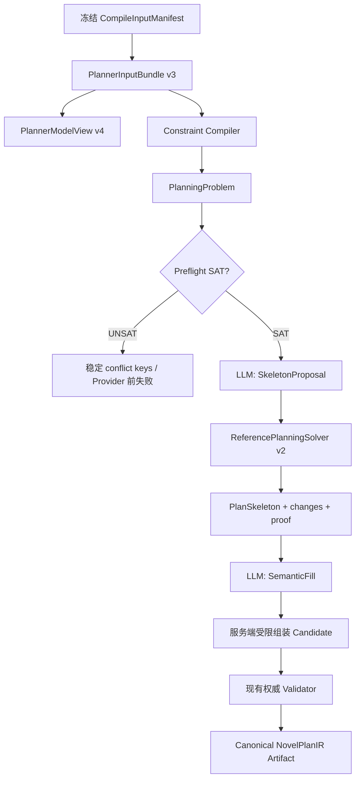

# Constraint-First Story Planner 优化研究文档

> 状态：已完成正式 24×3 晋级并激活生产默认
>
> 范围：N4.3 后端、契约、数据模型、Worker、Benchmark
> 明确不包含：前端、正文生成、N4.4 Scene Renderer

## 1. 结论先行

Constraint-First Story Planner 的提升不是一次 Prompt 文案优化，而是一次规划权责重构：

- LLM 从“直接生成最终 Artifact”降级为受约束的提案者与语义填充者。
- 服务端把冻结输入编译成强类型 PlanningProblem。
- 确定性求解器负责满足硬约束并生成不可被模型覆盖的 PlanSkeleton。
- 最终 Candidate 仍必须经过权威 Validator，模型输出永远不能直接成为 Artifact。

正式结果如下：

| 指标 | 旧生产 `story-planner-v3` | Constraint-First v1 | 变化 |
|---|---:|---:|---:|
| Semantic valid | 67/72，93.06% | 72/72，100% | +5 trials |
| G2 outcome | 40/72，55.56% | 72/72，100% | +32 trials |
| pass@3 | 18/24，75% | 24/24，100% | +6 tasks |
| all-three | 10/24，41.67% | 24/24，100% | +14 tasks |
| Resolution missing | 0 | 0 | 持平 |
| Unsafe | 0 | 0 | 持平 |
| Infrastructure failure | 0 | 0 | 持平 |
| Solver/Repair G2 regression | 旧管线无统一门禁 | 0 | 新增零容忍门禁 |

正式报告 fingerprint：

```text
f43d3b27ea1b926f8ae1634adb62fa3b9a4e10e61748eb481b4df1b3414a3007
```

对应 clean revision：

```text
3b9d2d4b0e56e70c46704f24e2dcc0633ba9fd0d
```

最终 `promotion_gate.evaluated=true` 且 `promotion_gate.qualified=true`。

## 2. 如何理解“100%”

这里的 100% 有严格限定：

- 是冻结 v4 Suite 的 24 个 Task、每 Task 3 trials，共 72 trials。
- Planner 与 G3 都使用精确模型 ID `deepseek-v4-pro`。
- 24 个 Task 覆盖 8 个能力族和 basic/decoy/dense 三种变体。
- G2 仍使用原有 Outcome invariants；Reference Solution 不是唯一正确答案。
- typed obligations 在资产冻结期写入 PlannerInput，Benchmark runtime 不从 Grader、Outcome invariant 或自然语言 note 反推硬约束。

因此它证明的是：

> 当前架构在冻结正式 Suite 上稳定满足契约、语义与能力门禁。

它不证明：

- 任意现实小说项目都能 100% 通过。
- 创作质量已经达到主观意义上的完美。
- 新管线与旧 v3 是纯 Prompt 单变量 A/B。

v4 同时升级了输入契约、数据资产和执行管线，所以应将结果理解为“工程系统能力提升”，而不是“同一输入下模型智力突然提升”。

## 3. 旧管线为什么会卡住

旧管线的核心形态是：

```text
PlannerInput -> 一次 LLM 完整生成 -> 结构修复 -> Validator -> Artifact
```

一次模型调用需要同时完成：

- 设计章节与场景结构；
- 选择 presentation mode；
- 绑定时序锚点；
- 安排 participant、basis 和 hypothesis refs；
- 保证 Exposure 顺序；
- 保证所有 Resolution 精确闭环；
- 构造无环依赖；
- 填写 title、intent、POV、location 等语义字段；
- 输出完全合法的严格 JSON。

这会混合三类本应分离的工作：

1. 创作选择；
2. 约束满足；
3. 合法性证明。

模型只要漏掉其中一个跨场景条件，整份 Candidate 就会被拒绝或在 G2 失败。历史实验中最典型的失败包括：

- `compiler_story_plan_temporal_order_invalid`
- `compiler_story_plan_exposure_violation`
- participant 覆盖不足
- presentation mode 能力缺失
- Resolution 未形成精确终态

单纯增加 Prompt 清单只能缓解一部分遗漏，无法让模型稳定承担确定性证明责任。

## 4. 优化演进证据链

以下结果并非全部可直接横向比较，但能说明问题如何逐步收敛。

| 阶段 | Semantic | G2 | pass@3 | all-three | 结论 |
|---|---:|---:|---:|---:|---|
| `story-planner-v2` | — | 10/72 | — | — | Resolution 大量漏覆盖 |
| `story-planner-v3` | 67/72 | 40/72 | 18/24 | 10/24 | Resolution 修复有效，但综合能力不足 |
| PlannerInput v2 | 54/72 | 54/72 | 21/24 | 13/24 | 输入更明确，仍由模型直接承担全局满足 |
| PlannerModelView v3 | 64/72 | 64/72 | 24/24 | 18/24 | 压缩后的模型视图明显改善 |
| 精确 normalization | 67/72 | 60/72 | 23/24 | 15/24 | Semantic 提升但引入 G2 回退，拒绝晋级 |
| bounded semantic repair | 66/72 | 59/72 | 22/24 | 16/24 | 修复不稳定且增加请求，拒绝晋级 |
| mode-repair v1 | 64/72 | 61/72 | 23/24 | 18/24 | 修复安全，但整体仍未晋级 |
| Constraint-First 初版 18-trial | 18/18 | 15/18 | 5/6 | 5/6 | 暴露 solver 非线性模式回退 |
| Solver v2 18-trial | 18/18 | 18/18 | 6/6 | 6/6 | 诊断门禁通过 |
| Constraint-First 正式 24×3 | 72/72 | 72/72 | 24/24 | 24/24 | 全部门禁通过 |

这里最重要的工程纪律是：Semantic 变好不等于系统变好。只要修复动作引入新的 G2 failure，就必须视为 regression。

## 5. 新管线总览



关键属性：

- UNSAT 在调用 Provider 前失败，避免让模型猜测不可满足问题。
- SkeletonProposal 不是 Artifact，只是求解器输入。
- PlanSkeleton 锁定场景身份、顺序、Exposure、Resolution、必需 refs 和依赖。
- SemanticFill 只能填写模型所有字段，不能覆盖 Skeleton 字段。
- 最终仍使用原有权威 Validator，不以 solver 自证替代生产验证。

## 6. 优化一：强类型结构局部修复

旧结构修复可以重新生成较大 Candidate，修复范围过宽，容易产生无关漂移。

新契约 `compiler.story-plan-structural-patch.v1` 首版只允许：

```text
replace_scene_purpose(scene_id, ScenePurpose)
```

服务端执行以下证明：

- 只能按 `scene_id` 合并；
- 除 `purpose` 外 Candidate 完全不变；
- 未知 Scene、重复 Patch、非法枚举立即失败；
- Patch 必须覆盖目标错误；
- 每次错误数必须下降；
- 最多三次，超限失败关闭。

这项优化主要提升 contract 稳定性，不负责语义能力。它把“修 JSON”限制成可证明的最小变更，而不是让模型借修复机会重写计划。

## 7. 优化二：Typed Semantic Obligations

### 7.1 问题

过去 participant、basis、hypothesis 等要求可能只存在于作者 note 或 Benchmark invariant 中。模型能看到自然语言，但服务端没有强类型、可执行的义务表达。

这会导致两个问题：

- 模型必须从文本中推断哪些是硬约束；
- Validator 无法区分显式用户义务和模型自行推断的要求。

### 7.2 新契约

Exposure Entry 新增可选 `planning_obligations`：

- `participant_coverage`
- `basis_ref_coverage`
- `hypothesis_coverage`

每项 obligation 均具有稳定 `obligation_key` 和 `level`：

- `hard`：进入 `PlannerConstraintIR v2` 与权威 Validator；
- `soft`：只进入模型上下文，不提升为硬约束。

服务端不会从 note、Grader 或 Benchmark runtime 推导新的 hard obligation。

### 7.3 数据一致性

义务和引用被规范化存储：

- `exposure_plan_obligations`
- `exposure_plan_obligation_refs`

引用使用 Project/CaseFile/Draft/Revision 复合归属外键，不把权威引用塞进 JSONB。

Exposure Revision 新增 `payload_schema_id`：

- 历史数据回填 v1；
- 新 revision 写 v2；
- 编译旧 v1 时维持原 JSON 形状；
- 只有 v2 投影 typed obligations。

这保证旧冻结 hash 和既有 Compile Artifact 可复验。

### 7.4 为什么有效

Typed obligations 把“模型最好记得做”变成“系统必须证明已做”。participant、basis 和 hypothesis 覆盖不再依赖模型自检。

## 8. 优化三：Constraint Compiler 与 PlanningProblem

Constraint Compiler 从冻结输入确定性生成：

- Chapter slots；
- Scene slots；
- Structure constraints；
- Exposure introduce order；
- Temporal anchors；
- Resolution terminal requirements；
- Hard semantic obligations；
- 合法 ObjectRef catalog。

`PlanningSolver` 是纯领域接口：

```text
solve(PlanningProblem, SkeletonProposal)
  -> Sat(PlanSkeleton, changes, proof)
  -> Unsat(conflict_keys)
```

接口不依赖 Provider、数据库或具体求解器，也不泄漏 Z3 类型。

静态冲突会在 Provider 前识别，例如：

- obligation 引用了 catalog 中不存在的对象；
- `min_distinct` 大于 eligible refs 的去重数量；
- Resolution requirement 引用了不存在的 Resolution。

因此“不可能完成”的任务不会消耗模型调用，也不会退回 LLM 猜测。

## 9. 优化四：SkeletonProposal 与 SemanticFill 解耦

### 9.1 第一阶段：结构提案

模型只输出小型 SkeletonProposal：

- purpose；
- presentation mode；
- story-time anchors；
- participant refs；
- basis refs；
- Exposure placement；
- Resolution placement；
- dependency preferences。

它不负责写 chapter title、scene intent 等表达字段。

### 9.2 第二阶段：语义填充

求解器生成 PlanSkeleton 后，第二次模型调用只能填写：

- chapter title；
- scene intent；
- POV；
- location；
- event refs 等模型所有字段。

服务端通过严格 Schema 和精确 slot identity 组装。SemanticFill 如果夹带 `purpose` 等 Skeleton 字段，会直接被拒绝。

### 9.3 为什么有效

拆分后，每次调用的认知负担更低：

- 第一次专注规划选择；
- 求解器专注全局一致性；
- 第二次专注语义表达。

模型不再一边写意图文本，一边维护跨场景集合相等、顺序、闭环和 DAG 证明。

## 10. 优化五：确定性参考求解器

参考后端的排序目标是：

1. 修改字段最少；
2. 修改数相同时保留非线性模式；
3. 再按稳定字典序 canonicalize。

它负责：

- 固定 scene/chapter slot identity；
- 过滤未知 refs；
- 规范 Exposure；
- 精确放置 Resolution 终态；
- 满足 hard semantic obligations；
- 修正 temporal mode 与 anchor 的冲突；
- 过滤非法依赖并证明 DAG。

输出 proof 绑定：

- solver version；
- PlanningProblem hash；
- PlanSkeleton hash；
- stable constraint keys；
- ranking identity。

## 11. 关键案例：为什么 Solver v1 是 15/18，而 v2 是 18/18

Constraint-First 初版在 `complex_mixed__decoy` 上连续三次出现：

```text
presentation_mode_present
```

当时的统计：

- Semantic：18/18；
- G2：15/18；
- `solver_g2_regression_count=3`。

根因不是模型没提议 flashback。模型提案原本包含非线性模式，但它绑定了一个相对前场更晚的时序锚点。Solver v1 为满足 temporal constraint，直接把 `flashback` 改成 `linear`。

这虽然让 Semantic 合法，却破坏了 G2 非线性能力要求。

Solver v2 改为：

- 比较“改 mode”和“改 anchor”的字段修改数；
- 两者都是修改一个字段时，按第二排序目标保留非线性模式；
- 将 story-time ref 调整为最近的合法更早锚点，而不是把 flashback 改成 linear。

修复后完整重新运行同一六任务诊断集：

- Semantic：18/18；
- G2：18/18；
- solver regression：0。

随后才允许进入正式 24×3。旧失败报告被保留，没有选择性覆盖或重新标注。

## 12. 模型、求解器与 Validator 的权责矩阵

| 数据/动作 | LLM Skeleton | Solver | LLM Fill | Validator |
|---|---:|---:|---:|---:|
| Scene identity | 提议 | 锁定 | 禁止覆盖 | 复验 |
| Scene order/chapter slot | 提议 | 锁定 | 禁止覆盖 | 复验 |
| Purpose/mode | 提议 | 必要时最小修正 | 禁止覆盖 | 复验 |
| Temporal anchors | 提议 | 硬约束修正 | 禁止覆盖 | 复验 |
| Participant/basis refs | 提议 | 满足 hard obligations | 禁止覆盖 | 复验 |
| Exposure/Resolution | 提议 | 权威规范化 | 禁止覆盖 | 复验 |
| Dependencies | 提议 | 过滤并证明 DAG | 禁止覆盖 | 复验 |
| Title/intent/POV/location | 不负责 | 不负责 | 填写 | Schema/引用复验 |
| 最终 Artifact | 无权生成 | 无权生成 | 无权生成 | 通过后由服务端 canonicalize |

该矩阵是本轮优化最核心的设计成果：任何模型阶段都不能越权成为 Artifact。

## 13. Durable Worker 与 exact-hash 恢复

两个模型阶段使用独立且不可变的 Prompt：

- `story-planner-skeleton-v1`
- `story-planner-semantic-fill-v1`

每次 AgentModelCall 记录：

- stage：`skeleton_proposal` / `semantic_fill`；
- 独立 input hash；
- Prompt version/hash；
- target schema；
- raw output/hash；
- usage 与 latency。

Worker 崩溃恢复只允许：

- 同一 stage；
- 同一输入 hash；
- 调用状态 succeeded；
- 输出未截断；
- 无结构问题；
- 输出 hash 可复验。

任何版本、Prompt、Solver、PlanningProblem 或模型视图变化都会改变 component fingerprint，旧成功调用不会被错误复用。

生产激活后：

- 新建且配置 Planner Provider 的 TaskRun 默认使用 `compiler.story-planner.constraint-first.v1`；
- TaskRun 以 `story-planner-constraint-first-v1` 记录 Prompt bundle 身份；
- 历史 `compiler.story-planner.v1` / `story-planner-v3` TaskRun 仍走遗留分支精确重放；
- 没有 Planner Provider 时维持 N4.2 providerless Compile，不创建 Provider。

## 14. Z3 为什么没有进入依赖

本轮先实现纯领域 `PlanningSolver` 接口和确定性参考后端，再冻结：

- SAT/UNSAT cases；
- 8/32/100/500 Scene 压力集；
- 100 次同输入 canonical determinism；
- 500 Scene 的 2 秒硬预算。

参考后端结果：

- 所有合法混合问题均支持；
- SAT/UNSAT oracle 正确；
- stable conflict keys 正确；
- 100 次产生同一 skeleton hash；
- 500 Scene 满足 2 秒预算。

所以没有触发 Z3 原型条件，也没有引入 `z3-solver`。接口扩展点保留，将来只有出现参考后端无法稳定最小求解的合法问题时，才重新评估 Z3。

## 15. 正式晋级门禁

正式 v4 gate：

- Semantic ≥ 67/72；
- G2 ≥ 65/72；
- pass@3 = 24/24；
- all-three ≥ 18/24；
- structural exhaustion = 0；
- Resolution missing = 0；
- unsafe = 0；
- infrastructure failure = 0；
- repair/solver G2 regression = 0；
- 完整 72 trials；
- G3 paired bootstrap 95% 下界 ≥ -0.03；
- 任一 G3 维度均值下降不超过 0.05。

正式结果：

| Gate | 结果 |
|---|---:|
| Semantic | 72/72 |
| G2 | 72/72 |
| pass@3 | 24/24 |
| all-three | 24/24 |
| Structural exhaustion | 0 |
| Resolution missing | 0 |
| Unsafe | 0 |
| Infrastructure failure | 0 |
| Repair G2 regression | 0 |
| Solver G2 regression | 0 |
| Complete 24×3 | 是 |

G3 task-cluster paired bootstrap：

| 指标 | 结果 | 门槛 |
|---|---:|---:|
| Mean delta | +0.041412 | 诊断 |
| 95% CI lower | -0.020718 | ≥ -0.03 |
| Opening delta | +0.044028 | ≥ -0.05 |
| Escalation delta | +0.025972 | ≥ -0.05 |
| Turn setup delta | +0.077083 | ≥ -0.05 |
| POV delta | +0.015000 | ≥ -0.05 |
| Climax delta | +0.031944 | ≥ -0.05 |
| Closure delta | +0.054444 | ≥ -0.05 |

这说明强约束没有通过牺牲 G3 软质量获得 G2 满分。

生产激活后的完整工程门禁：

- `backend/tests`：909 passed，9 个既有条件性 skip；
- PostgreSQL 空库、旧版本升级、Exposure API 与 Compiler runtime：通过；
- 契约生成漂移：通过；
- Python contract tests 与 TypeScript roundtrip：通过；
- 配置化 mypy：通过；
- 本次变更范围 Ruff：通过；
- Alembic 单头单链与 `No new upgrade operations`：通过。

## 16. 成本与性能 Trade-off

Constraint-First 不是免费提升。

### 16.1 调用数

旧 v3 主要是每 trial 一次 Planner 调用；新管线固定为两次：

```text
SkeletonProposal + SemanticFill
```

正式 v4 72 trials：

- Planner 请求：144；
- Planner tokens：1,072,560；
- G3 请求：72；
- G3 tokens：201,128。

旧 v3 正式报告：

- Planner 请求：73；
- Planner tokens：1,451,533；
- G3 请求：67；
- G3 tokens：179,992。

虽然调用次数接近翻倍，但新管线的两个输入更聚焦，总 Planner token 反而低于旧 v3 报告。不能仅凭该次样本断言普遍更便宜，仍需按真实项目规模做 token/latency 分层统计。

### 16.2 延迟

正式 v4 总 trial latency 约 3,609 秒，其中包含串行 Planner 与 G3 网络等待。生产体验需要关注：

- 两阶段串行调用增加单任务 wall time；
- cache 命中能明显降低重复输入成本；
- exact-hash 恢复可避免 Worker 崩溃后的重复计费；
- Provider 前 UNSAT 能避免无意义调用。

## 17. 为什么这不是 Benchmark 偷答案

需要区分“显式任务契约”与“运行时偷看答案”。

允许的做法：

- 在 Suite 冻结期，把本应由用户输入表达的 participant/basis/hypothesis 要求写成 typed obligations；
- 将 obligations 作为 PlannerInput 的一部分参与 hash；
- 由生产 Validator 使用同一强类型契约复验。

禁止的做法：

- Benchmark runtime 读取 Outcome invariant 后临时生成 hard obligation；
- 从 G2 失败结果反向修改同一 trial 输入；
- 从 Grader 结果推断约束；
- 把自然语言 note 自动提升为 hard constraint；
- 只重跑失败 trial 并合并成“正式报告”。

本轮还专门修正了一个资产问题：participant obligation 的 eligible refs 最初按全 ObjectRef 字典选择，可能把 Claim/Constraint 当参与者。正式资产改为只允许 Entity refs，并重新冻结全部输入 hash 后再运行正式 24×3。

因此当前结果是“显式契约驱动的系统成功”，不是 runtime 使用隐藏答案。不过，由于 v4 obligations 的设计参考了既有能力族，它仍可能对当前 Suite 形成结构性适配；这也是下一阶段必须建设外部 holdout 的原因。

## 18. 仍然存在的风险

### 18.1 Suite 覆盖风险

24 个 Task 不能覆盖真实长篇项目的全部复杂度，例如：

- 数十章节、数百场景；
- 多 Exposure Entry 交错；
- 多时间线并行与不完全可比时间；
- 条件式 Resolution；
- 角色身份变化、伪装和同一性冲突；
- 跨章节知识状态传播。

### 18.2 Solver 目标函数风险

“修改字段最少”不总等于创作意图保真。当前第二排序明确保留非线性模式，但未来可能还要冻结：

- 保留 POV 分布；
- 保留关键场景位置；
- 保留因果路径；
- 避免将大量 obligation 集中到同一场景。

这些不能从 Benchmark 自动推导成硬约束，应先设计正式契约。

### 18.3 两阶段漂移风险

SemanticFill 虽然不能覆盖 Skeleton，但仍可能产生：

- intent 与 Skeleton purpose 表意不一致；
- POV/location 合法但叙事上不自然；
- event refs 合法但表达弱；
- title 与章节功能不匹配。

当前 G3 没有显示总体回退，但外部 holdout 仍需关注这些软质量问题。

### 18.4 生产分布风险

Benchmark 使用固定模型与规范输入。真实数据可能包含：

- 边界 Schema 组合；
- 历史 v1 Exposure；
- 极少或极多 ObjectRef；
- 用户自定义 Profile；
- Provider 行为变化。

需要 Shadow telemetry，而不是仅依赖离线 Suite。

## 19. 下一阶段研究建议

### 19.1 外部 Holdout v1

建立一套不参与当前 obligations 和 Prompt 设计的 holdout：

- 新故事资产；
- 新能力组合；
- 新失败模式；
- 由独立规则作者冻结 typed obligations；
- 先冻结资产和 fingerprint，再运行模型。

建议最少包含：

- 12 个中等复杂 Task × 3 trials；
- 6 个长结构 Task × 3 trials；
- 6 个 adversarial Task × 3 trials。

### 19.2 生产 Shadow

对真实 CompileRun 记录但不影响用户结果的诊断：

- solver changes 数量与字段分布；
- UNSAT/unsupported 比例；
- 每阶段 token、latency、cache hit；
- Skeleton 与 Fill 的 Schema 失败；
- Validator rejection code；
- G2-like deterministic capability signals；
- exact-hash recovery 命中率。

### 19.3 消融实验

为了确认 100% 的贡献来源，应按单变量闭环做消融：

1. v4 typed obligations + 无 solver；
2. solver + 单阶段完整输出；
3. Skeleton/Fill 两阶段 + 无 semantic obligations；
4. Solver v1 与 v2 排序对比；
5. Reference solver 与未来候选 solver 对比。

每轮必须冻结 Suite、模型、Validator、Prompt、预算、trials 和 Grader，只改变一个维度。

### 19.4 成本优化

可研究：

- SemanticFill 输入进一步裁剪；
- 不同 Task 复杂度的动态 token budget；
- Skeleton/Fill cache 分层复用；
- 对完全确定的简单 Task 跳过部分模型字段；
- 批量 G3 或离线 G3，不影响生产主路径。

任何成本优化都必须重新验证 G2/G3 和 exact-hash 恢复边界。

## 20. 研究时应保留的核心原则

1. 模型输出不是 Artifact。
2. 硬约束只能来自显式 typed contract，不能从 note 或 Grader 推断。
3. Semantic 通过不等于 Capability 晋级。
4. 修复和求解器必须单独统计 G2 regression。
5. 失败报告不可选择性重跑后改名为正式证据。
6. 版本、Prompt、Solver、Schema、输入和模型视图都必须进入 fingerprint。
7. Providerless N4.2 行为必须保持不变。
8. 历史 TaskRun 必须按旧 agent/prompt 精确重放。
9. 先证明参考后端不足，再考虑 Z3 等更重依赖。
10. 100% Suite 成绩之后仍要做外部 holdout 和生产 Shadow。

## 21. 代码与证据索引

核心实现：

- `backend/src/casefile/domain/narrative_compiler/planning_solver.py`
- `backend/src/casefile/agent_runtime/constraint_first_story_planner.py`
- `backend/src/casefile/worker/executors/story_planner.py`
- `backend/src/casefile/benchmark/novel_plan_eval.py`

契约与资产：

- `contracts/schemas/compiler/constraint-first-planner.schema.json`
- `fixtures/novel_plan_benchmark/v4/suite.json`
- `fixtures/novel_plan_benchmark/v4/g3_baseline_v3.json`
- `fixtures/novel_plan_solver/reference_backend_stress_v1.json`

聚合发布证据：

- `docs/releases/N4.3-story-planner.md`

本地原始报告，不提交 Git：

- `backend/var/benchmark/constraint_first_phase3_live.json`
- `backend/var/benchmark/constraint_first_phase3_live_v2.json`
- `backend/var/benchmark/constraint_first_v4_formal.json`

关键提交：

```text
f782425 test: 增加故事规划器定向诊断评测
2bb2167 fix: 收紧故事规划器结构化局部修复
1d3af7b feat: 扩展披露计划语义义务契约
26694c9 feat: 引入约束优先故事规划骨架
44aefd8 test: 冻结约束优先故事规划正式评测
3b9d2d4 fix: 保留合法非线性规划模式
3f66eb4 feat: 激活约束优先故事规划器
```

## 22. 最终判断

本轮最值得复用的经验不是某段 Prompt，而是：

> 当 LLM 同时承担创作、约束满足和证明责任时，继续增加自然语言规则很快会遇到上限。将可形式化部分下沉为 typed obligations、Constraint Compiler、PlanSkeleton 和权威 Validator，才能把概率性生成变成可发布的工程系统。

Constraint-First 并没有消灭模型的不确定性，而是把不确定性限制在适合模型的选择与表达空间中，并把不可妥协的正确性重新交给服务端。
