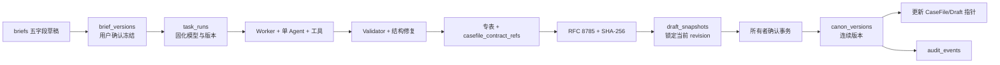

# CaseFile 个人版基座数据库表字段说明

本文描述 PostgreSQL 18 的 CaseFile 个人版六段 Alembic 基线。最终结构恰好 37 张业务表，采用“确认 Brief + PostgreSQL 任务队列 + 轻量对象注册表 + 规范化专用内容表 + 契约引用映射 + 不可变完整 JSON 快照”。

**本基线不存在 Workspace、Membership、成员、邀请、团队角色、评论、Review Task、共享项目或团队预算字段与占位表。**

## 1. 总体约定

| 约定 | 数据库表示 | 说明 |
|---|---|---|
| 主键 | `BIGINT GENERATED BY DEFAULT AS IDENTITY PRIMARY KEY` | 37 张表统一使用自增主键；允许导入显式赋值。 |
| 外键 | `BIGINT` | 不使用 UUID 主键；契约稳定字符串 ID 不参与关系连接。 |
| 稳定对象 ID | `casefile_objects.object_id VARCHAR(128)` | JSON 契约使用的稳定字符串；CaseFile 内唯一，软删除后不复用。 |
| 当前态归属 | `project_id + casefile_id + draft_id` | 当前态与任务表携带完整归属，复合外键防止跨归属串联。 |
| 有限状态 | `VARCHAR + CHECK` | 不使用 PostgreSQL ENUM。 |
| 开放叶子 | `JSONB` | 只存来源、traits、geo、时间、规则、动态值、边属性等；不存身份、状态、版本或引用。 |
| 完整版本 | `snapshot_jsonb` / `content_jsonb` | Snapshot 与 Canon 保存完整不可变 CaseFile JSON。 |
| 哈希 | `VARCHAR(64)` | RFC 8785 Canonical JSON 的 UTF-8 字节 SHA-256，小写十六进制。 |
| 时间 | `TIMESTAMPTZ` | 默认 `CURRENT_TIMESTAMP`；可变表由触发器维护 `updated_at`。 |

`casefile_objects` 不含 `payload_jsonb`。规范化专表是 Draft 当前态的唯一事实源；v1 投影器已经从专表和 `casefile_contract_refs` 组装 JSON，数据库触发器不自行拼装文档。

CaseFile v1 JSON 顶层固定为：`casefile`、`resolutions`、`entities`、`relationships`、`locations`、`events`、`information_units`、`claims`、`hypotheses`、`reasoning_paths`、`phases`、`constraints`、`structure_locks`。JSON ObjectRef 使用稳定字符串 `object_type + object_id`；数据库内部 BIGINT 只做关系连接，不输出为领域 ID。字段映射细节见 `contracts/casefile-postgres-mapping.md`。

## 2. 完整关系图



[单独打开 SVG 关系图](./数据库表关系图.svg) · [查看可维护的 Mermaid 图源](./数据库表关系图.mmd)

上图保留旧 28 张核心内容表的独立关系图；下方 Mermaid 已补齐本期 9 张输入、契约映射与任务表，应以本文件和迁移 head 为最新标准。

### 2.1 分层关系总览

实线表示正式主外键或 1:1 扩展关系，虚线表示注册类型匹配或当前/基准指针。所有专用当前态表还直接携带 `project_id + casefile_id + draft_id`，通过复合外键归属于同一 Draft；图中只画一次对象注册主线，避免 18 条重复归属线遮挡内容关系。

```mermaid
flowchart TB
    subgraph ownership["个人所有权与编辑底座"]
        direction LR
        U["users"] -->|"1:N owns"| P["projects"]
        P -->|"1:1"| CF["casefiles"]
        CF -->|"1:1 current"| D["drafts"]
        D -->|"1:N registers"| O["casefile_objects"]
        O -->|"from / to"| R["casefile_refs"]
        O -->|"v1 ObjectRef source"| CR["casefile_contract_refs"]
        D -->|"1:N append-only"| OP["draft_operations"]
        O -->|"0..1 target"| OP
    end

    subgraph workflow["输入、模型设置与任务执行"]
        direction LR
        U -->|"1:N provider"| PS["user_provider_settings"]
        P -->|"1:1"| B["briefs"]
        B -->|"1:N immutable"| BV["brief_versions"]
        BV -->|"1:N input"| TR["task_runs"]
        PS -->|"1:N pinned config"| TR
        D -->|"1:N target"| TR
        TR -->|"1:N"| TA["task_attempts"]
        TR -->|"1:N SSE replay"| TV["task_events"]
        TR -. "result_snapshot_id" .-> DS
    end

    subgraph narrative["叙事、实体与信息"]
        direction LR
        NP["narrative_phases"]
        EN["entities"] -->|"1:0..1 person"| PE["people"]
        EN -->|"1:0..1 location"| LO["locations"]
        RL["relationships"]
        NP -->|"0..N phase"| EV["events"]
        LO -->|"0..N occurs_at"| EV
        NP -->|"0..N visible_from"| IU["information_units"]
        IU -->|"1:0..1 evidence"| EI["evidence_items"]
        EV -->|"0..N source_event"| EI
        IU -->|"1:0..1 testimony"| TE["testimonies"]
        PE -->|"1:N speaker"| TE
        CL["claims"]
    end

    subgraph reasoning["假设、推理、结论与约束"]
        direction LR
        HY["hypotheses"]
        RP["reasoning_paths"] -->|"1:N"| RN["reasoning_nodes"]
        RP -->|"1:N"| RE["reasoning_edges"]
        RN -->|"from_node / to_node"| RE
        O -->|"0..N source_object"| RN
        RS["resolution_specs"] -->|"1:N"| SL["resolution_slots"]
        CO["casefile_constraints"]
        LK["structure_locks"]
        O -->|"0..N target_object"| CO
    end

    subgraph knowledge["阶段化知识状态"]
        direction LR
        EN -->|"1:N knower"| KS["knowledge_states"]
        NP -->|"1:N phase"| KS
        KS -->|"1:N"| KE["knowledge_state_entries"]
        IU -->|"1:N information"| KE
        O -->|"0..N acquired_from"| KE
    end

    subgraph history["不可变版本与审计"]
        direction LR
        D -->|"1:N freezes"| DS["draft_snapshots"]
        DS -->|"1:0..1 becomes"| CV["canon_versions"]
        CF -->|"1:N versions"| CV
        CV -->|"0..1 parent"| CV
        CF -. "current_canon_version_id" .-> CV
        D -. "base_canon_version_id" .-> CV
        P -->|"1:N"| AU["audit_events"]
        CF -->|"0..N scope"| AU
        U -->|"creates / confirms / acts"| DS
        U -->|"confirms"| CV
        U -->|"acts"| AU
    end

    O -. "object_type = narrative_phase" .-> NP
    O -. "object_type = entity" .-> EN
    O -. "object_type = relationship" .-> RL
    O -. "object_type = location" .-> LO
    O -. "object_type = event" .-> EV
    O -. "object_type = information_unit" .-> IU
    O -. "object_type = claim" .-> CL
    O -. "object_type = hypothesis" .-> HY
    O -. "object_type = reasoning_path" .-> RP
    O -. "object_type = resolution_spec" .-> RS
    O -. "object_type = constraint" .-> CO
    O -. "object_type = structure_lock" .-> LK
    O -. "object_type = knowledge_state" .-> KS

    R -. "event_actor / adjacency / supports / refutes / hypothesis links" .-> EV
    R -. "multi-value target" .-> EN
    R -. "multi-value target" .-> IU
    R -. "multi-value target" .-> CL
    R -. "multi-value source" .-> HY
```



### 2.2 外键基数图

```mermaid
erDiagram
    users ||--o{ projects : owns
    projects ||--|| casefiles : contains
    casefiles ||--|| drafts : has_current
    drafts ||--o{ casefile_objects : registers
    casefile_objects ||--o{ casefile_refs : from
    casefile_objects ||--o{ casefile_refs : to
    drafts ||--o{ draft_operations : records
    users ||--o{ user_provider_settings : configures
    projects ||--|| briefs : owns
    briefs ||--o{ brief_versions : freezes
    brief_versions ||--o{ task_runs : inputs
    user_provider_settings ||--o{ task_runs : configures
    drafts ||--o{ task_runs : targets
    task_runs ||--o{ task_attempts : attempts
    task_runs ||--o{ task_events : emits
    casefile_objects ||--o{ casefile_contract_refs : references

    casefile_objects ||--o| narrative_phases : describes
    casefile_objects ||--o| entities : describes
    casefile_objects ||--o| relationships : describes
    entities ||--o| people : person_extension
    entities ||--o| locations : location_extension
    casefile_objects ||--o| events : describes
    narrative_phases o|--o{ events : reveals
    locations o|--o{ events : occurs_at
    casefile_objects ||--o| information_units : describes
    narrative_phases o|--o{ information_units : visible_from
    information_units ||--o| evidence_items : evidence_extension
    events o|--o{ evidence_items : source_event
    information_units ||--o| testimonies : testimony_extension
    people ||--o{ testimonies : speaker
    casefile_objects ||--o| claims : describes
    casefile_objects ||--o| hypotheses : describes

    casefile_objects ||--o| reasoning_paths : describes
    reasoning_paths ||--o{ reasoning_nodes : contains
    reasoning_paths ||--o{ reasoning_edges : contains
    reasoning_nodes ||--o{ reasoning_edges : from_node
    reasoning_nodes ||--o{ reasoning_edges : to_node
    casefile_objects o|--o{ reasoning_nodes : source

    casefile_objects ||--o| resolution_specs : describes
    drafts ||--o| resolution_specs : resolves
    resolution_specs ||--o{ resolution_slots : contains
    casefile_objects ||--o| casefile_constraints : describes
    casefile_objects ||--o| structure_locks : describes
    casefile_objects o|--o{ casefile_constraints : target

    casefile_objects ||--o| knowledge_states : describes
    entities ||--o{ knowledge_states : knower
    narrative_phases ||--o{ knowledge_states : phase
    knowledge_states ||--o{ knowledge_state_entries : contains
    information_units ||--o{ knowledge_state_entries : knows
    casefile_objects o|--o{ knowledge_state_entries : acquired_from

    drafts ||--o{ draft_snapshots : freezes
    draft_snapshots o|--o| task_runs : result
    draft_snapshots ||--o| canon_versions : becomes
    casefiles ||--o{ canon_versions : versions
    canon_versions o|--o{ canon_versions : parent
    casefiles o|--o| canon_versions : current
    canon_versions o|--o| drafts : baseline
    projects ||--o{ audit_events : owns
    casefiles o|--o{ audit_events : scopes
```

旧纵向切片的语义边仍使用 `casefile_refs`；CaseFile v1 中所有 ObjectRef 统一落在 `casefile_contract_refs`，目标以契约 `object_type + object_id` 表示并由 Validator 校验。规范化表之间的稳定单值关系仍使用带归属列的正式复合外键。

## 3. 37 张表职责总览

这一节回答“每张表为什么存在、负责保存哪一类事实”。一项事实只能有一个主要事实源，避免注册表、专用表、Snapshot 和 Audit 之间重复承责。

| 表 | 负责什么 | 职责边界 |
|---|---|---|
| `users` | 负责表达个人账号主体、展示名和账号可用状态。 | 不负责密码、邮箱、OAuth、会话、套餐或团队身份。 |
| `projects` | 负责作为个人数据的所有权聚合根，保存唯一所有者、项目资料和归档状态。 | 不负责成员列表、共享权限或 CaseFile 具体正文。 |
| `user_provider_settings` | 负责用户级 Provider、模型、预算、配置版本和 AES-256-GCM API Key 密文。 | 不保存可回显明文，不承担登录认证或 JWT。 |
| `briefs` | 负责 Project 唯一的五字段可变 Brief 草稿和当前确认版本指针。 | 不作为 Agent 的不可变输入；生成只消费 BriefVersion。 |
| `brief_versions` | 负责用户确认后的 Brief 内容、连续版本号、哈希和确认责任。 | 只追加，不覆盖草稿或历史版本。 |
| `casefiles` | 负责一个 Project 的结构化卷宗入口、当前 Schema 版本、生命周期状态和当前 Canon 指针。 | 不负责保存可编辑对象正文，也不复制完整 Canon JSON。 |
| `drafts` | 负责一个 CaseFile 唯一当前编辑态的 v1 版本链、Brief 来源、整体 revision、锁定状态和基准 Canon。 | 不负责记录每个对象的正文或历史版本内容。 |
| `casefile_objects` | 负责所有核心 CaseFile 对象的稳定字符串 `object_id`、契约顺序、注册类型、来源、标签、置信度、确认状态和软删除。 | 不负责类型正文；没有通用 `payload_jsonb`。 |
| `casefile_refs` | 负责同一 Draft 内跨类型、多值、有顺序的对象引用边及开放边属性。 | 不承载 Event → Location 等单值关系，也不取代专用外键。 |
| `casefile_contract_refs` | 负责 v1 ObjectRef 的来源对象/字段路径、目标稳定类型/ID、顺序和开放元数据。 | 不要求所有目标都有注册行；语义完整性由 v1 Validator 校验。 |
| `draft_operations` | 负责记录 Draft 从一个 revision 到下一个 revision 的有序编辑及 Actor，包含一次全量 Agent 生成操作。 | 不是当前态事实源，不保存完整 Draft，也不等同于 TaskEvent。 |
| `narrative_phases` | 负责定义叙事阶段的名称、顺序、描述、发布规则和状态。 | 不负责记录具体 Entity 的知识内容或 Event 正文。 |
| `entities` | 负责 Person、Location、Organization、Object、Concept 等对象的通用身份、名称、描述和共享属性。 | 不负责 Person/Location 专属字段；专属内容进入扩展表。 |
| `relationships` | 负责 v1 一等 Relationship 对象的标题、关系类型、方向、真值和可见性。 | 关系端点等 ObjectRef 写入 `casefile_contract_refs`。 |
| `people` | 负责 Person Entity 的角色和背景扩展。 | 不负责人物知识随阶段变化的内容；该职责属于 Knowledge State。 |
| `locations` | 兼容旧 Location Entity 扩展并负责 v1 独立 Location 的名称、地理、移动、访问和可见规则。 | 两种路径通过 `entity_id` 或 `object_registry_id` 区分。 |
| `events` | 负责事件标题、摘要、时间结构、叙事顺序、阶段、地点、可见性和真值状态。 | 不直接保存多值 Actor；Actor 关系进入 `casefile_refs`。 |
| `information_units` | 负责 Evidence、Testimony、Document、Observation 等信息的通用标题、正文、可信度、可见阶段、误导和状态。 | 不负责 Evidence/Testimony 的专属字段，也不直接保存支持/反驳数组。 |
| `evidence_items` | 负责 Evidence Information Unit 的证据类型及可选来源 Event。 | 不重复保存标题、正文、可信度或 Claim 关系。 |
| `testimonies` | 负责 Testimony Information Unit 的说话人、证词原文和暂存音频资源引用。 | 不重复保存通用信息字段；不承担正式 Asset 管理。 |
| `claims` | 负责可被支持、反驳或争议的断言正文及当前判定状态。 | 不嵌入证据列表；Information → Claim 关系进入引用边。 |
| `hypotheses` | 负责候选解释的标题、摘要、状态、得分和排除规则。 | 不嵌入 Claim 或必需信息数组；这些多值关系进入引用边。 |
| `reasoning_paths` | 负责一条推理路径的名称、推理类型、状态、置信度、人工确认和摘要。 | 不把整个推理图塞入 JSONB；节点和边分别存表。 |
| `reasoning_nodes` | 负责 Path 内稳定节点 key、顺序、来源对象、节点类型、陈述和开放节点属性。 | 不负责跨 Path 连接，也不复制来源对象正文。 |
| `reasoning_edges` | 负责同一 Path 内两个 Node 之间的有向论证关系、置信度、人工确认和边属性。 | 不允许跨 Path 或自环；不承担通用 CaseFile 对象引用。 |
| `resolution_specs` | 负责 v1 多个动态结论规格，包括标题、问题类型、目标问题、结论模式、可接受答案与公平性要求。 | 不固定成预设 `answer_tuple`；每个 Resolution 通过稳定对象 ID 区分。 |
| `resolution_slots` | 负责 Resolution Spec 内动态槽位的稳定 key、标签、必填性、顺序和值。 | 不定义整个问题；槽位只在所属 Spec 内有意义。 |
| `casefile_constraints` | 负责硬/软约束的类型、规则、可选目标、启用状态和冲突状态。 | 不负责执行 Validator 或生成 Validator Report。 |
| `structure_locks` | 负责 v1 结构锁的标题、强度、字段路径和原因。 | 不执行锁策略；生成与编辑服务消费其声明。 |
| `knowledge_states` | 负责某个 Entity 在某个 Narrative Phase 的总体知识状态和说明。 | 不直接存储多条 Information Unit 认知明细。 |
| `knowledge_state_entries` | 负责 Knowledge State 内每个 Information Unit 的认知状态、披露状态、获得来源、确定度和顺序。 | 不复制 Information Unit 正文，也不取代 Narrative Phase 发布规则。 |
| `task_runs` | 负责一次生成任务的不可变输入指针、Provider/模型、Schema/Agent/Prompt/Toolset 版本、预算、lease、用量、状态和结果。 | 不存 API Key 明文，不存隐藏思维链。 |
| `task_attempts` | 负责每次 Worker 执行的候选 JSON、Validator 错误、用量和失败摘要。 | 不作为 SSE 回放日志，不覆盖前一次尝试。 |
| `task_events` | 负责按 sequence 回放安全阶段、工具摘要、Validator、用量与终态事件。 | 只追加；不展示或持久化模型隐藏思维链。 |
| `draft_snapshots` | 负责冻结某个当前 Draft revision 的完整 CaseFile JSON、Schema 版本和内容哈希。 | 不表示正式确认，不记录逐步编辑过程；只追加且不可修改。 |
| `canon_versions` | 负责保存个人所有者确认的连续正式版本、父版本、来源 Snapshot、完整 JSON、哈希和确认责任。 | 不嵌入 Audit，不允许覆盖历史，不承担协作审批。 |
| `audit_events` | 负责记录关键动作的项目范围、Actor、动作、目标、Trace 和结构化摘要。 | 不保存完整业务正文，不参与 Canon 内容哈希，也不替代 Operation。 |

## 4. 逐字段定义

以下“必填”表示 `NOT NULL`，“可空”表示允许 `NULL`。

### 4.1 身份、项目与编辑底座

#### `users` — 负责个人账号主体

| 字段 | 类型 / 默认 | 含义 |
|---|---|---|
| `id` | BIGINT Identity；必填 | 自增主键。 |
| `display_name` | VARCHAR(120)；必填 | 个人账号展示名。 |
| `status` | VARCHAR(20)；默认 `active` | `active/disabled`。 |
| `created_at` | TIMESTAMPTZ；默认当前时间 | 创建时间。 |
| `updated_at` | TIMESTAMPTZ；默认当前时间 | 数据库维护的更新时间。 |

#### `projects` — 负责个人项目所有权聚合

| 字段 | 类型 / 默认 | 含义 |
|---|---|---|
| `id` | BIGINT Identity；必填 | 自增主键。 |
| `owner_user_id` | BIGINT；必填 | 唯一所有者，FK → `users.id`；创建后不可变。 |
| `title` | VARCHAR(200)；必填 | 项目标题。 |
| `description` | TEXT；可空 | 项目说明。 |
| `profile_jsonb` | JSONB；默认 `{}` | 开放的项目画像对象。 |
| `status` | VARCHAR(20)；默认 `active` | `active/archived`。 |
| `archived_at` | TIMESTAMPTZ；可空 | 归档时间，与状态一致。 |
| `created_at` | TIMESTAMPTZ | 创建时间。 |
| `updated_at` | TIMESTAMPTZ | 数据库维护的更新时间。 |

#### `user_provider_settings` — 负责用户级模型与密文凭证

| 字段 | 类型 / 默认 | 含义 |
|---|---|---|
| `id` | BIGINT Identity | Provider 设置主键。 |
| `user_id` | BIGINT；必填 | FK → `users.id`；与 `provider` 组合唯一。 |
| `provider` | VARCHAR(40)；必填 | snake_case Provider 标识。 |
| `model_id` | VARCHAR(160)；必填 | 模型 ID，默认工作流使用 `gpt-5.6-sol`。 |
| `model_is_custom` | BOOLEAN；默认 false | 是否为用户自定义模型 ID。 |
| `config_version` | BIGINT；默认 1 | 每次设置变化递增，TaskRun 固化该版本。 |
| `secret_ciphertext` | BYTEA；必填 | AES-256-GCM 密文，API 永不回显。 |
| `secret_nonce` | BYTEA；必填 | 12 字节 GCM nonce。 |
| `key_version` | BIGINT；默认 1 | 主密钥轮换版本。 |
| `secret_last_four` | VARCHAR(4)；必填 | 仅供 UI 识别凭证的后四位。 |
| `credential_status` | VARCHAR(20)；默认 `unverified` | `unverified/valid/invalid`。 |
| `default_budget_jsonb` | JSONB；默认 `{}` | 用户默认生成预算对象。 |
| `validated_at` | TIMESTAMPTZ；可空 | 最近成功验证时间。 |
| `validation_error_code` | VARCHAR(80)；可空 | 最近验证错误码，不含密钥。 |
| `created_at` / `updated_at` | TIMESTAMPTZ | 创建/数据库更新时间。 |

#### `briefs` — 负责 Project 唯一可变 Brief 草稿

| 字段 | 类型 / 默认 | 含义 |
|---|---|---|
| `id` | BIGINT Identity | Brief 主键。 |
| `project_id` | BIGINT；必填且唯一 | FK → `projects.id`，形成 Project 1:1 Brief。 |
| `public_id` | VARCHAR(64)；必填且唯一 | `brief_...` 契约稳定 ID。 |
| `draft_revision` | INTEGER；默认 1 | 草稿乐观锁 revision。 |
| `draft_jsonb` | JSONB；默认 `{}` | 五字段结构化草稿对象。 |
| `current_version_id` | BIGINT；可空 | 当前已确认 BriefVersion 的复合 FK。 |
| `created_at` / `updated_at` | TIMESTAMPTZ | 创建/数据库更新时间。 |

#### `brief_versions` — 负责不可变确认输入

| 字段 | 类型 / 默认 | 含义 |
|---|---|---|
| `id` | BIGINT Identity | BriefVersion 主键。 |
| `project_id` | BIGINT；必填 | Project 归属。 |
| `brief_id` | BIGINT；必填 | 所属 Brief；与 `version_no` 组合唯一。 |
| `version_no` | INTEGER；必填 | 从 1 连续递增的确认版本号。 |
| `content_jsonb` | JSONB；必填 | 已按 Brief Schema 校验的五字段内容。 |
| `content_hash` | VARCHAR(64)；必填 | RFC 8785 Canonical JSON SHA-256。 |
| `confirmed_by_user_id` | BIGINT；必填 | 确认用户，必须为项目所有者。 |
| `confirmed_at` | TIMESTAMPTZ；默认当前时间 | 确认时间。 |

#### `casefiles` — 负责结构化卷宗入口与当前 Canon 指针

| 字段 | 类型 / 默认 | 含义 |
|---|---|---|
| `id` | BIGINT Identity | 自增主键。 |
| `project_id` | BIGINT；必填 | FK → `projects.id`；同时唯一，形成 Project 1:1 CaseFile。 |
| `object_id` | VARCHAR(64)；必填且唯一 | `case_...` v1 契约稳定 ID。 |
| `title` | VARCHAR(200)；必填 | CaseFile 标题。 |
| `schema_version` | VARCHAR(32)；必填 | 当前 CaseFile JSON Schema 版本。 |
| `status` | VARCHAR(20)；默认 `draft` | `draft/canon/archived`。 |
| `current_canon_version_id` | BIGINT；可空 | 当前正式版复合 FK → `canon_versions`。 |
| `archived_at` | TIMESTAMPTZ；可空 | 归档时间。 |
| `created_at` | TIMESTAMPTZ | 创建时间。 |
| `updated_at` | TIMESTAMPTZ | 数据库维护的更新时间。 |

#### `drafts` — 负责唯一当前编辑态与整体 revision

| 字段 | 类型 / 默认 | 含义 |
|---|---|---|
| `id` | BIGINT Identity | 自增主键。 |
| `project_id` | BIGINT；必填 | Project 归属。 |
| `casefile_id` | BIGINT；必填 | CaseFile 归属；与 Project 组合唯一。 |
| `base_canon_version_id` | BIGINT；可空 | 当前编辑基准 Canon。 |
| `revision` | INTEGER；默认 1 | Draft 乐观锁 revision，必须 ≥1。 |
| `version_id` | VARCHAR(64)；必填 | `draft_...` v1 版本稳定 ID。 |
| `version_no` | INTEGER；默认 1 | v1 Draft 版本号。 |
| `parent_version_id` | VARCHAR(64)；可空 | v1 父 Draft 版本稳定 ID。 |
| `brief_version_id` | BIGINT；可空 | 生成该 Draft 的确认 BriefVersion。 |
| `schema_version` | VARCHAR(32)；必填 | Draft Schema 版本。 |
| `status` | VARCHAR(20)；默认 `active` | `active/locked`。 |
| `content_notices_jsonb` | JSONB；默认 `[]` | v1 内容提示数组。 |
| `extensions_jsonb` | JSONB；默认 `{}` | v1 顶层扩展对象。 |
| `created_at` | TIMESTAMPTZ | 创建时间。 |
| `updated_at` | TIMESTAMPTZ | 数据库维护的更新时间。 |

#### `casefile_objects` — 负责稳定对象身份与类型注册

| 字段 | 类型 / 默认 | 含义 |
|---|---|---|
| `id` | BIGINT Identity | 数据库内部对象注册 ID。 |
| `project_id` | BIGINT；必填 | Project 归属。 |
| `casefile_id` | BIGINT；必填 | CaseFile 归属。 |
| `draft_id` | BIGINT；必填 | 当前 Draft 归属。 |
| `object_id` | VARCHAR(128)；必填 | JSON 契约稳定 ID；CaseFile 内永久唯一。 |
| `object_type` | VARCHAR(40)；必填 | v1/兼容核心注册类型。 |
| `contract_ordinal` | INTEGER；必填 | 同 Draft、同类型的契约顺序，≥1 且唯一。 |
| `revision` | INTEGER；默认 1 | 对象 revision，必须 ≥1。 |
| `description` | TEXT；可空 | v1 公共描述。 |
| `tags_jsonb` | JSONB；默认 `[]` | v1 公共标签数组。 |
| `created_by_type` | VARCHAR(16)；默认 `user` | `user/agent/system`。 |
| `created_by_id` | VARCHAR(64)；必填 | 契约 Actor 稳定 ID。 |
| `contract_updated_at` | VARCHAR(40)；必填 | 契约 RFC 3339 更新时间字符串。 |
| `source_jsonb` | JSONB；默认 `{}` | 开放来源摘要。 |
| `confidence` | NUMERIC(5,4)；可空 | 0..1 置信度。 |
| `confirmation_status` | VARCHAR(24)；必填 | `user_confirmed/ai_inferred/unresolved`。 |
| `deleted_at` | TIMESTAMPTZ；可空 | 软删除时间；`object_id` 不复用。 |
| `created_at` | TIMESTAMPTZ | 创建时间。 |
| `updated_at` | TIMESTAMPTZ | 数据库维护的更新时间。 |

`object_type` 允许：`narrative_phase`、`phase`、`entity`、`relationship`、`location`、`event`、`information_unit`、`claim`、`hypothesis`、`reasoning_path`、`resolution_spec`、`constraint`、`structure_lock`、`knowledge_state`。`narrative_phase` 仅为旧数据兼容值，v1 写入使用 `phase`。

#### `casefile_refs` — 负责有序多值跨类型引用边

| 字段 | 类型 / 默认 | 含义 |
|---|---|---|
| `id` | BIGINT Identity | 引用边主键。 |
| `project_id` / `casefile_id` / `draft_id` | BIGINT；必填 | 边归属。 |
| `from_object_id` | BIGINT；必填 | 来源对象注册 ID。 |
| `to_object_id` | BIGINT；必填 | 目标对象注册 ID。 |
| `field_path` | VARCHAR(512)；必填 | 以 `/` 开头的 JSON Pointer。 |
| `ref_kind` | VARCHAR(64)；必填 | 引用语义。 |
| `ordinal` | INTEGER；必填 | 同字段同类型的 1 起顺序。 |
| `metadata_jsonb` | JSONB；默认 `{}` | 开放边属性。 |
| `created_at` | TIMESTAMPTZ | 创建时间。 |

#### `casefile_contract_refs` — 负责 v1 ObjectRef 映射

| 字段 | 类型 / 默认 | 含义 |
|---|---|---|
| `id` | BIGINT Identity | 契约引用主键。 |
| `project_id` / `casefile_id` / `draft_id` | BIGINT；必填 | 引用归属。 |
| `from_object_id` | BIGINT；必填 | 来源对象注册 ID。 |
| `field_path` | VARCHAR(512)；必填 | 来源对象内以 `/` 开头的 JSON Pointer。 |
| `object_type` | VARCHAR(40)；必填 | 目标契约对象类型。 |
| `object_id` | VARCHAR(64)；必填 | 目标契约稳定 ID。 |
| `ordinal` | INTEGER；必填 | 同来源字段的 1 起顺序。 |
| `metadata_jsonb` | JSONB；默认 `{}` | 开放引用元数据。 |
| `created_at` | TIMESTAMPTZ | 创建时间。 |

#### `draft_operations` — 负责只追加的增量编辑记录

| 字段 | 类型 / 默认 | 含义 |
|---|---|---|
| `id` | BIGINT Identity | Operation 主键。 |
| `project_id` / `casefile_id` / `draft_id` | BIGINT；必填 | Operation 归属。 |
| `casefile_object_id` | BIGINT；可空 | 可选目标对象注册 ID。 |
| `sequence_no` | BIGINT；必填 | Draft 内连续序号。 |
| `operation_group_no` | BIGINT；必填 | 一次逻辑编辑的操作组序号。 |
| `operation_type` | VARCHAR(64)；必填 | `add/remove/replace/agent_generate_from_brief`。 |
| `field_path` | VARCHAR(512)；必填 | 空串表示根，或 JSON Pointer。 |
| `old_value_jsonb` | JSONB；可空 | 修改前动态值。 |
| `new_value_jsonb` | JSONB；可空 | 修改后动态值。 |
| `base_revision` | INTEGER；必填 | 事务声明的当前 revision。 |
| `result_revision` | INTEGER；必填 | 必须等于 `base_revision + 1`。 |
| `actor_kind` | VARCHAR(16)；必填 | `user/agent/system/import`。 |
| `actor_user_id` | BIGINT；可空 | User Actor；个人用户必须为项目所有者。 |
| `actor_ref` | VARCHAR(128)；可空 | 非 User Actor 标识。 |
| `created_at` | TIMESTAMPTZ | 追加时间。 |

### 4.2 叙事、实体与信息

#### `narrative_phases` — 负责叙事阶段与发布规则

| 字段 | 类型 / 默认 | 含义 |
|---|---|---|
| `id` | BIGINT Identity | 阶段主键。 |
| `project_id` / `casefile_id` / `draft_id` | BIGINT；必填 | 当前态归属。 |
| `object_registry_id` | BIGINT；必填且唯一 | v1 对应 `object_type=phase`；兼容旧 `narrative_phase`。 |
| `name` | VARCHAR(120)；必填 | 阶段名称。 |
| `phase_order` | INTEGER；必填 | Draft 内唯一，必须 ≥1。 |
| `description` | TEXT；可空 | 阶段说明。 |
| `release_rule_jsonb` | JSONB；默认 `{}` | 开放发布规则对象。 |
| `entry_conditions_jsonb` | JSONB；默认 `[]` | v1 进入条件数组。 |
| `allowed_action_types_jsonb` | JSONB；默认 `[]` | v1 允许动作类型数组。 |
| `completion_conditions_jsonb` | JSONB；默认 `[]` | v1 完成条件数组。 |
| `status` | VARCHAR(20)；默认 `draft` | `draft/active/retired`。 |
| `created_at` / `updated_at` | TIMESTAMPTZ | 创建/数据库更新时间。 |

#### `entities` — 负责通用 Entity 基类内容

| 字段 | 类型 / 默认 | 含义 |
|---|---|---|
| `id` | BIGINT Identity | Entity 主键。 |
| `project_id` / `casefile_id` / `draft_id` | BIGINT；必填 | 当前态归属。 |
| `object_registry_id` | BIGINT；必填且唯一 | 对应 `object_type=entity`。 |
| `entity_kind` | VARCHAR(24)；必填 | `person/organization/object/system/faction/rule_actor/location/concept/other`；不可变。 |
| `name` | VARCHAR(200)；必填 | Entity 名称。 |
| `description` | TEXT；可空 | 通用描述。 |
| `traits_jsonb` | JSONB；默认 `[]` | 开放 traits 数组。 |
| `aliases_jsonb` | JSONB；默认 `[]` | v1 别名数组。 |
| `goals_jsonb` | JSONB；默认 `[]` | v1 目标数组。 |
| `secrets_jsonb` | JSONB；默认 `[]` | v1 秘密数组。 |
| `capabilities_jsonb` | JSONB；默认 `[]` | v1 能力数组。 |
| `attributes_jsonb` | JSONB；默认 `{}` | 开放扩展属性对象。 |
| `created_at` / `updated_at` | TIMESTAMPTZ | 创建/数据库更新时间。 |

#### `relationships` — 负责 v1 一等关系对象

| 字段 | 类型 / 默认 | 含义 |
|---|---|---|
| `id` | BIGINT Identity | Relationship 主键。 |
| `project_id` / `casefile_id` / `draft_id` | BIGINT；必填 | 当前态归属。 |
| `object_registry_id` | BIGINT；必填且唯一 | 对应 `object_type=relationship`。 |
| `title` | VARCHAR(200)；必填 | 关系标题。 |
| `relationship_type` | VARCHAR(64)；必填 | snake_case 关系类型。 |
| `direction` | VARCHAR(20)；必填 | `directed/undirected/bidirectional`。 |
| `truth_status` | VARCHAR(20)；必填 | `canon_true/reported/disputed/false_belief/unknown`。 |
| `visibility` | VARCHAR(20)；必填 | `public/private/restricted/hidden`。 |
| `created_at` / `updated_at` | TIMESTAMPTZ | 创建/数据库更新时间。 |

#### `people` — 负责 Person 类型专属扩展

| 字段 | 类型 / 默认 | 含义 |
|---|---|---|
| `id` | BIGINT Identity | Person 扩展主键。 |
| `project_id` / `casefile_id` / `draft_id` | BIGINT；必填 | 当前态归属。 |
| `entity_id` | BIGINT；必填且唯一 | 1:1 Entity；必须 `entity_kind=person`。 |
| `role` | VARCHAR(120)；可空 | 角色。 |
| `background` | TEXT；可空 | 背景。 |
| `created_at` / `updated_at` | TIMESTAMPTZ | 创建/数据库更新时间。 |

#### `locations` — 负责 Location 类型专属扩展

| 字段 | 类型 / 默认 | 含义 |
|---|---|---|
| `id` | BIGINT Identity | Location 扩展主键。 |
| `project_id` / `casefile_id` / `draft_id` | BIGINT；必填 | 当前态归属。 |
| `entity_id` | BIGINT；可空且唯一 | 旧版 1:1 Location Entity 路径；必须 `entity_kind=location`。 |
| `object_registry_id` | BIGINT；可空且唯一 | v1 独立 Location 路径；必须 `object_type=location`。 |
| `name` | VARCHAR(200)；可空 | v1 独立 Location 名称。 |
| `geo_jsonb` | JSONB；默认 `{}` | 开放地理结构。 |
| `movement_rules_jsonb` | JSONB；默认 `{}` | 通用移动规则。 |
| `access_rules_jsonb` | JSONB；默认 `[]` | v1 访问规则数组。 |
| `visibility_rules_jsonb` | JSONB；默认 `[]` | v1 可见规则数组。 |
| `created_at` / `updated_at` | TIMESTAMPTZ | 创建/数据库更新时间。 |

#### `events` — 负责事件时间、叙事位置与真值状态

| 字段 | 类型 / 默认 | 含义 |
|---|---|---|
| `id` | BIGINT Identity | Event 主键。 |
| `project_id` / `casefile_id` / `draft_id` | BIGINT；必填 | 当前态归属。 |
| `object_registry_id` | BIGINT；必填且唯一 | 对应 `object_type=event`。 |
| `title` | VARCHAR(200)；必填 | 标题。 |
| `summary` | TEXT；可空 | 摘要。 |
| `start_time_jsonb` / `end_time_jsonb` | JSONB；可空 | 开放起止时间结构。 |
| `time_jsonb` | JSONB；可空 | v1 单一时间对象；与旧起止字段并存以支持降级。 |
| `narrative_order` | INTEGER；必填 | Draft 内唯一，必须 ≥1。 |
| `narrative_phase_id` | BIGINT；可空 | 单值阶段复合 FK。 |
| `location_id` | BIGINT；可空 | 单值 Location 复合 FK。 |
| `visibility` | VARCHAR(20)；默认 `restricted` | `public/restricted/hidden`。 |
| `truth_status` | VARCHAR(20)；默认 `uncertain` | 兼容旧 `true/false/uncertain` 与 v1 `canon_true/reported/disputed/false_belief/unknown`。 |
| `created_at` / `updated_at` | TIMESTAMPTZ | 创建/数据库更新时间。 |

#### `information_units` — 负责通用 Information Unit 基类内容

| 字段 | 类型 / 默认 | 含义 |
|---|---|---|
| `id` | BIGINT Identity | Information Unit 主键。 |
| `project_id` / `casefile_id` / `draft_id` | BIGINT；必填 | 当前态归属。 |
| `object_registry_id` | BIGINT；必填且唯一 | 对应 `object_type=information_unit`。 |
| `information_kind` | VARCHAR(24)；必填 | `evidence/testimony/observation/dialogue/document/system_log/rule/environment/feedback/clue/other`；不可变。 |
| `title` | VARCHAR(200)；必填 | 标题。 |
| `body_text` | TEXT；必填 | 正文。 |
| `reliability` | VARCHAR(16)；可空 | `high/medium/low/unknown`。 |
| `truth_status` | VARCHAR(20)；可空 | `canon_true/reported/disputed/false_belief/unknown`。 |
| `classification` | VARCHAR(20)；可空 | `key/supporting/background/distractor/misleading/incomplete`。 |
| `acquisition_conditions_jsonb` | JSONB；默认 `[]` | v1 取得条件数组。 |
| `source_credibility` | NUMERIC(5,4)；可空 | 0..1 来源可信度。 |
| `visible_from_phase_id` | BIGINT；可空 | 单值可见阶段。 |
| `is_misleading` | BOOLEAN；默认 false | 是否为误导信息。 |
| `status` | VARCHAR(20)；默认 `draft` | `draft/active/retired`。 |
| `created_at` / `updated_at` | TIMESTAMPTZ | 创建/数据库更新时间。 |

#### `evidence_items` — 负责 Evidence 类型专属扩展

| 字段 | 类型 / 默认 | 含义 |
|---|---|---|
| `id` | BIGINT Identity | Evidence 扩展主键。 |
| `project_id` / `casefile_id` / `draft_id` | BIGINT；必填 | 当前态归属。 |
| `information_unit_id` | BIGINT；必填且唯一 | 1:1 Information Unit；必须 `information_kind=evidence`。 |
| `evidence_kind` | VARCHAR(40)；必填 | 可扩展 snake_case 证据类型。 |
| `source_event_id` | BIGINT；可空 | 单值来源 Event。 |
| `created_at` / `updated_at` | TIMESTAMPTZ | 创建/数据库更新时间。 |

#### `testimonies` — 负责 Testimony 类型专属扩展

| 字段 | 类型 / 默认 | 含义 |
|---|---|---|
| `id` | BIGINT Identity | Testimony 扩展主键。 |
| `project_id` / `casefile_id` / `draft_id` | BIGINT；必填 | 当前态归属。 |
| `information_unit_id` | BIGINT；必填且唯一 | 1:1 Information Unit；必须 `information_kind=testimony`。 |
| `speaker_person_id` | BIGINT；必填 | 单值说话人 Person。 |
| `quote_text` | TEXT；必填 | 证词原文。 |
| `audio_asset_ref` | VARCHAR(512)；可空 | Asset 表建立前的暂存资源引用。 |
| `created_at` / `updated_at` | TIMESTAMPTZ | 创建/数据库更新时间。 |

#### `claims` — 负责可支持或反驳的断言

| 字段 | 类型 / 默认 | 含义 |
|---|---|---|
| `id` | BIGINT Identity | Claim 主键。 |
| `project_id` / `casefile_id` / `draft_id` | BIGINT；必填 | 当前态归属。 |
| `object_registry_id` | BIGINT；必填且唯一 | 对应 `object_type=claim`。 |
| `title` | VARCHAR(200)；可空 | v1 Claim 标题。 |
| `statement` | TEXT；必填 | 断言正文。 |
| `claim_type` | VARCHAR(20)；可空 | `fact/causal/identity/relationship/temporal/rule/evaluative/other`。 |
| `materiality` | VARCHAR(20)；可空 | `critical/major/minor/background`。 |
| `status` | VARCHAR(20)；默认 `unresolved` | `unsupported/partially_supported/supported/refuted/disputed/unresolved`。 |
| `created_at` / `updated_at` | TIMESTAMPTZ | 创建/数据库更新时间。 |

### 4.3 推理、结论、约束与知识

#### `hypotheses` — 负责候选解释与排除规则

| 字段 | 类型 / 默认 | 含义 |
|---|---|---|
| `id` | BIGINT Identity | Hypothesis 主键。 |
| `project_id` / `casefile_id` / `draft_id` | BIGINT；必填 | 当前态归属。 |
| `object_registry_id` | BIGINT；必填且唯一 | 对应 `object_type=hypothesis`。 |
| `title` | VARCHAR(200)；必填 | 标题。 |
| `summary` | TEXT；可空 | 摘要。 |
| `status` | VARCHAR(20)；默认 `draft` | 兼容旧状态并支持 `eliminated/accepted/rejected/undetermined`。 |
| `score` | NUMERIC(5,4)；可空 | 0..1 得分。 |
| `exclusion_rule_jsonb` | JSONB；默认 `{}` | 开放排除规则。 |
| `created_at` / `updated_at` | TIMESTAMPTZ | 创建/数据库更新时间。 |

#### `reasoning_paths` — 负责一条推理路径的总体信息

| 字段 | 类型 / 默认 | 含义 |
|---|---|---|
| `id` | BIGINT Identity | Path 主键。 |
| `project_id` / `casefile_id` / `draft_id` | BIGINT；必填 | 当前态归属。 |
| `object_registry_id` | BIGINT；必填且唯一 | 对应 `object_type=reasoning_path`。 |
| `name` | VARCHAR(200)；必填 | Path 名称。 |
| `reasoning_type` | VARCHAR(20)；必填 | 兼容逻辑类型并支持 `exclusion/causal/proof/combination/relationship/temporal/decision/rule_derivation/counterfactual`。 |
| `status` | VARCHAR(20)；默认 `draft` | `draft/active/confirmed/rejected`。 |
| `confidence` | NUMERIC(5,4)；可空 | 0..1 置信度。 |
| `human_confirmed` | BOOLEAN；默认 false | 是否人工确认。 |
| `summary` | TEXT；可空 | 推理摘要。 |
| `required_for_resolution` | BOOLEAN；默认 false | 是否为结论必需路径。 |
| `created_at` / `updated_at` | TIMESTAMPTZ | 创建/数据库更新时间。 |

#### `reasoning_nodes` — 负责推理路径内的有序节点

| 字段 | 类型 / 默认 | 含义 |
|---|---|---|
| `id` | BIGINT Identity | Node 主键。 |
| `project_id` / `casefile_id` / `draft_id` | BIGINT；必填 | 当前态归属。 |
| `reasoning_path_id` | BIGINT；必填 | 所属 Path。 |
| `node_key` | VARCHAR(128)；必填 | Path 内稳定字符串 key。 |
| `ordinal` | INTEGER；必填 | Path 内唯一顺序，≥1。 |
| `source_object_id` | BIGINT；可空 | 单值来源注册对象。 |
| `node_type` | VARCHAR(40)；必填 | 可扩展节点类型。 |
| `statement` | TEXT；必填 | 节点陈述。 |
| `attributes_jsonb` | JSONB；默认 `{}` | 开放节点属性。 |
| `created_at` / `updated_at` | TIMESTAMPTZ | 创建/数据库更新时间。 |

#### `reasoning_edges` — 负责同一路径内的有向论证边

| 字段 | 类型 / 默认 | 含义 |
|---|---|---|
| `id` | BIGINT Identity | Edge 主键。 |
| `project_id` / `casefile_id` / `draft_id` | BIGINT；必填 | 当前态归属。 |
| `reasoning_path_id` | BIGINT；必填 | 所属 Path。 |
| `from_node_id` / `to_node_id` | BIGINT；必填 | 同 Path 起止 Node；不得相同。 |
| `argument_kind` | VARCHAR(40)；必填 | 可扩展论证类型。 |
| `confidence` | NUMERIC(5,4)；可空 | 0..1 置信度。 |
| `human_confirmed` | BOOLEAN；默认 false | 是否人工确认。 |
| `attributes_jsonb` | JSONB；默认 `{}` | 开放边属性。 |
| `created_at` / `updated_at` | TIMESTAMPTZ | 创建/数据库更新时间。 |

#### `resolution_specs` — 负责 v1 动态结论规格

| 字段 | 类型 / 默认 | 含义 |
|---|---|---|
| `id` | BIGINT Identity | Spec 主键。 |
| `project_id` / `casefile_id` / `draft_id` | BIGINT；必填 | 当前态归属；v1 允许同 Draft 多条。 |
| `object_registry_id` | BIGINT；必填且唯一 | 对应 `object_type=resolution_spec`。 |
| `title` | VARCHAR(200)；可空 | v1 Resolution 标题。 |
| `question_type` | VARCHAR(40)；必填 | 动态问题类型。 |
| `target_question` | TEXT；必填 | 目标问题。 |
| `conclusion_mode` | VARCHAR(32)；可空 | `unique/finite_multiple/optimal/probabilistic/open_interpretation/multiple_endings/undetermined`。 |
| `accepted_answer_texts_jsonb` | JSONB；默认 `{}` | v1 可接受答案文本映射。 |
| `fairness_requirements_jsonb` | JSONB；默认 `[]` | v1 公平性要求数组。 |
| `conclusion_pattern_jsonb` | JSONB；默认 `{}` | 开放结论模式。 |
| `status` | VARCHAR(20)；默认 `draft` | `draft/resolved/locked`。 |
| `created_at` / `updated_at` | TIMESTAMPTZ | 创建/数据库更新时间。 |

#### `resolution_slots` — 负责结论规格内的动态槽位

| 字段 | 类型 / 默认 | 含义 |
|---|---|---|
| `id` | BIGINT Identity | Slot 主键。 |
| `project_id` / `casefile_id` / `draft_id` | BIGINT；必填 | 当前态归属。 |
| `resolution_spec_id` | BIGINT；必填 | 所属 Spec。 |
| `slot_key` | VARCHAR(128)；必填 | Spec 内稳定 key。 |
| `value_type` | VARCHAR(32)；可空 | `entity_or_claim_ref/text_or_claim_ref/object_ref/text/number/boolean`。 |
| `label` | VARCHAR(160)；必填 | 展示标签。 |
| `is_required` | BOOLEAN；默认 false | 是否必填。 |
| `ordinal` | INTEGER；必填 | Spec 内唯一顺序，≥1。 |
| `value_jsonb` | JSONB；可空 | Schema 定义的动态槽位值。 |
| `created_at` / `updated_at` | TIMESTAMPTZ | 创建/数据库更新时间。 |

#### `casefile_constraints` — 负责硬软规则与冲突状态

| 字段 | 类型 / 默认 | 含义 |
|---|---|---|
| `id` | BIGINT Identity | Constraint 主键。 |
| `project_id` / `casefile_id` / `draft_id` | BIGINT；必填 | 当前态归属。 |
| `object_registry_id` | BIGINT；必填且唯一 | 对应 `object_type=constraint`。 |
| `target_object_id` | BIGINT；可空 | 可选单值目标注册对象。 |
| `title` | VARCHAR(200)；可空 | v1 约束标题。 |
| `statement` | TEXT；可空 | v1 自然语言约束陈述。 |
| `rule_expression` | TEXT；可空 | v1 规则表达式。 |
| `constraint_kind` | VARCHAR(40)；必填 | 可扩展约束类型。 |
| `constraint_level` | VARCHAR(12)；必填 | `hard/soft`。 |
| `rule_jsonb` | JSONB；必填 | 开放机器规则对象。 |
| `status` | VARCHAR(20)；默认 `active` | `active/inactive`。 |
| `conflict_status` | VARCHAR(20)；默认 `none` | `none/potential/confirmed/resolved`。 |
| `created_at` / `updated_at` | TIMESTAMPTZ | 创建/数据库更新时间。 |

#### `structure_locks` — 负责 v1 结构锁

| 字段 | 类型 / 默认 | 含义 |
|---|---|---|
| `id` | BIGINT Identity | Structure Lock 主键。 |
| `project_id` / `casefile_id` / `draft_id` | BIGINT；必填 | 当前态归属。 |
| `object_registry_id` | BIGINT；必填且唯一 | 对应 `object_type=structure_lock`。 |
| `title` | VARCHAR(200)；必填 | 锁标题。 |
| `lock_type` | VARCHAR(12)；必填 | `hard/soft/open`。 |
| `field_paths_jsonb` | JSONB；必填 | 受影响 JSON Pointer 数组。 |
| `reason` | TEXT；必填 | 设置原因。 |
| `created_at` / `updated_at` | TIMESTAMPTZ | 创建/数据库更新时间。 |

#### `knowledge_states` — 负责 Entity 在 Phase 的总体知识状态

| 字段 | 类型 / 默认 | 含义 |
|---|---|---|
| `id` | BIGINT Identity | Knowledge State 主键。 |
| `project_id` / `casefile_id` / `draft_id` | BIGINT；必填 | 当前态归属。 |
| `object_registry_id` | BIGINT；必填且唯一 | 对应 `object_type=knowledge_state`。 |
| `entity_id` | BIGINT；必填 | 知识主体 Entity。 |
| `narrative_phase_id` | BIGINT；必填 | 所在 Narrative Phase。 |
| `status` | VARCHAR(20)；必填 | `unknown/partial/known/misinformed`。 |
| `notes` | TEXT；可空 | 说明。 |
| `created_at` / `updated_at` | TIMESTAMPTZ | 创建/数据库更新时间。 |

#### `knowledge_state_entries` — 负责知识状态中的信息认知明细

| 字段 | 类型 / 默认 | 含义 |
|---|---|---|
| `id` | BIGINT Identity | Entry 主键。 |
| `project_id` / `casefile_id` / `draft_id` | BIGINT；必填 | 当前态归属。 |
| `knowledge_state_id` | BIGINT；必填 | 所属 Knowledge State。 |
| `information_unit_id` | BIGINT；必填 | 对应 Information Unit。 |
| `cognition_status` | VARCHAR(20)；必填 | `unknown/suspected/known/believed/disbelieved`。 |
| `disclosure_status` | VARCHAR(20)；必填 | `hidden/available/revealed`。 |
| `acquired_from_object_id` | BIGINT；可空 | 单值获得来源注册对象。 |
| `certainty` | NUMERIC(5,4)；可空 | 0..1 确定度。 |
| `ordinal` | INTEGER；必填 | State 内唯一顺序，≥1。 |
| `created_at` / `updated_at` | TIMESTAMPTZ | 创建/数据库更新时间。 |

### 4.4 任务执行与 SSE 回放

#### `task_runs` — 负责可租赁生成任务

| 字段 | 类型 / 默认 | 含义 |
|---|---|---|
| `id` | BIGINT Identity | TaskRun 主键。 |
| `project_id` / `casefile_id` / `draft_id` | BIGINT；必填 | 目标 Draft 完整归属。 |
| `brief_version_id` | BIGINT；必填 | 不可变 Brief 输入。 |
| `actor_user_id` | BIGINT；必填 | 发起用户，必须为项目所有者。 |
| `provider_setting_id` | BIGINT；必填 | 发起用户的 Provider 设置。 |
| `task_type` | VARCHAR(64)；必填 | 当前为 `brief_to_draft`。 |
| `status` | VARCHAR(20)；默认 `queued` | `queued/running/cancelling/succeeded/failed/cancelled`。 |
| `stage` | VARCHAR(64)；默认 `queued` | 当前安全展示阶段。 |
| `input_draft_revision` | INTEGER；必填 | 创建任务时固化的 Draft revision。 |
| `provider` / `model_id` | VARCHAR(40/160)；必填 | 固化 Provider 与模型。 |
| `provider_config_version` | BIGINT；必填 | 固化用户配置版本。 |
| `schema_version` | VARCHAR(32)；必填 | 固化 CaseFile Schema 版本。 |
| `agent_version` / `prompt_version` / `toolset_version` | VARCHAR(64)；必填 | 固化运行时三类版本。 |
| `budget_jsonb` | JSONB；必填 | 本次任务预算对象。 |
| `usage_jsonb` | JSONB；默认 `{}` | 聚合 token、工具调用和延迟等用量。 |
| `attempt_count` | INTEGER；默认 0 | 已领取尝试次数。 |
| `leased_by` / `lease_expires_at` | VARCHAR(128) / TIMESTAMPTZ；可空 | PostgreSQL Worker lease。 |
| `cancel_requested_at` / `completed_at` | TIMESTAMPTZ；可空 | 取消请求与终态时间。 |
| `result_snapshot_id` | BIGINT；可空 | 成功结果 Snapshot。 |
| `error_code` | VARCHAR(80)；可空 | 稳定终态错误码。 |
| `error_details_jsonb` | JSONB；默认 `{}` | 不含密钥的结构化错误摘要。 |
| `created_at` / `updated_at` | TIMESTAMPTZ | 创建/数据库更新时间。 |

#### `task_attempts` — 负责每次 Worker 尝试

| 字段 | 类型 / 默认 | 含义 |
|---|---|---|
| `id` | BIGINT Identity | Attempt 主键。 |
| `project_id` / `task_run_id` | BIGINT；必填 | Run 归属。 |
| `attempt_no` | INTEGER；必填 | Run 内从 1 递增且唯一。 |
| `status` | VARCHAR(20)；必填 | `running/succeeded/failed/cancelled`。 |
| `candidate_jsonb` | JSONB；可空 | Provider 候选对象；结构化成功后保存。 |
| `validation_errors_jsonb` | JSONB；默认 `[]` | 结构/引用/确定性 Validator 错误。 |
| `usage_jsonb` | JSONB；默认 `{}` | 本次尝试用量与工具指标。 |
| `error_code` | VARCHAR(80)；可空 | 尝试错误码。 |
| `error_details_jsonb` | JSONB；默认 `{}` | 结构化错误摘要。 |
| `started_at` / `finished_at` | TIMESTAMPTZ | 开始时间和可空终止时间。 |

#### `task_events` — 负责安全事件与 SSE 回放

| 字段 | 类型 / 默认 | 含义 |
|---|---|---|
| `id` | BIGINT Identity | TaskEvent 主键。 |
| `project_id` / `task_run_id` | BIGINT；必填 | Run 归属。 |
| `sequence_no` | BIGINT；必填 | Run 内从 1 连续递增且唯一。 |
| `event_type` | VARCHAR(80)；必填 | 点分安全事件类型。 |
| `stage` | VARCHAR(64)；必填 | 前端展示阶段。 |
| `payload_jsonb` | JSONB；默认 `{}` | 工具摘要、Validator、用量和终态，不含隐藏思维链。 |
| `occurred_at` | TIMESTAMPTZ；默认当前时间 | 发生时间。 |

### 4.5 不可变版本与审计

#### `draft_snapshots` — 负责冻结完整 Draft 候选版本

| 字段 | 类型 / 默认 | 含义 |
|---|---|---|
| `id` | BIGINT Identity | Snapshot 主键。 |
| `project_id` / `casefile_id` / `draft_id` | BIGINT；必填 | 被冻结 Draft 归属。 |
| `snapshot_revision` | INTEGER；必填 | 必须等于插入时 Draft revision；每 revision 唯一。 |
| `schema_version` | VARCHAR(32)；必填 | Snapshot Schema 版本。 |
| `snapshot_jsonb` | JSONB；必填 | 完整 CaseFile JSON。 |
| `content_hash` | VARCHAR(64)；必填 | RFC 8785 + SHA-256。 |
| `created_by_user_id` | BIGINT；必填 | 必须为项目所有者。 |
| `created_at` | TIMESTAMPTZ | 创建时间。 |

#### `canon_versions` — 负责所有者确认的连续正式版本

| 字段 | 类型 / 默认 | 含义 |
|---|---|---|
| `id` | BIGINT Identity | Canon 主键。 |
| `project_id` / `casefile_id` | BIGINT；必填 | Canon 归属。 |
| `parent_canon_version_id` | BIGINT；可空 | 同 CaseFile 父 Canon；首版为空。 |
| `source_snapshot_id` | BIGINT；必填且唯一 | 来源 Snapshot；一个 Snapshot 最多确认一次。 |
| `version_no` | INTEGER；必填 | CaseFile 内从 1 连续递增。 |
| `schema_version` | VARCHAR(32)；必填 | Canon Schema 版本。 |
| `content_jsonb` | JSONB；必填 | 与来源 Snapshot 完全相同的完整 JSON。 |
| `content_hash` | VARCHAR(64)；必填 | 与来源 Snapshot 完全相同的哈希。 |
| `confirmed_by_user_id` | BIGINT；必填 | 必须为项目所有者。 |
| `confirmed_at` | TIMESTAMPTZ | 本人确认时间。 |
| `created_at` | TIMESTAMPTZ | 行创建时间。 |

#### `audit_events` — 负责关键动作的责任审计摘要

| 字段 | 类型 / 默认 | 含义 |
|---|---|---|
| `id` | BIGINT Identity | Audit 主键。 |
| `project_id` | BIGINT；必填 | 项目范围。 |
| `casefile_id` | BIGINT；可空 | 可选 CaseFile 范围。 |
| `actor_kind` | VARCHAR(16)；必填 | `user/agent/system/import`。 |
| `actor_user_id` | BIGINT；可空 | User Actor。 |
| `actor_ref` | VARCHAR(128)；可空 | 非 User Actor 标识。 |
| `action` | VARCHAR(80)；必填 | 点分动作名，例如 `canon.created`。 |
| `target_type` | VARCHAR(64)；必填 | 目标表语义类型。 |
| `target_id` | BIGINT；必填 | 目标关系 ID。 |
| `trace_id` | VARCHAR(128)；可空 | 跨调用 Trace。 |
| `details_jsonb` | JSONB；默认 `{}` | 不含完整正文的结构化摘要。 |
| `occurred_at` | TIMESTAMPTZ | 发生时间。 |

## 5. 引用规则

旧纵向切片仍由数据库验证以下 `casefile_refs.ref_kind`：

| `ref_kind` | 来源 → 目标 |
|---|---|
| `event_actor` | Event → Entity |
| `location_adjacent_to` | Location Entity → 不同的 Location Entity |
| `supports` / `refutes` | Information Unit → Claim |
| `hypothesis_claim` | Hypothesis → Claim |
| `hypothesis_required_information` | Hypothesis → Information Unit |

同一来源字段和引用类型的 `ordinal` 唯一；同一个目标不能在相同来源字段/类型下重复。v1 生成不把新 ObjectRef 写入该表，而是写入 `casefile_contract_refs`：来源注册对象 + JSON Pointer + 目标 `object_type/object_id` + ordinal。目标可指向 CaseFile 或 Resolution 等不适合用通用 BIGINT 外键表示的契约对象，完整性由已实现的 v1 Validator 和投影 round-trip 校验。

## 6. 索引、唯一、CHECK 与触发器

### 6.1 主要索引

- 所有 PK、FK 目标唯一键及 UNIQUE 自动拥有 B-tree 支撑。
- 列表索引：User 状态；Project 所有者/状态/更新时间；CaseFile 状态；对象类型/软删除；Claim/Hypothesis/Path/Constraint 状态。
- 引用索引：旧 `casefile_refs` 的来源/目标索引，以及 `casefile_contract_refs` 的来源字段和目标稳定 ID 索引。
- 时序索引：BriefVersion、TaskRun/Attempt/Event、Operation、Snapshot、Canon、Audit 的归属 + 时间/序号。
- 队列索引：`task_runs(status, created_at)`、`lease_expires_at` 和 Project 更新时间。
- 推理边索引：Path + 起点、Path + 终点。
- 本轮不创建全文、GIN、PostGIS 或 pgvector 索引。

### 6.2 关键唯一与 CHECK

- Project 1:1 CaseFile、Brief；CaseFile 1:1 Draft；v1 Draft 允许多条 Resolution Spec。
- CaseFile 内 `object_id` 唯一；所有核心专表 `object_registry_id` 唯一。
- Person/Location 与 Entity 1:1；Evidence/Testimony 与 Information Unit 1:1。
- BriefVersion 版本号、Task Attempt/Event 序号、对象类型内 contract ordinal、Phase/Event 顺序、Path 内 `node_key`/Node 顺序、Spec 内 Slot key/顺序均唯一。
- revision、sequence、ordinal 均从 1 开始；置信度、可信度、得分和确定度只能为空或 0..1。
- JSON object/array 叶子字段通过 `jsonb_typeof` 检查；哈希必须为 64 位小写十六进制。
- 所有状态、Actor 形状、对象 ID/key 格式和归档状态均由 CHECK 拒绝非法值。

### 6.3 触发器

- 可变表 `updated_at`：数据库统一改为当前时间。
- `projects.owner_user_id`：禁止所有权转移。
- 对象注册身份/类型和 Entity/Information 判别类型：禁止普通 UPDATE 改写。
- 核心表/注册类型和四类扩展/基类类型：插入或更换归属时强制匹配。
- 已知引用端点：强制方向和类型。
- BriefVersion、TaskEvent：普通 UPDATE/DELETE 被拒绝；TaskRun 通过 lease 字段支持 PostgreSQL Worker 恢复。
- Relationship/Structure Lock：强制注册类型 1:1；Location 同时校验旧 Entity 扩展与 v1 独立对象路径。
- Operation：锁 Draft，校验连续序号、当前 revision、所有者 Actor，原子推进 revision。
- Snapshot：锁 CaseFile/Draft，校验当前 revision、所有者和三层 Schema。
- Canon：锁 CaseFile/Draft，校验来源 Snapshot、内容、哈希、所有者、父版本、连续版本和四层 Schema；同事务更新指针并写 Audit。
- `brief_versions`、`task_events`、`draft_operations`、`draft_snapshots`、`canon_versions`、`audit_events`：普通 UPDATE/DELETE 一律拒绝。

## 7. Draft → Snapshot → Canon



四层 Schema 必须一致：

```text
casefiles.schema_version
  = drafts.schema_version
  = draft_snapshots.schema_version
  = canon_versions.schema_version
```

Operation、Snapshot、Audit 的区别：

- Operation 记录“怎么从 revision N 编辑到 N+1”，用于并发控制和编辑追溯，不是完整状态。
- Snapshot 记录“revision N 的完整候选 CaseFile JSON”，是确认输入，不表示已正式确认。
- Audit 记录“谁、何时、对什么目标做了什么”，只保存结构化摘要，不复制完整内容，也不进入 Canon 哈希。
- TaskEvent 记录可通过 SSE 回放的阶段、工具摘要、Validator 和用量，不记录隐藏思维链，也不替代业务 Audit。

## 8. 写入边界与生命周期

- Repository 必须由 `owner_user_id` 起始过滤，并在同事务携带完整归属；本轮不启用 RLS，API 暂用开发用户 1。
- 当前态专表和引用边可编辑；对象删除使用 `deleted_at`，Project/CaseFile 使用归档状态。
- BriefVersion、TaskEvent、Operation、Snapshot、Canon、Audit 只追加；TaskAttempt 按尝试追加。未来物理清除必须使用专用、可审计流程，不能依赖普通级联删除。
- Canon 本人确认直接记录在 `canon_versions.confirmed_by_user_id/confirmed_at`，不创建 approvals 或 confirmations 表。

## 9. 本轮未创建的后续表

未创建：登录认证/JWT、邮箱/OAuth、Asset、Import、Validator Report、Export Manifest、Patch、Simulation、Compiler、预算账本、删除工作流、全文/向量投影，以及任何 Workspace、Membership、成员、邀请、团队角色、评论、Review Task、共享项目或其他团队协作表。Brief 与 TaskRun 已在本期落库；用户 API Key 仅作为 Provider 设置密文保存，不等同于产品登录凭证。

## 10. 开发者速读：用一宗案件理解 37 张表

前面的章节回答“数据库精确存了什么”，本节回答“开发功能时为什么要找这些表”。先记住五层即可：

1. `users → projects → user_provider_settings` 确定“谁在使用哪个模型配置”，密钥只存密文。
2. `briefs → brief_versions → task_runs → task_attempts/task_events` 确定“用户确认了什么输入、Agent 如何被排队执行、前端能安全看到什么”。
3. `casefiles → drafts → casefile_objects + 专用内容表` 确定“当前卷宗版本里有哪些对象、正文是什么”。
4. 正式外键、`casefile_contract_refs`、Reasoning 和 Knowledge 表确定“契约对象怎样连接、怎样推出结论、谁在何时知道什么”。
5. `draft_operations → draft_snapshots → canon_versions` 确定“内容怎样变化、哪一刻被完整冻结、哪一版成为正式事实”；`audit_events` 另外回答“谁做了关键动作”。

下面统一使用“雾港仓库失窃案”作为示例：个人用户阿宁创建项目；卷宗中有嫌疑人林舟、北码头仓库、23:40 断电事件、门禁日志和保安证词；目标问题是“谁实施了盗窃，使用了什么手段？”

### 10.1 所有权与编辑底座

| 表 | 可以把它理解为 | 主要关系 | “雾港仓库失窃案”中的例子 |
|---|---|---|---|
| `users` | 产品里的个人账号主体。 | 一个 User 拥有多个 Project，也可以成为 Operation、Snapshot、Canon 和 Audit 的 Actor。 | 阿宁是一行 `users`；这里不保存其密码或团队身份。 |
| `projects` | 一组个人创作数据的所有权根和项目外壳。 | 必须属于一个 User；与 CaseFile 1:1；下游所有数据最终都能追溯到它。 | “雾港仓库失窃案”项目属于阿宁。 |
| `user_provider_settings` | 阿宁自己的模型与密文 API Key 设置。 | 属于 User；每个 Provider 一行；TaskRun 固化其配置版本。 | 阿宁选择 OpenAI 和目标模型，数据库只保存 AES-256-GCM 密文与后四位。 |
| `briefs` / `brief_versions` | 可编辑建案单及用户确认后的不可变输入。 | Project 与 Brief 1:1，Brief 与 Version 1:N。 | 阿宁填写题材、核心冲突、体验目标、约束和补充背景，确认 v1 后才允许生成。 |
| `casefiles` | 项目中那份结构化卷宗的入口。它保存 Schema 版本、状态和“当前正式版”指针，不保存当前正文。 | 与 Project 1:1、与当前 Draft 1:1、与 Canon 1:N。 | 该 CaseFile 使用 `2.3` Schema；确认第一版后，`current_canon_version_id` 指向 Canon v1。 |
| `drafts` | 唯一可编辑工作区的总控行。 | 属于一个 CaseFile；统领当前态内容表、Operation 和 Snapshot；可指向编辑所基于的 Canon。 | 阿宁每次成功编辑都会让 Draft revision 从 7 变为 8，而不是新建另一份 Draft。 |
| `casefile_objects` | 核心领域对象的“对象身份证登记簿”。只登记稳定 `object_id`、类型、revision 和来源，不保存正文。 | 每个核心对象对应一个专用内容行；作为 `casefile_refs`、Reasoning Node、Constraint 等关系的统一端点。 | `entity_lin_zhou` 登记为 `entity`；名字和描述写在 `entities`，人物背景再写在 `people`。 |
| `casefile_refs` | 两个已登记对象之间的有语义、有顺序的多值连线。 | `from_object_id` 和 `to_object_id` 都指向 `casefile_objects`，且必须属于同一 Draft。 | “23:40 断电”有多个参与者时，为每个参与者写一条 `event_actor`；“门禁日志支持断电系人为”写一条 `supports`。 |
| `casefile_contract_refs` | v1 JSON 中 ObjectRef 的关系投影。 | 来源指向注册对象，目标保留契约类型、稳定 ID 和字段路径。 | Agent 生成的参与者、支持证据和结论引用都能无损 round-trip 回 v1 JSON。 |
| `draft_operations` | Draft 的只追加编辑流水账，也是推进整体 revision 的并发控制入口。 | 属于 Draft，可选指向被修改对象；成功插入后把 Draft 从 `base_revision` 原子推进到 `result_revision`。 | Agent 把林舟的背景从空值补成“夜班电工”，记录 `replace /background`；正文当前值仍以 `people` 为准。 |

### 10.2 叙事、人物、地点与信息

| 表 | 可以把它理解为 | 主要关系 | “雾港仓库失窃案”中的例子 |
|---|---|---|---|
| `narrative_phases` | 内容何时进入故事或何时允许被看见的阶段表。 | Event 可发生在某 Phase；Information Unit 可从某 Phase 起可见；Knowledge State 也按 Phase 切片。 | “案发前”“现场调查”“最终推理”是三个按顺序排列的 Phase。 |
| `entities` | 人、地点、组织、物品、概念等可参与叙事和推理之对象的通用基类。 | 每行先对应一个 `casefile_objects`；Person/Location 再分别 1:1 扩展到 `people`/`locations`。 | 林舟和北码头仓库各有一行 Entity，分别标记为 `person` 和 `location`。 |
| `relationships` | v1 中可以独立命名、判断真值和控制可见性的关系。 | 自身注册为 Relationship；端点通过契约引用表映射。 | “林舟拥有维修权限”是一条有方向、可验证的关系对象。 |
| `people` | 仅保存人物才有的字段。 | 必须 1:1 指向 `entity_kind=person` 的 Entity；Testimony 的说话人可以指向它。 | 林舟的角色是“夜班电工”，背景是“熟悉仓库配电系统”。 |
| `locations` | 保存地点的名称、地理、移动、访问和可见规则。 | v1 作为独立注册对象；同时兼容旧 Location Entity 扩展。 | 北码头仓库的区域结构写入 `geo_jsonb`，刷卡规则进入 `access_rules_jsonb`。 |
| `events` | 实际发生或被叙事安排的事件。 | 可单值关联 Phase 和 Location；多个参与者通过 `casefile_refs.event_actor` 连接。 | “23:40 仓库断电”发生在北码头仓库，叙事顺序为 4，真值状态为 `true`。 |
| `information_units` | 玩家、角色或推理过程可以取得并使用的一条信息。 | 每行先对应对象注册；Evidence/Testimony 再 1:1 扩展；通过引用边支持或反驳 Claim。 | “门禁日志显示 23:36 有维护卡刷入”是一条 Evidence 类型 Information Unit。 |
| `evidence_items` | 证据类 Information Unit 的专属补充。 | 必须 1:1 指向 `information_kind=evidence` 的 Information Unit；可单值关联来源 Event。 | 门禁日志的 `evidence_kind` 是 `access_log`，来源是“23:40 断电”事件。 |
| `testimonies` | 证词类 Information Unit 的专属补充。 | 必须 1:1 指向 `information_kind=testimony` 的 Information Unit；说话人单值关联 Person。 | 保安的原话写在 `quote_text`，`speaker_person_id` 指向保安对应的 `people` 行。 |
| `claims` | 可以被信息支持、反驳或保持争议的一句明确断言。 | Evidence/Testimony 等 Information Unit 通过 `supports` 或 `refutes` 引用边连接它；Hypothesis 也可引用它。 | Claim：“仓库断电是人为操作”，目前状态为 `supported`。 |

### 10.3 假设、推理、答案、约束与知识

| 表 | 可以把它理解为 | 主要关系 | “雾港仓库失窃案”中的例子 |
|---|---|---|---|
| `hypotheses` | 尚待验证的候选解释，不是已经确认的答案。 | 通过 `hypothesis_claim` 关联相关 Claim，通过 `hypothesis_required_information` 声明验证所需信息。 | 假设 H1：“林舟为掩盖盗窃切断电源”；H2 可以是另一名嫌疑人的替代解释。 |
| `reasoning_paths` | 一整条“为什么能得出这个结论”的推理路线。 | 拥有多个 Node 和 Edge；自身也在 `casefile_objects` 注册。 | “门禁记录 + 配电权限 → 林舟具备作案条件”是一条待确认推理路径。 |
| `reasoning_nodes` | 推理路线中的一个前提、中间判断或结论步骤。 | 属于一个 Path；可通过 `source_object_id` 指向 Claim、Information Unit、Hypothesis 等来源对象。 | 节点 N1 引用门禁日志，陈述“林舟在断电前进入仓库”。 |
| `reasoning_edges` | 同一路径内两个推理节点之间的有向论证关系。 | 起点和终点必须是同一 Path 的 Node，不能自环。 | N1“断电前进入”通过 `supports` 类型的论证边指向 N3“具备作案机会”。 |
| `resolution_specs` | 这份卷宗最终必须回答什么问题，以及答案采用什么结构。 | v1 每个 Draft 可有多个 Resolution；各自拥有 Slot 并在对象注册表登记。 | 主结论回答“谁实施了盗窃”，另一结论可回答“如何证明其手段”。 |
| `resolution_slots` | 最终答案结构中的一个动态字段。 | 多个 Slot 属于一个 Resolution Spec，key 和顺序只在该 Spec 内唯一。 | `perpetrator` 槽位填林舟，`method` 槽位填“切断电源后使用维护卡进入”。 |
| `casefile_constraints` | 创作或推理必须遵守的硬规则、软规则及其冲突状态。 | 自身在对象注册表登记；需要限制某个对象时单值指向该对象。 | 硬约束：“最终嫌疑人必须在断电前具备进入仓库的方式”。分层 Validator 判断候选是否满足，本表只保存规则。 |
| `structure_locks` | 声明生成或编辑时哪些字段保持稳定。 | 自身注册，字段路径与原因保存在专表。 | 阿宁把真凶和核心作案手段设为 hard lock，后续 Agent 不得静默改写。 |
| `knowledge_states` | 某个 Entity 在某个叙事阶段的总体认知切片。 | 唯一连接一个 Entity 和一个 Phase；拥有多条 Knowledge State Entry。 | “现场调查”阶段的保安处于 `partial`：知道有人刷卡，但不知道刷卡者身份。 |
| `knowledge_state_entries` | 上述认知切片里，对某一条具体 Information Unit 的知道、相信和披露情况。 | 属于一个 Knowledge State，指向一条 Information Unit，可选记录信息从哪个对象获得。 | 保安对“23:36 维护卡刷入”是 `known + revealed`，确定度为 0.9。 |

### 10.4 版本与审计

| 表 | 可以把它理解为 | 主要关系 | “雾港仓库失窃案”中的例子 |
|---|---|---|---|
| `task_runs` | 一次可以被 Worker 领取和恢复的生成工作单。 | 固化 BriefVersion、Draft revision、Provider/模型和四类运行版本。 | “从 Brief v1 生成 Draft”的 Run 使用 Prompt v1，并把最终 Snapshot ID 写回。 |
| `task_attempts` | Run 的一次实际执行尝试。 | 一个 Run 可因 lease 过期拥有多个 Attempt。 | 首次 Worker 中断后标记失败，第二个 Attempt 继续并成功。 |
| `task_events` | 前端通过 SSE 看到的安全执行轨迹。 | 按 Run 内 sequence 只追加回放。 | UI 展示阶段、工具调用结果、Validator 和用量，但不展示隐藏思维链。 |
| `draft_snapshots` | 对某个 Draft revision 拍下的完整、不可修改候选照片。 | 属于 Draft；一个 revision 最多一张；将来可被一个 Canon 采用。 | Draft revision 18 通过 Schema 校验后，完整 JSON 和哈希被保存为 Snapshot S18。 |
| `canon_versions` | 项目所有者正式确认过的完整事实版本。 | 来自唯一 Snapshot；在同一 CaseFile 内按父版本形成连续链；被 CaseFile 当前指针和 Draft 基准指针引用。 | 阿宁确认 S18 后形成 Canon v1；以后修改再确认形成以 v1 为父版本的 v2，而不是覆盖 v1。 |
| `audit_events` | 关键业务动作的责任记录，不是内容历史。 | 归属 Project，可限定 CaseFile，记录 Actor、动作、目标和 Trace；不嵌入 Canon。 | Canon v1 创建事务同时追加 `canon.created`，说明阿宁何时确认了哪一行 Canon。 |

### 10.5 最容易混淆的关系

#### 对象注册表与专用内容表

创建林舟时，不是在两个地方各保存一份人物：

```text
casefile_objects: object_id = "entity_lin_zhou", object_type = "entity"
        │ 1:1
        ▼
entities: entity_kind = "person", name = "林舟"
        │ 1:1 可选类型扩展
        ▼
people: role = "夜班电工", background = "熟悉配电系统"
```

`casefile_objects` 解决稳定身份和统一引用，`entities` 解决跨 Entity 类型共有字段，`people` 只解决人物专属字段。读取完整 Person 时需要组合三者；不得在任一层复制另外两层的正文。

#### 单值外键与多值引用边

- 一个 Event 只有一个主要发生地点，所以 `events.location_id` 使用正式单值外键。
- 一个 Event 可以有多个 Actor，所以 Event → Entity 使用多行 `casefile_refs(ref_kind='event_actor')`。
- 一条 Information Unit 可以同时支持多个 Claim，一个 Claim 也可以被多条 Information Unit 支持，因此使用 `casefile_refs`，不在任一表中保存 ID 数组。

判断原则是：稳定且单值的结构关系用专表外键；跨类型、多值、有顺序、需要扩展关系属性的关系用 `casefile_refs`。

#### 当前态、编辑记录、候选快照、正式版本和审计

```text
专用内容表 = 现在是什么
draft_operations = 怎么一步步改成现在这样
draft_snapshots = 某个 revision 的完整候选内容
canon_versions = 所有者确认过的正式完整内容
audit_events = 谁在何时执行了哪个关键动作
```

例如修改林舟背景时，应用在同一编辑事务中先通过 `draft_operations` 的 revision 门禁，再更新 `people.background`；任一步失败都会整体回滚。达到确认条件后，Snapshot Builder 才将所有当前态表和引用边组装为完整 JSON 写入 `draft_snapshots`。所有者确认该 Snapshot 后才产生 `canon_versions`，并由同一事务写 `audit_events`。这五类数据职责不同，不能互相替代。

### 10.6 一次完整业务落库顺序

以首次创建并确认该案件为例，典型顺序是：

1. 创建阿宁的 `users`，再创建其 `projects`、1:1 `casefiles`、当前 `drafts`、1:1 `briefs` 和用户级 `user_provider_settings`。
2. 阿宁保存五字段 Brief 草稿并确认 `brief_versions`；Workflow Service 固化输入 revision、Provider/模型和版本信息创建 `task_runs`。
3. Worker 用 PostgreSQL lease 领取 Run，创建 `task_attempts` 并按 sequence 追加安全 `task_events`。
4. 单 Agent 调用注册工具规划 ID、生成 v1 候选并经过结构、引用和确定性 Validator；需要时进行有限结构修复。
5. 对每个 Resolution、Entity、Relationship、Location、Event、Information Unit、Claim、Hypothesis、Reasoning Path、Phase、Constraint、Structure Lock 注册稳定身份，再写对应专表。
6. v1 ObjectRef 写 `casefile_contract_refs`，推理图内部节点/边写 `reasoning_nodes` 和 `reasoning_edges`；旧接口仍可维护 `casefile_refs`。
7. 同一事务只追加一个 `agent_generate_from_brief` Operation、推进 Draft revision、写规范化当前态与一个 `draft_snapshots`；候选 JSON、Snapshot JSON 和 RFC 8785 哈希必须一致。
8. Worker 把 Snapshot 指针和用量写回 TaskRun，Attempt/Run 进入成功终态，前端收到完成事件后由用户点击确定进入工作台。
9. 阿宁以后确认候选时写入 `canon_versions`；数据库检查所有者、Schema、revision、哈希、父版本和连续版本号。
10. 同一确认事务更新 `casefiles.current_canon_version_id`、`drafts.base_canon_version_id`，并追加 `audit_events`；后续编辑不会覆盖旧 Snapshot、Canon 或任务历史。

关于为什么采用这套拆分、舍弃了哪些方案以及接受了什么代价，见 [CaseFile 数据库表设计决策与 Trade-off](./技术选型和tradeoff/数据库表设计决策与Trade-off.md)。
